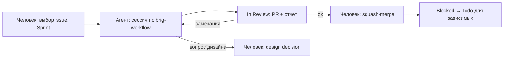

# Сопровождение Brig: вручную, через агентов и в связке

Практическое руководство для мейнтейнеров. **Правила** живут в `CONTRIBUTING.md` — здесь только «как»: команды, порядок действий, точки передачи работы между человеком и агентом. Если этот файл расходится с `CONTRIBUTING.md`, прав `CONTRIBUTING.md`, а этот файл надо поправить.

## 1. Где что лежит

| Что | Где | Зачем |
|---|---|---|
| Доска | [github.com/users/it1ro/projects/5](https://github.com/users/it1ro/projects/5), `gh project view 5 --owner it1ro --web` | Единственный список задач и их статусов |
| Задачи с DoD | issues `it1ro/brig-lang` с label `audit` | Body issue = блок задачи из `TASKS.md` |
| План целиком | `TASKS.md` | Волны, зависимости, design decisions, задачи T-80…T-86, ждущие решения |
| Находки | `AUDIT_REPORT.md` | Описание каждого finding (S-F*, A-F*, I-F*, O-F*) и пробных программ |
| Правила | `CONTRIBUTING.md` | Ветки, коммиты, PR, DoR/DoD, правила для LLM-сессий |
| Контекст для агентов | `.claude/skills/*/SKILL.md` | Инварианты подсистем и протокол сессии (`brig-workflow`) |
| Лог настройки доски | `PROMPT_SETUP_KANBAN.log.md` | Соответствие T-NN → issue #, id проекта и полей |

`TASKS_EXAMPLE.md` — посторонний черновик с другой нумерацией, в работе не используется.

## 2. Доска: поля и статусы

Поля: **Priority** (P0…P3), **Task type** (fail-fast, full-fix, test-infra, docs, merge), **Effort** (S/M/L), **Model** (sonnet/opus/human), **Wave** (0-branch … 5-docs), **Sprint** (итерации по 2 недели с понедельника 2026-09-28). Поле называется `Task type`, а не `Type`: имя `Type` GitHub зарезервировал под встроенные issue types.

| Статус | Значит | Кто переводит |
|---|---|---|
| Todo | Все `Blocked by` закрыты, можно брать | Тот, кто закрыл последний блокер |
| In Progress | Идёт сессия, ровно одна на issue | Исполнитель в начале сессии |
| In Review | PR открыт, ждёт CI и/или ревью человека | Исполнитель, открыв PR |
| Blocked | Открыт хотя бы один `Blocked by`, или finding не воспроизвёлся и ждёт решения | Исполнитель или мейнтейнер |
| Done | Issue закрыт | Автоматически при закрытии issue (workflow проекта) |

Порядок выбора: сначала меньшая Wave, внутри — выше Priority. Design-decision issues (#40–#43) и эпики (#44–#49) на доске не стоят.

## 3. Разовая настройка

**В веб-интерфейсе доски** (через API это не делается):

1. New view → Board, Group by: Status, Sort: Wave, затем Priority. Отдельный вид с фильтром `status:Todo` удобен как «что брать дальше».
2. Settings → Workflows: включены «Item closed → Done» и «Pull request merged → Done».
3. Sprint: проставить задачам, которые берутся в ближайшие две недели (начать с Wave 0 в Sprint 1).

**В shell** — функции для работы с доской (положить в `~/.bashrc` или вставить в терминал):

```bash
export BRIG_P=5 BRIG_O=it1ro BRIG_R=it1ro/brig-lang BRIG_PID=PVT_kwHOAoQ_k84Bksrz

# id карточки на доске по номеру issue
board_item() {
  gh project item-list $BRIG_P --owner $BRIG_O --limit 200 --format json \
    --jq ".items[] | select(.content.number==$1) | .id"
}

# board_set <issue#> <поле> <значение>, например: board_set 21 Status "In Progress"
board_set() {
  local item fid oid
  item=$(board_item "$1")
  read -r fid oid < <(gh project field-list $BRIG_P --owner $BRIG_O --format json \
    --jq ".fields[] | select(.name==\"$2\") | [.id, (.options[] | select(.name==\"$3\") | .id)] | @tsv")
  gh project item-edit --id "$item" --project-id $BRIG_PID --field-id "$fid" --single-select-option-id "$oid"
}

# кто ждёт этот issue: board_dependents 7
board_dependents() {
  gh issue list --repo $BRIG_R --state open --search "\"Blocked by #$1\" in:body" \
    --json number,title --jq '.[] | "#\(.number) \(.title)"'
}

# какие блокеры ещё открыты: board_open_blockers 8 (пусто — можно в Todo)
board_open_blockers() {
  gh issue view "$1" --repo $BRIG_R --json body --jq .body | grep -o 'Blocked by #[0-9]*' | grep -o '[0-9]*' |
    while read -r n; do
      [ "$(gh issue view "$n" --repo $BRIG_R --json state --jq .state)" = OPEN ] && echo "#$n open"
    done
}
```

## 4. Режим A — вручную

Одна задача от Todo до Done:

```bash
gh issue view 15 --repo it1ro/brig-lang            # прочитать DoD и «НЕ делать»
board_set 15 Status "In Progress"
git switch main && git pull && git switch -c fix/T-21-newline-required
# ... правка + тест-якорь из issue ...
make all && BRIG_VERIFY=1 go test ./...
git commit -m "fix(parser): require NEWLINE between statements [T-21]"
git push -u origin fix/T-21-newline-required
gh pr create --title "$(git log -1 --format=%s)" --body-file pr.md   # pr.md — шаблон CONTRIBUTING.md §5 с "Closes #15"
board_set 15 Status "In Review"
gh pr checks --watch
gh pr merge --squash --delete-branch               # issue закроется, карточка уйдёт в Done
for n in $(board_dependents 15 | grep -o '^#[0-9]*' | tr -d '#'); do
  [ -z "$(board_open_blockers $n)" ] && board_set $n Status Todo
done
```

Что проверить глазами перед merge:

- DoD из issue выполнен **дословно**: каждая команда из DoD возвращает то, что написано.
- Ни один пункт «НЕ делать» не нарушен (типичное нарушение — «попутный» фикс соседнего finding).
- Если в PR есть `make update-golden`/`update-bytecode` — diff golden/bytecode прочитан и лежит отдельным коммитом.
- Если задача снимала `t.Skip("blocked: T-NN")` — skip действительно удалён, тест зелёный.

## 5. Режим B — через агента

Агент — Claude Code или Cursor Agent, запущенный в корне репозитория. Skills из `.claude/skills/` подхватываются автоматически; протокол сессии описан в skill `brig-workflow`, контекст подсистем — в `brig-overview`, `brig-lexer`, `brig-parser-ast`, `brig-sema`, `brig-compiler`, `brig-vm`, `brig-testing-workflow`.

**Модель** берётся из поля Model issue. Для Effort L (T-36, T-39, T-50, T-51, T-53) — только она; S/M — любая. `model-human` агенту не отдаётся (T-07 и design decisions).

**Промпт сессии** (скопировать, подставить номер):

```text
Возьми issue #<N> в it1ro/brig-lang и выполни его по протоколу skill brig-workflow.
Режим: <автономный | со сдачей на ревью>.
Работай строго в рамках DoD и «НЕ делать» из issue. Найденное по пути — новый issue, не правка.
```

- **Автономный** — агент доводит до squash-merge при зелёном CI и сам переводит зависимые задачи в Todo (так описано в `CONTRIBUTING.md` §7). Подходит для S/M задач типов fail-fast, test-infra, простых full-fix.
- **Со сдачей на ревью** — агент останавливается на In Review с открытым PR; merge делает человек. Для всего, что трогает `compiler.go`, `scheduler.go`, `verify.go`, golden/bytecode, и для всех задач Effort L.

**Что агент не делает никогда:** не берёт issue без label `audit` и вне доски; не трогает design-decision issues; не правит `docs/`, `README.md`, `STATUS.md`, `CONTRIBUTING.md` вне задач с Task type `docs`; не меняет семантику языка сверх DoD; не делает merge в режиме ревью; не ставит Sprint.

**Параллельные агенты.** Можно, если задачи не пересекаются по файлам: по одному агенту на issue, каждый в своём worktree (`git worktree add ../brig-T-22 -b fix/T-22-int-literals main`). Две задачи, трогающие `compiler.go`, одновременно не запускать — конфликты при squash.

**Как принять результат агента:** тот же чек-лист, что в разделе 4, плюс прочитать body PR: разделы «Что НЕ сделано» и «Как проверялось» должны быть заполнены, а в «Как проверялось» — реальные команды с результатом.

## 6. Режим C — в связке (рекомендуемый)

Агенты пишут код, человек принимает решения и держит качество.



| Работа | Кто |
|---|---|
| Design decisions (#40–#43), превращение T-80…T-86 в issues | Человек |
| T-07: теги `stack-vm-final`/`regvm-merged`, squash `iter/regvm` → `main` | Человек |
| Вердикт по verification (T-13…T-15): подтвердить или закрыть как `false-positive` | Агент собирает доказательства, человек утверждает |
| Реализация fail-fast / full-fix / test-infra | Агент |
| Ревью diff'ов golden/bytecode, merge PR в `compiler`/`vm` | Человек |
| Задачи docs (T-12, T-60, T-61) | Агент, ревью человека |
| Новые issues, найденные по пути | Агент создаёт, человек ставит Priority и Sprint |

Точки передачи: статус **In Review** (агент → человек), комментарий в issue с вопросом и статус **Blocked** (агент → человек, если упёрся в неясность спеки или в design decision), статус **Todo** у зависимых задач (человек → агент после merge).

## 7. Особые случаи

**Wave 0 (T-01…T-06) — на ветке `iter/regvm`, без PR.** Коммиты `<type>(<scope>): <subject> [T-NN]` идут прямо в `iter/regvm`; issue закрывается вручную: `gh issue close 1 --comment "Сделано в <sha> на iter/regvm"`. Ветка сейчас только локальная — работать на той машине, где она есть, или сначала `git push -u origin iter/regvm`. T-07 выполняет человек:

```bash
git tag stack-vm-final main && git push origin stack-vm-final
git switch main && git merge --squash iter/regvm
git add AUDIT_REPORT.md CONTRIBUTING.md TASKS.md MAINTAINING.md
git commit        # subject с [T-07], в body — список T-01…T-06
make all && BRIG_VERIFY=1 go test ./...
git tag regvm-merged && git push origin main regvm-merged
git branch -D iter/regvm
```

**`t.Skip("blocked: T-NN")`.** T-10 добавляет тесты из §7 аудита; упавшие сейчас помечаются этим skip'ом. Задача T-NN обязана снять свой skip — `rg -n 'blocked: T-NN' internal` после неё пуст.

**Пробные программы `p/*.brig` в репозитории нет.** Аудит гонял их во временной копии. Если DoD ссылается на `p/…`, программа восстанавливается по описанию finding в `AUDIT_REPORT.md` и становится тестом, а не файлом в `p/`.

**Verification (T-13…T-15).** Результат — комментарий с выводом команд. Подтвердилось — новый issue по строке таблицы «Verification needed» в `TASKS.md`. Не подтвердилось — label `false-positive`, issue закрыт.

**Design decision принят.** Записать вариант в issue (#40–#43) и закрыть. Затем для каждой задачи из списка «Задачи, ждущие решения» в `TASKS.md` создать issue по образцу соседних блоков (meta, Файлы, Тест-якорь, DoD, «НЕ делать») в Wave 3 и добавить на доску.

**Новый issue, найденный по пути:**

```bash
gh issue create --repo it1ro/brig-lang --title "T-NN · <имя>" --body-file body.md \
  --label "audit,<task type>,<P>,wave-<wave>,model-<model>"
gh project item-add 5 --owner it1ro --url <url>
board_set <N> Priority <P>; board_set <N> "Task type" <type>; board_set <N> Effort <S|M|L>
board_set <N> Model <model>; board_set <N> Wave <wave>; board_set <N> Status Todo
```

Номер T-NN — следующий свободный в десятке волны (занятые — в `TASKS.md` и `PROMPT_SETUP_KANBAN.log.md`).

**Задача требует менять спецификацию или публичный синтаксис.** `CONTRIBUTING.md` §6 требует обновить `docs/` в том же PR, а §7 запрещает агенту трогать doc-файлы вне docs-задач. Как это делать на практике: агент останавливается, пишет в issue, какой раздел спеки нужно поменять, и переводит issue в Blocked; правку спеки делает человек или отдельный issue с Task type `docs`.

**Задача не помещается в сессию.** Не продолжать в следующей сессии: разбить на несколько issues (каждый — со своим DoD), исходный закрыть со ссылками.

## 8. Шпаргалка

```bash
gh project view 5 --owner it1ro --web                                   # доска
gh issue list --repo it1ro/brig-lang --label wave-0-branch --state open  # волна
gh issue list --repo it1ro/brig-lang --label design-decision            # ждут решения
gh issue list --repo it1ro/brig-lang --label verification               # проверки
board_set <N> Status "In Progress"                                      # статус
board_dependents <N>; board_open_blockers <N>                           # зависимости
make ci-quick                                                           # быстрый прогон
make all && BRIG_VERIFY=1 go test ./...                                 # перед PR
```
