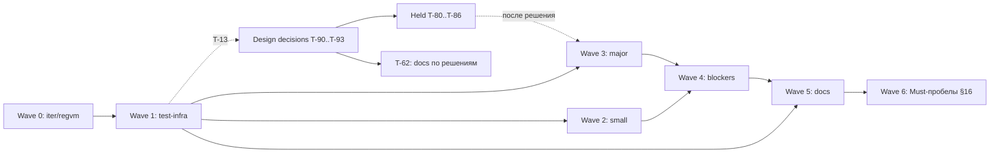

# TASKS — карта плана

Карта плана работ: волны, зависимости, ссылки на issues. **Источник DoD, файлов, тест-якоря и «НЕ делать» — тело issue**, здесь их нет. Статусы — на [доске](https://github.com/users/it1ro/projects/5) «Brig — разработка» (GitHub Projects v2, проект 5). Конвенции — `CONTRIBUTING.md`.

Label источника: `audit` — finding `AUDIT_REPORT.md` (ветка `iter/regvm` @ `8ab58cf`), `spec-gap` — Must-пробел §16 относительно спеки. Design-decision issues (T-90…T-95) лежат на доске. Нумерация: каждая волна начинается с нового десятка; `depends_on` ссылается на меньший номер, граф ацикличен. Эпики: Wave 5 — [#49](https://github.com/it1ro/brig-lang/issues/49), Wave 6 — [#124](https://github.com/it1ro/brig-lang/issues/124).

## Verification needed

Findings с тегом `[inferred]`. Задача-фикс не создаётся до результата проверки. `I-F4`, `I-F6`, `I-F11` тоже `[inferred]`, но аудит сам пометил их `ok` / «не дыра» — они в разделе «False positives / no-op».

| Finding | Что проверить | Команда/тест | Если подтвердится | Если нет |
|---|---|---|---|---|
| A-F1 (T-13) | Все акторы исполняются в одной goroutine кооперативным run-loop (`internal/vm/scheduler.go:313-428`) | `rg -n 'go func\|go s\.' internal/vm`; тест `TestVerifyAF1SingleGoroutineScheduler`: spawn 100 акторов, `runtime.NumGoroutine()` растёт меньше чем на 100 | T-90 решён: C (#40); T-80 — правка доков | A-F1 → `false-positive`, T-90 закрывается как неактуальный, T-80 не создаётся |
| A-F7 (T-14) | (1) «срез: не реализовано» → exit 3 вместо 1; (2) `internal: upvalue out of range` → exit 2 вместо 3; (3) `runModule` (`internal/compiler/compiler_test.go:13-33`) не прогоняет sema | (1)(2) `go run ./cmd/brig run <probe>.brig; echo $?` по `cmd/brig/main.go:162-166, 208-211`; (3) тест `TestVerifyAF7RunModuleSkipsSema`: `print(trap(1+1))` компилируется через `runModule`, а `brig check` отвергает | Создать issue «exit-коды: классификация ошибок в cmd/brig» (full-fix, wave 3) и/или «runModule прогоняет sema» (test-infra, wave 3) — по подтверждённым пунктам | Неподтверждённый пункт → `false-positive` |
| I-F14 (T-15) | (1) Большой `ms` в `RECVTIMER` молча усекается или переполняется (`scheduler.go:888-894`); (2) `wakeExpired` (`scheduler.go:366`) даёт недетерминированный порядок в `ready` | (1) тест `TestVerifyIF14HugeTimerMs`: `after 9223372036854775807`; (2) программа из N акторов с одинаковым таймаутом: `for i in $(seq 20); do go run ./cmd/brig run p.brig; done \| sort \| uniq -c` — больше одной строки значит недетерминизм | Issue «RECVTIMER: валидация ms» и/или «wakeExpired: детерминированный порядок (deadline, seq)» (full-fix, wave 3) | `false-positive` |

## Design decisions required

Код по этим findings не пишется до решения автора языка. Для каждого заведён issue с label `design-decision` (не на доске). Задачи, которые ждут решения, — T-80…T-86 (Wave 3) и T-62 (Wave 5, запись решений в doc 02 и спеку): issues созданы, на доске в Blocked. После решения задача переходит в Todo, а если выбранный вариант её отменяет — закрывается как won't-fix (так сказано в её DoD). Полные блоки — в разделе «Задачи».

| Finding | Вопрос | Варианты | Что блокирует |
|---|---|---|---|
| A-F1 (T-90) | «1 актор = 1 goroutine» (§15.2, architecture.md:148) — норматив или деталь реализации? | **A:** описать кооперативный однопоточный loop как соответствующий спеке (правка §15.2 и architecture.md); детерминизм §15.4 сохраняется. **B:** переписать scheduler на goroutine-per-actor: L+, гонки, детерминизм §15.4 теряется. **C:** спека фиксирует только наблюдаемую семантику (порядок, fairness), модель потоков — свобода реализации | **Решено: C (#40).** T-80; follow-up из T-15 (порядок таймеров) |
| A-F3 (T-91) | Не-Bool в `if`/`and`/`or` — это `:type_error` (тир 1: §7.2, §8.1, §16) или truthiness (K-2 в doc 02)? | **A:** строгий Bool везде, включая правый операнд `and`/`or`; правый операнд тогда не хвостовой, T-82 закрывается как won't-fix, doc 02 §4 табл. п.6 правится. **B:** строгий Bool для условия и левого операнда, правый не проверяется (как `andalso` в Erlang); T-82 делается. **C:** оставить K-2 и править §7.2/§16 (тир 1) | T-81, T-82; семантика не-Bool guard в T-51/T-52 |
| A-F4 (T-92) | Ловится ли `:type_error` через `trap`? | **A:** да (§10.4): `arithErr`, `NOT`, `Compare` → ловимый `ErrRaise(:type_error)`. **B:** нет (K-3): `decArithErr` становится фатальным, §10.4 правится. **C:** арифметика и сравнения ловятся, внутренние инварианты VM — нет (явный список в doc 02) | T-83; при A-F3=A — вид ошибки из `JMPIF` |
| I-F8 (T-93) | Как сравниваются числа разных видов в `==`/`<`, паттернах, ключах Map/Set? | **A:** паттерны и ключи — строго по Kind (`runtime.MatchEqual`), `==`/`<` — точно по значению (Int×Float через `big.Rat`), Decimal×Float → `:type_error` везде. **B:** Decimal×Float → `false` везде (включая `==`), без ошибок. **C:** Decimal×Float сравниваются точно через `big.Rat` везде | T-84, T-85, T-86 |

## Waves

**Wave 0 — на ветке `iter/regvm`, до merge.** Вход: аудит на `8ab58cf`. Коммиты идут прямо в `iter/regvm` (integration-ветка, `CONTRIBUTING.md` §3), формат `<type>(<scope>): <subject> [T-NN]`; issue закрывается ссылкой на коммит. Каждая задача сама создаёт свой тест-якорь: правило «тесты §7 до фиксов» действует с Wave 1. Отклонение от «только fail-fast»: T-06 (lint, O-F3) — без него `make all` красный и merge невозможен. Выход: T-07 закрыт, теги `stack-vm-final` и `regvm-merged` на origin.

**Wave 1 — test-infra и разблокировка.** Вход: T-07. Выход: набор §7 в `main` (упавшие тесты — через `t.Skip("blocked: T-NN")`), golden `.ast` содержательны, skills актуальны, по трём `[inferred]` findings есть вердикт.

**Wave 2 — small fixes слоя 1.** Вход: T-10 и T-11 (golden `.ast` осмысленны). Выход: все задачи волны закрыты, `make all` зелёный.

**Wave 3 — major fixes.** Вход: T-10; для T-37 — T-30. Задачи, завязанные на A-F1/A-F3/A-F4/I-F8, сюда не входят (T-80…T-86). Выход: все задачи волны закрыты, ни одного `t.Skip("blocked: T-3x")` в репо.

**Wave 4 — blockers full-fix.** Вход: T-11, T-20, T-23, T-36. Выход: fail-fast из T-01, T-02, T-04 удалены, канонические примеры §6.1/§6.5/§12.4 и интерполяция дают правильный результат.

**Wave 5 — docs cleanup.** Вход: T-12; для T-61 — все волны 0–4. Выход: §8 и §5 аудита закрыты, `TASKS.md` и `AUDIT_REPORT.md` связаны с issues. T-60 переоткрыт 2026-09-26: его PR #52 закрыт без merge. T-62 ждёт design decisions, T-63 синхронизирует план с доской.

**Wave 6 — Must-пробелы §16.** Вход: волны 0–4 закрыты. Задачи с label `spec-gap` и Task type `feature` реализуют Must-фичи §16, которые парсятся, но не компилируются или отсутствуют: `match`, `with`, pipe, записи, вариадики, `Sys.args()`/`link`/`mailbox_size()`, term order, формат диагностики, stack trace. Зависимости: T-71 ждёт T-70; T-74 ждёт T-70 и T-73. Почти все задачи волны правят `internal/compiler/compiler.go`, поэтому по `MAINTAINING.md` §5 их не берут параллельно; исключения — T-77 (`runtime.Compare`) и T-79 (scheduler, `cmd/brig`). Выход: `rg -n 'срез: (pipe|record literal|неподдерживаемое выражение)' internal/compiler` пуст, `make check-examples` → `failed 0`.

## Задачи

### Wave 0

| T-NN | Issue | Название | depends_on | Источник |
|---|---|---|---|---|
| T-01 | [#1](https://github.com/it1ro/brig-lang/issues/1) | Fail-fast: мультиклозы, guard и параметры-паттерны fn | — | audit |
| T-02 | [#2](https://github.com/it1ro/brig-lang/issues/2) | Fail-fast: guard в ветках recv | — | audit |
| T-03 | [#3](https://github.com/it1ro/brig-lang/issues/3) | Fail-fast: гибрид ensure теряет блок | — | audit |
| T-04 | [#4](https://github.com/it1ro/brig-lang/issues/4) | Fail-fast: интерполяция строк → явная ошибка | — | audit |
| T-05 | [#5](https://github.com/it1ro/brig-lang/issues/5) | REPL: nil-deref на любой строке | — | audit |
| T-06 | [#6](https://github.com/it1ro/brig-lang/issues/6) | Lint: 10 замечаний golangci-lint | — | audit |
| T-07 | [#7](https://github.com/it1ro/brig-lang/issues/7) | Merge iter/regvm → main | T-01, T-02, T-03, T-04, T-05, T-06 | audit |

### Wave 1

| T-NN | Issue | Название | depends_on | Источник |
|---|---|---|---|---|
| T-10 | [#8](https://github.com/it1ro/brig-lang/issues/8) | Набор регресс-тестов из §7 аудита | T-07 | audit |
| T-11 | [#9](https://github.com/it1ro/brig-lang/issues/9) | ast.Pretty и ast.Walk не видят Decl | T-10 | audit |
| T-12 | [#10](https://github.com/it1ro/brig-lang/issues/10) | Обновить устаревшие skills | T-11 | audit |
| T-13 | [#11](https://github.com/it1ro/brig-lang/issues/11) | Verify: A-F1 — однопоточный scheduler | T-07 | audit |
| T-14 | [#12](https://github.com/it1ro/brig-lang/issues/12) | Verify: A-F7 — exit-коды и тесты в обход sema | T-07 | audit |
| T-15 | [#13](https://github.com/it1ro/brig-lang/issues/13) | Verify: I-F14 — таймеры | T-07 | audit |
| T-16 | [#65](https://github.com/it1ro/brig-lang/issues/65) | CI: установка golangci-lint падает на checksum | — | — |

### Wave 2

| T-NN | Issue | Название | depends_on | Источник |
|---|---|---|---|---|
| T-20 | [#14](https://github.com/it1ro/brig-lang/issues/14) | Parser: guard через parseOr и идемпотентный round-trip guard | T-11 | audit |
| T-21 | [#15](https://github.com/it1ro/brig-lang/issues/15) | Parser: NEWLINE обязателен между стейтментами | T-11 | audit |
| T-22 | [#16](https://github.com/it1ro/brig-lang/issues/16) | Числовые литералы: base 10 по умолчанию и произвольная точность | T-10 | audit |
| T-23 | [#17](https://github.com/it1ro/brig-lang/issues/17) | Lexer: `0x_1`, `0b102`, ATOM после `)` | T-10 | audit |
| T-24 | [#18](https://github.com/it1ro/brig-lang/issues/18) | Parser: NEWLINE-sep, паттерн `()`, порядок в with | T-11 | audit |

### Wave 3

| T-NN | Issue | Название | depends_on | Источник |
|---|---|---|---|---|
| T-30 | [#19](https://github.com/it1ro/brig-lang/issues/19) | Переписать print-only тесты на утверждения | T-10 | audit |
| T-31 | [#20](https://github.com/it1ro/brig-lang/issues/20) | Компилятор: проверка TAILCALL при trapDepth>0 | T-10 | audit |
| T-32 | [#21](https://github.com/it1ro/brig-lang/issues/21) | Компилятор: инвариант I-1 (стек-нейтральность compileExpr) | T-10 | audit |
| T-33 | [#22](https://github.com/it1ro/brig-lang/issues/22) | Компилятор: инвариант I-3 (запись в bound-регистр) | T-10 | audit |
| T-34 | [#23](https://github.com/it1ro/brig-lang/issues/23) | callSync: unwind raise в колбэке прелюдии | T-10 | audit |
| T-35 | [#24](https://github.com/it1ro/brig-lang/issues/24) | Локальные fn: поиск у предков и манглинг в лямбдах | T-10 | audit |
| T-36 | [#25](https://github.com/it1ro/brig-lang/issues/25) | vm.Verify: рёбра MATCHLOCAL и RECVTAKE→after | T-10 | audit |
| T-37 | [#26](https://github.com/it1ro/brig-lang/issues/26) | ensure: область видимости тела и точка регистрации | T-30 | audit |
| T-38 | [#27](https://github.com/it1ro/brig-lang/issues/27) | Fail-fast: локальная fn с захватом | T-10 | audit |
| T-39 | [#28](https://github.com/it1ro/brig-lang/issues/28) | Локальная fn с захватом: полная реализация | T-35, T-38 | audit |
| T-40 | [#29](https://github.com/it1ro/brig-lang/issues/29) | Акторы: удаление мёртвых и значение raise в :down | T-10 | audit |
| T-41 | [#30](https://github.com/it1ro/brig-lang/issues/30) | Позиции 0:0 в bytecode | T-10 | audit |
| T-42 | [#31](https://github.com/it1ro/brig-lang/issues/31) | JSON: маркер $bytes, Inf, Float 1.0 | T-10 | audit |
| T-43 | [#32](https://github.com/it1ro/brig-lang/issues/32) | sema: полная проверка позиции trap | T-10 | audit |
| T-44 | [#50](https://github.com/it1ro/brig-lang/issues/50) | Fail-fast: параметры-паттерны и variadic в лямбдах fn (…) | T-01, T-10 | audit |
| T-45 | [#57](https://github.com/it1ro/brig-lang/issues/57) | exit-коды: классификация ошибок в cmd/brig | T-14 | audit |
| T-46 | [#58](https://github.com/it1ro/brig-lang/issues/58) | runModule прогоняет sema | T-14 | audit |
| T-47 | [#60](https://github.com/it1ro/brig-lang/issues/60) | RECVTIMER: валидация ms | T-15 | audit |
| T-48 | [#61](https://github.com/it1ro/brig-lang/issues/61) | wakeExpired: детерминированный порядок (deadline, seq) | T-15, T-90 | audit |
| T-49 | [#91](https://github.com/it1ro/brig-lang/issues/91) | compileVar: локальная fn предка перекрывает локаль промежуточной функции | T-51 | audit |
| T-55 | [#92](https://github.com/it1ro/brig-lang/issues/92) | vm.Verify: timeout-ребро RECVTAKE и структурные инварианты MATCHLOCAL | T-36 | audit |
| T-56 | [#94](https://github.com/it1ro/brig-lang/issues/94) | Локальная fn: затенение на промежуточном уровне | — | audit |
| T-57 | [#99](https://github.com/it1ro/brig-lang/issues/99) | sema: guard клозов fn не проверяется | — | audit |
| T-58 | [#144](https://github.com/it1ro/brig-lang/issues/144) | Fairness: колбэки прелюдии не тратят редукции (callSync) | — | audit |
| T-80 | [#105](https://github.com/it1ro/brig-lang/issues/105) | Scheduler: привести доки или код к решению A-F1 | T-90, T-13 | audit |
| T-81 | [#106](https://github.com/it1ro/brig-lang/issues/106) | JMPIF/JMPIFNOT: не-Bool → :type_error | T-91 | audit |
| T-82 | [#107](https://github.com/it1ro/brig-lang/issues/107) | Компилятор: правый операнд and/or в хвостовой позиции | T-91, T-10 | audit |
| T-83 | [#108](https://github.com/it1ro/brig-lang/issues/108) | Единая классификация type errors | T-92 | audit |
| T-84 | [#109](https://github.com/it1ro/brig-lang/issues/109) | Паттерны: точное сравнение литералов (MatchEqual) | T-93 | audit |
| T-85 | [#110](https://github.com/it1ro/brig-lang/issues/110) | Точное сравнение Int×Float | T-93 | audit |
| T-86 | [#111](https://github.com/it1ro/brig-lang/issues/111) | Decimal×Float: единое поведение в INDEX, Map/Set, паттернах | T-93 | audit |
| T-88 | [#132](https://github.com/it1ro/brig-lang/issues/132) | Parser: ошибка на bind после тела with (решение T-95) | T-95, T-87 | audit |

### Wave 4

| T-NN | Issue | Название | depends_on | Источник |
|---|---|---|---|---|
| T-50 | [#33](https://github.com/it1ro/brig-lang/issues/33) | S-F2: параметры-паттерны и guard fn в AST и парсере | T-11, T-20 | audit |
| T-51 | [#34](https://github.com/it1ro/brig-lang/issues/34) | S-F2: компиляция мультиклозных fn и guard | T-36, T-50 | audit |
| T-52 | [#35](https://github.com/it1ro/brig-lang/issues/35) | S-F3: компиляция guard в recv | T-02, T-51 | audit |
| T-53 | [#36](https://github.com/it1ro/brig-lang/issues/36) | S-F1: интерполяция в лексере и парсере (узел Interp) | T-11, T-23 | audit |
| T-54 | [#37](https://github.com/it1ro/brig-lang/issues/37) | S-F1: компиляция интерполяции | T-53 | audit |

### Wave 5

| T-NN | Issue | Название | depends_on | Источник |
|---|---|---|---|---|
| T-60 | [#38](https://github.com/it1ro/brig-lang/issues/38) | Docs: §8 и §5 аудита, пробелы вне K-8 | T-12 | audit |
| T-61 | [#39](https://github.com/it1ro/brig-lang/issues/39) | Закрыть TASKS.md и AUDIT_REPORT.md ссылками | T-60 | audit |
| T-62 | [#112](https://github.com/it1ro/brig-lang/issues/112) | Docs: записать решения DD #41–#43 в doc 02 и спеку | T-91, T-92, T-93 | audit |
| T-63 | [#113](https://github.com/it1ro/brig-lang/issues/113) | Docs: актуализировать TASKS.md, удалить STATUS.md, правила для spec-gap | T-61 | audit |
| T-64 | [#143](https://github.com/it1ro/brig-lang/issues/143) | Docs: ужать TASKS.md до карты плана | T-63 | audit |
| T-87 | [#131](https://github.com/it1ro/brig-lang/issues/131) | Docs: with — binds только в начале (решение T-95) | T-95 | audit |

### Wave 6

| T-NN | Issue | Название | depends_on | Источник |
|---|---|---|---|---|
| T-70 | [#114](https://github.com/it1ro/brig-lang/issues/114) | Компиляция match (§8.3) | — | spec-gap |
| T-71 | [#122](https://github.com/it1ro/brig-lang/issues/122) | Компиляция with/else (§8.2) | T-70 | spec-gap |
| T-72 | [#115](https://github.com/it1ro/brig-lang/issues/115) | Pipe |> (§7.5) | — | spec-gap |
| T-73 | [#116](https://github.com/it1ro/brig-lang/issues/116) | Записи: номинальные и анонимные (§4.7) | — | spec-gap |
| T-74 | [#123](https://github.com/it1ro/brig-lang/issues/123) | Record-паттерны (§9.6) | T-73, T-70 | spec-gap |
| T-75 | [#117](https://github.com/it1ro/brig-lang/issues/117) | Прелюдия: Sys.args(), Prelude.*, link, mailbox_size() | — | spec-gap |
| T-76 | [#118](https://github.com/it1ro/brig-lang/issues/118) | Диагностика: формат error: file:line:col (§E) | — | spec-gap |
| T-77 | [#119](https://github.com/it1ro/brig-lang/issues/119) | Term order: тотальный < между видами (§7.4) | — | spec-gap |
| T-78 | [#120](https://github.com/it1ro/brig-lang/issues/120) | Вариадики: клозы разной арности, лямбды, захват (§6.3) | — | spec-gap |
| T-79 | [#121](https://github.com/it1ro/brig-lang/issues/121) | Stack trace для непойманного raise | — | spec-gap |
| T-89 | [#135](https://github.com/it1ro/brig-lang/issues/135) | Term order записей (§7.4) | T-73 | spec-gap |

### Wave —

| T-NN | Issue | Название | depends_on | Источник |
|---|---|---|---|---|
| T-90 | [#40](https://github.com/it1ro/brig-lang/issues/40) | DD: модель планировщика (1 актор = 1 goroutine) | — | audit |
| T-91 | [#41](https://github.com/it1ro/brig-lang/issues/41) | DD: truthiness или строгий Bool | — | audit |
| T-92 | [#42](https://github.com/it1ro/brig-lang/issues/42) | DD: ловится ли :type_error | — | audit |
| T-93 | [#43](https://github.com/it1ro/brig-lang/issues/43) | DD: равенство чисел разных видов | — | audit |
| T-94 | [#55](https://github.com/it1ro/brig-lang/issues/55) | DD: §12.4 vs after_clause (inline after) | — | — |
| T-95 | [#129](https://github.com/it1ro/brig-lang/issues/129) | DD: порядок bind/stmt в with (§8.2 vs brig.ebnf) | — | spec-gap |
