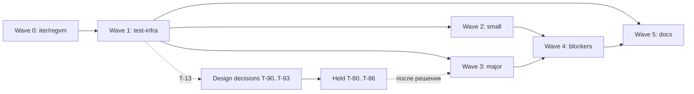

# TASKS — план работ по `AUDIT_REPORT.md`

Ветка `iter/regvm` @ `8ab58cf` (коммит аудита), `main` @ `41bbb70`. Источник findings — только `AUDIT_REPORT.md`, конвенции — `CONTRIBUTING.md`.
Задач в волнах: **39** — fail-fast 5, full-fix 23, test-infra 7, docs 3, merge 1. Отдельно: 4 design-decision issue (T-90…T-93, не на доске) и 7 задач, ждущих решения (T-80…T-86, issue не создаются).
Нумерация: каждая волна начинается с нового десятка (T-10 — набор тестов из §7 аудита). `depends_on` всегда ссылается на меньший номер — граф ацикличен по построению.

Статус задач — на [доске](https://github.com/users/it1ro/projects/5) (GitHub Projects v2, проект 5); у каждой T-NN ниже — ссылка на issue и статус на 2026-09-26. Открыты только design decisions T-90…T-93; T-80…T-86 ждут их и issue не имеют.

Задачи, созданные по ходу работ (в план ниже не входят):

| T-NN | Issue | Задача | Finding | Волна | Статус |
|---|---|---|---|---|---|
| T-16 | [#65](https://github.com/it1ro/brig-lang/issues/65) | CI: установка golangci-lint падает на checksum | — | Wave 1 | Done |
| T-44 | [#50](https://github.com/it1ro/brig-lang/issues/50) | Fail-fast: параметры-паттерны и variadic в лямбдах `fn (…)` | родственна S-F2 (найдена в T-01) | Wave 3 | Done |
| T-45 | [#57](https://github.com/it1ro/brig-lang/issues/57) | exit-коды: классификация ошибок в cmd/brig | A-F7 (по итогам T-14) | Wave 3 | Done |
| T-46 | [#58](https://github.com/it1ro/brig-lang/issues/58) | runModule прогоняет sema | A-F7 (по итогам T-14) | Wave 3 | Done |
| T-47 | [#60](https://github.com/it1ro/brig-lang/issues/60) | RECVTIMER: валидация ms | I-F14 (по итогам T-15) | Wave 3 | Done |
| T-48 | [#61](https://github.com/it1ro/brig-lang/issues/61) | wakeExpired: детерминированный порядок (deadline, seq) | I-F14 (по итогам T-15) | Wave 3 | Done (PR #103) |
| T-49 | [#91](https://github.com/it1ro/brig-lang/issues/91) | compileVar: локальная fn предка перекрывает локаль промежуточной функции | — (найдена при ревью T-51) | Wave 3 | Done |
| T-55 | [#92](https://github.com/it1ro/brig-lang/issues/92) | vm.Verify: timeout-ребро RECVTAKE и структурные инварианты MATCHLOCAL | I-F1 | Wave 3 | Done |
| T-56 | [#94](https://github.com/it1ro/brig-lang/issues/94) | Локальная fn: затенение на промежуточном уровне | A-F6 | Wave 3 | Done |
| T-57 | [#99](https://github.com/it1ro/brig-lang/issues/99) | sema: guard клозов fn не проверяется | — (найдена в T-52) | Wave 3 | Done |
| T-94 | [#55](https://github.com/it1ro/brig-lang/issues/55) | DD: §12.4 vs `after_clause` (inline after) | §8 аудита (из T-60) | — | Done |

## Verification needed

Findings с тегом `[inferred]`. Задача-фикс не создаётся до результата проверки. `I-F4`, `I-F6`, `I-F11` тоже `[inferred]`, но аудит сам пометил их `ok` / «не дыра» — они в разделе «False positives / no-op».

| Finding | Что проверить | Команда/тест | Если подтвердится | Если нет |
|---|---|---|---|---|
| A-F1 (T-13) | Все акторы исполняются в одной goroutine кооперативным run-loop (`internal/vm/scheduler.go:313-428`) | `rg -n 'go func\|go s\.' internal/vm`; тест `TestVerifyAF1SingleGoroutineScheduler`: spawn 100 акторов, `runtime.NumGoroutine()` растёт меньше чем на 100 | T-90 остаётся открытым; после решения — T-80 | A-F1 → `false-positive`, T-90 закрывается как неактуальный, T-80 не создаётся |
| A-F7 (T-14) | (1) «срез: не реализовано» → exit 3 вместо 1; (2) `internal: upvalue out of range` → exit 2 вместо 3; (3) `runModule` (`internal/compiler/compiler_test.go:13-33`) не прогоняет sema | (1)(2) `go run ./cmd/brig run <probe>.brig; echo $?` по `cmd/brig/main.go:162-166, 208-211`; (3) тест `TestVerifyAF7RunModuleSkipsSema`: `print(trap(1+1))` компилируется через `runModule`, а `brig check` отвергает | Создать issue «exit-коды: классификация ошибок в cmd/brig» (full-fix, wave 3) и/или «runModule прогоняет sema» (test-infra, wave 3) — по подтверждённым пунктам | Неподтверждённый пункт → `false-positive` |
| I-F14 (T-15) | (1) Большой `ms` в `RECVTIMER` молча усекается или переполняется (`scheduler.go:888-894`); (2) `wakeExpired` (`scheduler.go:366`) даёт недетерминированный порядок в `ready` | (1) тест `TestVerifyIF14HugeTimerMs`: `after 9223372036854775807`; (2) программа из N акторов с одинаковым таймаутом: `for i in $(seq 20); do go run ./cmd/brig run p.brig; done \| sort \| uniq -c` — больше одной строки значит недетерминизм | Issue «RECVTIMER: валидация ms» и/или «wakeExpired: детерминированный порядок (deadline, seq)» (full-fix, wave 3) | `false-positive` |

## Design decisions required

Код по этим findings не пишется до решения автора языка. Для каждого создаётся issue с label `design-decision` (не на доске). Задачи, которые ждут решения, перечислены ниже как T-80…T-86 — это не issue; после решения из них делаются обычные задачи Wave 3.

| Finding | Вопрос | Варианты | Что блокирует |
|---|---|---|---|
| A-F1 (T-90) | «1 актор = 1 goroutine» (§15.2, architecture.md:148) — норматив или деталь реализации? | **A:** описать кооперативный однопоточный loop как соответствующий спеке (правка §15.2 и architecture.md); детерминизм §15.4 сохраняется. **B:** переписать scheduler на goroutine-per-actor: L+, гонки, детерминизм §15.4 теряется. **C:** спека фиксирует только наблюдаемую семантику (порядок, fairness), модель потоков — свобода реализации | T-80; follow-up из T-15 (порядок таймеров) |
| A-F3 (T-91) | Не-Bool в `if`/`and`/`or` — это `:type_error` (тир 1: §7.2, §8.1, §16) или truthiness (K-2 в doc 02)? | **A:** строгий Bool везде, включая правый операнд `and`/`or`; правый операнд тогда не хвостовой, T-82 закрывается как won't-fix, doc 02 §4 табл. п.6 правится. **B:** строгий Bool для условия и левого операнда, правый не проверяется (как `andalso` в Erlang); T-82 делается. **C:** оставить K-2 и править §7.2/§16 (тир 1) | T-81, T-82; семантика не-Bool guard в T-51/T-52 |
| A-F4 (T-92) | Ловится ли `:type_error` через `trap`? | **A:** да (§10.4): `arithErr`, `NOT`, `Compare` → ловимый `ErrRaise(:type_error)`. **B:** нет (K-3): `decArithErr` становится фатальным, §10.4 правится. **C:** арифметика и сравнения ловятся, внутренние инварианты VM — нет (явный список в doc 02) | T-83; при A-F3=A — вид ошибки из `JMPIF` |
| I-F8 (T-93) | Как сравниваются числа разных видов в `==`/`<`, паттернах, ключах Map/Set? | **A:** паттерны и ключи — строго по Kind (`runtime.MatchEqual`), `==`/`<` — точно по значению (Int×Float через `big.Rat`), Decimal×Float → `:type_error` везде. **B:** Decimal×Float → `false` везде (включая `==`), без ошибок. **C:** Decimal×Float сравниваются точно через `big.Rat` везде | T-84, T-85, T-86 |

### Задачи, ждущие решения (issue не создаются)

- **T-80** (issue нет · **Статус:** Held, ждёт [#40](https://github.com/it1ro/brig-lang/issues/40); A-F1, ждёт T-90 и T-13): привести architecture.md / doc 02 / §15.2 или scheduler к принятому варианту.
- **T-81** (issue нет · **Статус:** Held, ждёт [#41](https://github.com/it1ro/brig-lang/issues/41); A-F3, ждёт T-91): `JMPIF`/`JMPIFNOT` на не-Bool → `(:type_error, …)`; проверка операндов `and`/`or` по решению. Якорь: `p/t7_if_nonbool.brig`, `p/w3_andor_nonbool.brig`.
- **T-82** (issue нет · **Статус:** Held, ждёт [#41](https://github.com/it1ro/brig-lang/issues/41); I-F3, ждёт T-91 и T-10): правый операнд `and`/`or` в хвостовой позиции (`compileAndOr`, `compiler.go:905-921`). Якорь: `TestAuditAndOrRightOperandIsTail` (skip `blocked: T-82`). Перенесена из Wave 3, потому что при A-F3=A правый операнд проверяется на Bool и хвостовым быть не может.
- **T-83** (issue нет · **Статус:** Held, ждёт [#42](https://github.com/it1ro/brig-lang/issues/42); A-F4, ждёт T-92): единая классификация type errors (`internal/vm/vm.go:113` `decArithErr`, `:356` `arithErr`, `NOT`, `runtime.Compare`). Якорь: `p/x1_typeerr.brig`.
- **T-84** (issue нет · **Статус:** Held, ждёт [#43](https://github.com/it1ro/brig-lang/issues/43); I-F8, ждёт T-93): `runtime.MatchEqual` для `PatLiteral` (`internal/vm/pattern.go:67`). Якорь: `TestAuditLiteralPatternIsExact` (skip `blocked: T-84`).
- **T-85** (issue нет · **Статус:** Held, ждёт [#43](https://github.com/it1ro/brig-lang/issues/43); I-F8, ждёт T-93): точное сравнение Int×Float (`internal/runtime/value.go:361-370`), `2^53+1 == 2^53.0` → false. Якорь: `p/w2_bigprec.brig`.
- **T-86** (issue нет · **Статус:** Held, ждёт [#43](https://github.com/it1ro/brig-lang/issues/43); I-F8, ждёт T-93): единое поведение Decimal×Float в `INDEX` (`scheduler.go:1038`), `set`/`Map.*` (`prelude.go:103,286,304,317`), паттернах; решение записано в doc 02. Якорь: `p/v6_mixed.brig`.

### T-90 · DD: модель планировщика (1 актор = 1 goroutine)
<!-- meta
priority: P2
type: design-decision
effort: S
model: human
wave: —
depends_on: —
findings: [A-F1]
extra_labels: design-decision
-->
- **Issue:** [#40](https://github.com/it1ro/brig-lang/issues/40) · **Статус:** Open — design decision, ждёт автора языка
- **Файлы:** docs/architecture.md:148, docs/01-language-design.md §15.2, internal/vm/scheduler.go:313-428
- **Тест-якорь:** — (решение, не код); факты — из T-13
- **DoD:** в issue записан выбранный вариант (A/B/C из таблицы) и ссылка на коммит/раздел, где он зафиксирован. Issue закрыт.
- **НЕ делать:** писать код до решения; трогать scheduler; решать заодно I-F14.

### T-91 · DD: truthiness или строгий Bool
<!-- meta
priority: P1
type: design-decision
effort: S
model: human
wave: —
depends_on: —
findings: [A-F3]
extra_labels: design-decision
-->
- **Issue:** [#41](https://github.com/it1ro/brig-lang/issues/41) · **Статус:** Open — design decision, ждёт автора языка
- **Файлы:** docs/02-register-based-virtual-machine.md (K-2, §4 табл. п.6), docs/01-language-design.md §7.2, §8.1, §16
- **Тест-якорь:** — ; пробы `p/t7_if_nonbool.brig`, `p/w3_andor_nonbool.brig`
- **DoD:** в issue записан выбранный вариант (A/B/C) и судьба T-82 (делается / won't-fix). Issue закрыт.
- **НЕ делать:** писать код до решения; менять `compileAndOr`; решать заодно A-F4.

### T-92 · DD: ловится ли :type_error
<!-- meta
priority: P1
type: design-decision
effort: S
model: human
wave: —
depends_on: —
findings: [A-F4]
extra_labels: design-decision
-->
- **Issue:** [#42](https://github.com/it1ro/brig-lang/issues/42) · **Статус:** Open — design decision, ждёт автора языка
- **Файлы:** docs/02-register-based-virtual-machine.md (K-3), docs/01-language-design.md §10.4, internal/vm/vm.go:113,356
- **Тест-якорь:** — ; проба `p/x1_typeerr.brig`
- **DoD:** в issue записан выбранный вариант (A/B/C). Issue закрыт.
- **НЕ делать:** писать код до решения; менять `decArithErr`/`arithErr`; решать заодно A-F3.

### T-93 · DD: равенство чисел разных видов
<!-- meta
priority: P1
type: design-decision
effort: S
model: human
wave: —
depends_on: —
findings: [I-F8]
extra_labels: design-decision
-->
- **Issue:** [#43](https://github.com/it1ro/brig-lang/issues/43) · **Статус:** Open — design decision, ждёт автора языка
- **Файлы:** internal/vm/pattern.go:67, internal/runtime/value.go:361-370, internal/vm/vm.go:361-363, docs/01-language-design.md §4.8
- **Тест-якорь:** — ; пробы `p/w1_pat_exact.brig`, `p/w2_bigprec.brig`, `p/v6_mixed.brig`
- **DoD:** в issue записан выбранный вариант (A/B/C) для каждого из трёх мест (паттерны, `==`/`<`, ключи Map/Set). Issue закрыт.
- **НЕ делать:** писать код до решения; вводить `MatchEqual`; решать заодно A-F4.

## Waves

**Wave 0 — на ветке `iter/regvm`, до merge.** Вход: аудит на `8ab58cf`. Коммиты идут прямо в `iter/regvm` (integration-ветка, `CONTRIBUTING.md` §3), формат `<type>(<scope>): <subject> [T-NN]`; issue закрывается ссылкой на коммит. Каждая задача сама создаёт свой тест-якорь: правило «тесты §7 до фиксов» действует с Wave 1. Отклонение от «только fail-fast»: T-06 (lint, O-F3) — без него `make all` красный и merge невозможен. Выход: T-07 закрыт, теги `stack-vm-final` и `regvm-merged` на origin.

**Wave 1 — test-infra и разблокировка.** Вход: T-07. Выход: набор §7 в `main` (упавшие тесты — через `t.Skip("blocked: T-NN")`), golden `.ast` содержательны, skills актуальны, по трём `[inferred]` findings есть вердикт.

**Wave 2 — small fixes слоя 1.** Вход: T-10 и T-11 (golden `.ast` осмысленны). Выход: все задачи волны закрыты, `make all` зелёный.

**Wave 3 — major fixes.** Вход: T-10; для T-37 — T-30. Задачи, завязанные на A-F1/A-F3/A-F4/I-F8, сюда не входят (T-80…T-86). Выход: все задачи волны закрыты, ни одного `t.Skip("blocked: T-3x")` в репо.

**Wave 4 — blockers full-fix.** Вход: T-11, T-20, T-23, T-36. Выход: fail-fast из T-01, T-02, T-04 удалены, канонические примеры §6.1/§6.5/§12.4 и интерполяция дают правильный результат.

**Wave 5 — docs cleanup.** Вход: T-12; для T-61 — все волны 0–4. Выход: §8 и §5 аудита закрыты, `TASKS.md` и `AUDIT_REPORT.md` связаны с issues.

## Задачи

### T-01 · Fail-fast: мультиклозы, guard и параметры-паттерны fn
<!-- meta
priority: P0
type: fail-fast
effort: S
model: sonnet
wave: 0-branch
depends_on: —
findings: [S-F2]
-->
- **Issue:** [#1](https://github.com/it1ro/brig-lang/issues/1) · **Статус:** Done
- **Файлы:** internal/parser/stmt.go:111-146, internal/compiler/compiler.go:357-371
- **Тест-якорь:** `TestAuditMultiClauseNotSilentlyDropped` в `internal/compiler/audit_regress_test.go` (создать)
- **DoD:** `Compile` возвращает ошибку, если `len(clauses)>1`, есть guard или параметр не `IdentPattern`/`..name`. Программы `p/t10_multiclause.brig`, `p/u2_guard_fn.brig`, `p/u1_spec65.brig` дают ошибку компиляции, а не `fact(5)=1` / `"positive"` / `pow(2,10)=1`. `TestAuditMultiClauseNotSilentlyDropped`, `TestRecursion`, `TestLocalFn` зелёные. `make all` и `BRIG_VERIFY=1 go test ./...` возвращают 0. `go run ./cmd/check-examples -- docs/01-language-design.md` → `checked 62, failed 0`.
- **НЕ делать:** реализовывать `Params []ast.Pattern` (T-50); трогать doc-файлы; рефакторить вокруг фикса; чинить разбор `when ident ->` (S-F4, T-20).

### T-02 · Fail-fast: guard в ветках recv
<!-- meta
priority: P1
type: fail-fast
effort: M
model: sonnet
wave: 0-branch
depends_on: —
findings: [S-F3]
-->
- **Issue:** [#2](https://github.com/it1ro/brig-lang/issues/2) · **Статус:** Done
- **Файлы:** internal/parser/expr.go:937-941, :970-974; internal/ast/construct.go:89-92 (`RecvBranchArg`); internal/ast/format.go; internal/ast/equal.go; internal/compiler/compiler.go:1438 (`compileRecv`)
- **Тест-якорь:** `TestAuditRecvGuardSurvivesRoundTrip` (создать, parser) и `TestAuditRecvGuardRejected` (создать, compiler)
- **DoD:** `RecvBranchArg` содержит поле `Guard ast.Expr`; парсер его заполняет; `Format` печатает `when <guard>`; `ast.Equal` сравнивает `Guard`. `Compile` возвращает ошибку, если `Guard != nil`; `p/t9_guard.brig` даёт ошибку компиляции, а не `:big`. Отвергать guard в парсере нельзя: doc 01:1084 содержит guard в `recv`, и `check-examples` → `checked 62, failed 0`. Оба теста зелёные, `make all` → 0.
- **НЕ делать:** компилировать guard (T-52); трогать doc-файлы; рефакторить разбор recv; чинить `when ident ->` (S-F4, T-20).

### T-03 · Fail-fast: гибрид ensure теряет блок
<!-- meta
priority: P1
type: fail-fast
effort: S
model: sonnet
wave: 0-branch
depends_on: —
findings: [S-F5]
-->
- **Issue:** [#3](https://github.com/it1ro/brig-lang/issues/3) · **Статус:** Done
- **Файлы:** internal/parser/expr.go:887-906
- **Тест-якорь:** `TestAuditEnsureHybridRejected` в `internal/parser/negative_test.go` (создать)
- **DoD:** `ensure expr NEWLINE INDENT …` (проба `p/u3_ensure_hybrid.brig`) → ошибка парсинга. Блочная форма `ensure NEWLINE INDENT …` → ошибка с текстом, содержащим `ensure` и `MVP`. Тест зелёный. `check-examples` → `checked 62, failed 0`. `make all` → 0.
- **НЕ делать:** реализовывать блочную форму ensure (Out of scope); трогать doc-файлы; рефакторить разбор trap; чинить область видимости ensure (I-F5, T-37).

### T-04 · Fail-fast: интерполяция строк → явная ошибка
<!-- meta
priority: P0
type: fail-fast
effort: S
model: sonnet
wave: 0-branch
depends_on: —
findings: [S-F1]
-->
- **Issue:** [#4](https://github.com/it1ro/brig-lang/issues/4) · **Статус:** Done
- **Файлы:** internal/compiler/compiler.go:1844-1848
- **Тест-якорь:** `TestAuditInterpolationFailsFast` в `internal/compiler/audit_regress_test.go` (создать)
- **DoD:** компиляция `"x = \(x)"` (`p/t3_interp.brig`) → ошибка с текстом `interpolation`. Строка с экранированным `\\(` компилируется в литерал. Тест зелёный. `make run-examples` → 0. `check-examples` → `checked 62, failed 0` (он только парсит). `make all` → 0.
- **НЕ делать:** строить узел Interp в лексере/парсере (T-53); трогать doc-файлы; рефакторить декодирование строк; чинить числовые литералы в том же файле (S-F7, T-22).

### T-05 · REPL: nil-deref на любой строке
<!-- meta
priority: P0
type: full-fix
effort: S
model: sonnet
wave: 0-branch
depends_on: —
findings: [O-F1]
-->
- **Issue:** [#5](https://github.com/it1ro/brig-lang/issues/5) · **Статус:** Done
- **Файлы:** internal/compiler/compiler.go:494 (`CompileReplLine`), internal/repl/repl.go:81
- **Тест-якорь:** `TestAuditReplSnapshot` в `internal/repl/audit_repl_test.go` (создать): `x=5; f=()->x; x=10; f()==5`
- **DoD:** `CompileReplLine` инициализирует `c.image`. `printf 'x = 5\n' | go run ./cmd/brig repl` возвращает 0 без panic. Тест зелёный. `make all` → 0.
- **НЕ делать:** перепроектировать REPL / переиспользование `Scheduler` (§9 аудита); трогать doc-файлы и устаревшие комментарии `cmd/brig/main.go` (T-60); рефакторить `repl.go`.

### T-06 · Lint: 10 замечаний golangci-lint
<!-- meta
priority: P0
type: test-infra
effort: S
model: sonnet
wave: 0-branch
depends_on: —
findings: [O-F3]
-->
- **Issue:** [#6](https://github.com/it1ro/brig-lang/issues/6) · **Статус:** Done
- **Файлы:** по выводу `golangci-lint run ./...`: internal/vm/opcodes.go, internal/vm/pattern.go:15, internal/vm/prelude_json.go:10 (`InstallJsonPrelude` → `InstallJSONPrelude`), internal/vm/regs_test.go:104, internal/runtime/json.go:71, internal/vm/vm.go:197,249 и др.
- **Тест-якорь:** `golangci-lint run ./...` (существующая команда)
- **DoD:** `golangci-lint run ./...` → rc=0. `make all` → 0. `git diff` не меняет `.golangci.yml` и не добавляет новых `//nolint`. `BRIG_VERIFY=1 go test ./...` → 0.
- **НЕ делать:** отключать линтеры в конфиге; менять поведение кода; трогать doc-файлы; переписывать print-only тесты (O-F2, T-30).

### T-07 · Merge iter/regvm → main
<!-- meta
priority: P0
type: merge
effort: S
model: human
wave: 0-branch
depends_on: T-01, T-02, T-03, T-04, T-05, T-06
findings: []
-->
- **Issue:** [#7](https://github.com/it1ro/brig-lang/issues/7) · **Статус:** Done
- **Файлы:** git (ветка `iter/regvm` на origin); `AUDIT_REPORT.md`, `CONTRIBUTING.md`, `TASKS.md`, `MAINTAINING.md` уже закоммичены в `iter/regvm` и попадают в `main` squash-коммитом
- **Тест-якорь:** `make all` и `BRIG_VERIFY=1 go test ./...` на `main` после merge
- **DoD:** тег `stack-vm-final` стоит на `main` до merge (`41bbb70`) и запушен. В `main` один squash-коммит из `iter/regvm` с `[T-07]` в subject и списком T-01…T-06 в body. `AUDIT_REPORT.md`, `CONTRIBUTING.md`, `TASKS.md` есть в `main`. Тег `regvm-merged` стоит на squash-коммите и запушен. На `main` `make all` → 0, `BRIG_VERIFY=1 go test ./...` → 0. `iter/regvm` удалена локально и на origin.
- **НЕ делать:** merge-commit или rebase-merge (только squash, `CONTRIBUTING.md` §5); чинить что-либо в ходе merge; `push --force` в `main`; трогать doc-файлы.

### T-10 · Набор регресс-тестов из §7 аудита
<!-- meta
priority: P0
type: test-infra
effort: M
model: sonnet
wave: 1-test-infra
depends_on: T-07
findings: [I-F2]
-->
- **Issue:** [#8](https://github.com/it1ro/brig-lang/issues/8) · **Статус:** Done
- **Файлы:** internal/compiler/audit_regress_test.go (дополнить; стиль `regvm_test.go`), internal/vm/verify_test.go (создать; чанки через `NewChunk`/`Emit`), internal/ast/audit_pretty_test.go (создать)
- **Тест-якорь:** создать тесты §7. Проходят сразу: `TestAuditNoTailCallInsideTrap`, `TestVerifyRejectsTailCallUnderTrap`, `TestVMTailCallUnderTrapGuard` (`RunMain` без Verify → `internal: TAILCALL under active trap`). Со `t.Skip("blocked: T-NN")`: `TestAuditAndOrRightOperandIsTail` (T-82), `TestAuditLocalFnCapturesEnclosingParam` (T-39), `TestAuditBigIntLiteral` и `TestAuditLeadingZeroIsDecimal` (T-22), `TestAuditDownReasonCarriesRaiseValue` (T-40), `TestAuditTrapInsideNativeCallback` (T-34), `TestAuditEnsureSeesBodyLocals` (T-37), `TestAuditLiteralPatternIsExact` (T-84), `TestVerifyMatchLocalBranchUndefinedReg` и `TestVerifyRecvAfterUndefinedReg` (T-36), `TestAuditPrettyPrintsFuncDecl` (T-11). Уже созданы в Wave 0: `TestAuditMultiClauseNotSilentlyDropped`, `TestAuditRecvGuardSurvivesRoundTrip`, `TestAuditReplSnapshot`.
- **DoD:** все перечисленные тесты существуют. `rg -c 't.Skip\("blocked: T-' internal` в сумме даёт 11. Каждый skip-тест падает, если убрать `t.Skip` (вывод прогона — в body PR). `make all` → 0, `BRIG_VERIFY=1 go test ./...` → 0.
- **НЕ делать:** чинить какой-либо finding; трогать doc-файлы; переписывать print-only тесты (O-F2, T-30); переводить `runModule` на sema (A-F7, T-14).

### T-11 · ast.Pretty и ast.Walk не видят Decl
<!-- meta
priority: P1
type: test-infra
effort: M
model: sonnet
wave: 1-test-infra
depends_on: T-10
findings: [S-F13]
-->
- **Issue:** [#9](https://github.com/it1ro/brig-lang/issues/9) · **Статус:** Done
- **Файлы:** internal/ast/decl.go:14,25,40,69 (`IsExpression` у Decl), internal/ast/pretty.go:35, internal/ast/visitor.go:31, testdata/golden/*.ast
- **Тест-якорь:** `TestAuditPrettyPrintsFuncDecl` (снять skip) и `TestWalkVisitsFuncDecl` (создать)
- **DoD:** оба теста зелёные. `rg -lx '\(program \)' testdata/golden` находит только файлы с действительно пустой программой (список — в body PR). `make update-golden` — прогнать, diff просмотреть глазами; golden — отдельным коммитом `test(ast): regenerate golden files [T-11]`. `make all` → 0.
- **НЕ делать:** менять `ast.Format`; трогать doc-файлы; рефакторить visitor сверх фикса порядка case; чинить идемпотентность guard (S-F12, T-20).

### T-12 · Обновить устаревшие skills
<!-- meta
priority: P2
type: docs
effort: S
model: sonnet
wave: 1-test-infra
depends_on: T-11
findings: []
-->
- **Issue:** [#10](https://github.com/it1ro/brig-lang/issues/10) · **Статус:** Done
- **Файлы:** .claude/skills/brig-compiler/SKILL.md, .claude/skills/brig-vm/SKILL.md, .claude/skills/brig-overview/SKILL.md, .claude/skills/brig-parser-ast/SKILL.md, .claude/skills/brig-testing-workflow/SKILL.md
- **Тест-якорь:** `rg`-проверки из DoD (существующая команда)
- **DoD:** каждое расхождение из таблицы «Шаг 0» аудита исправлено: brig-compiler не утверждает, что проверка `trapDepth` существует (ссылка на T-31), «предки» → «только прямой родитель» (T-35), `and`/`or` → CALL (T-82); brig-vm различает pid, «никогда не существовавший» и «завершившийся» (T-40), указывает потерю `val` в `:down` (T-40) и что Verify не моделирует MATCHLOCAL/after (T-36); brig-overview — иерархия источников как в AUDIT_PROMPT. `rg -n '65' .claude/skills` не находит «65/65» и «65 блоков». `rg -n 'brig-cli' .claude/skills` пуст.
- **НЕ делать:** править `docs/` (T-60); менять код; создавать несуществующие skills `brig-cli/docs/sync/test`.

### T-13 · Verify: A-F1 — однопоточный scheduler
<!-- meta
priority: P2
type: test-infra
effort: S
model: sonnet
wave: 1-test-infra
depends_on: T-07
findings: [A-F1]
extra_labels: verification
-->
- **Issue:** [#11](https://github.com/it1ro/brig-lang/issues/11) · **Статус:** Done
- **Файлы:** internal/vm/scheduler.go:313-428
- **Тест-якорь:** `TestVerifyAF1SingleGoroutineScheduler` (создать)
- **DoD:** команда и тест из таблицы «Verification needed» прогнаны, вывод — комментарием в issue. Если подтверждено: тест закоммичен, в T-90 добавлена ссылка на результат. Если нет: label `false-positive` на этом issue, T-90 закрыт с комментарием.
- **НЕ делать:** менять scheduler; трогать doc-файлы (T-80 после решения T-90); чинить порядок таймеров (I-F14, T-15).

### T-14 · Verify: A-F7 — exit-коды и тесты в обход sema
<!-- meta
priority: P2
type: test-infra
effort: S
model: sonnet
wave: 1-test-infra
depends_on: T-07
findings: [A-F7]
extra_labels: verification
-->
- **Issue:** [#12](https://github.com/it1ro/brig-lang/issues/12) · **Статус:** Done
- **Файлы:** cmd/brig/main.go:162-166, 208-211; internal/compiler/compiler_test.go:13-33
- **Тест-якорь:** `TestVerifyAF7RunModuleSkipsSema` (создать)
- **DoD:** три пункта из таблицы «Verification needed» прогнаны, вывод (`echo $?` по каждой пробе) — комментарием в issue. По каждому подтверждённому пункту создан issue по шаблону `TASKS.md` и добавлен на доску (Wave 3). По неподтверждённому — запись `false-positive` в комментарии.
- **НЕ делать:** менять exit-коды в этой сессии; переводить `runModule` на sema; чинить падение локальной fn с захватом (I-F7, T-38).

### T-15 · Verify: I-F14 — таймеры
<!-- meta
priority: P2
type: test-infra
effort: S
model: sonnet
wave: 1-test-infra
depends_on: T-07
findings: [I-F14]
extra_labels: verification
-->
- **Issue:** [#13](https://github.com/it1ro/brig-lang/issues/13) · **Статус:** Done
- **Файлы:** internal/vm/scheduler.go:366 (`wakeExpired`), :888-894 (`RECVTIMER`)
- **Тест-якорь:** `TestVerifyIF14HugeTimerMs` (создать)
- **DoD:** тест и цикл 20 прогонов из таблицы «Verification needed» выполнены, вывод — комментарием в issue. По каждому подтверждённому пункту создан issue по шаблону `TASKS.md` на доске (Wave 3). По неподтверждённому — `false-positive`.
- **НЕ делать:** чинить таймеры в этой сессии; менять модель scheduler (A-F1, T-90); трогать doc-файлы.

### T-20 · Parser: guard через parseOr и идемпотентный round-trip guard
<!-- meta
priority: P1
type: full-fix
effort: S
model: sonnet
wave: 2-small
depends_on: T-11
findings: [S-F4, S-F12]
-->
- **Issue:** [#14](https://github.com/it1ro/brig-lang/issues/14) · **Статус:** Done
- **Файлы:** internal/parser/expr.go:34 (`tryLambda` из разбора guard), :937-941, :970-974; internal/parser/stmt.go:90-99, 190-199, 225-232 (`normalizeGuardString`, `stripOuterParens`)
- **Тест-якорь:** `TestParseGuardSingleIdent` (создать; пробы `fn_guard_ident`, `recv_guard_ident`) и `TestRoundTripGuardParenString` (создать; `fn f(x) when x == ")" -> 1`)
- **DoD:** guard разбирается через `parseOr()`. `fn f(x) when x -> 1` и `n when ok -> …` парсятся без `expected '->'`. Для `fn f(x) when x == ")" -> 1` `EQUAL=true IDEMPOTENT=true`. `make test-parser` и `make test-roundtrip` → 0. `make update-golden` — прогнать, diff просмотреть глазами. `make all` → 0.
- **НЕ делать:** переводить guard fn в `ast.Expr` (T-50); компилировать guard (T-51/T-52); трогать doc-файлы; рефакторить разбор лямбд.

### T-21 · Parser: NEWLINE обязателен между стейтментами
<!-- meta
priority: P1
type: full-fix
effort: S
model: sonnet
wave: 2-small
depends_on: T-11
findings: [S-F6]
-->
- **Issue:** [#15](https://github.com/it1ro/brig-lang/issues/15) · **Статус:** Done
- **Файлы:** internal/parser/stmt.go:13-26 (`parseStmtList`)
- **Тест-якорь:** `TestParseRequiresNewlineBetweenStmts` (создать; пробы `two_stmts_one_line`, `p/u4_two_stmt_line.brig`, `p/z1.brig`)
- **DoD:** после `parseStmt` требуется NEWLINE, DEDENT, EOF или `until`; `x = 1 y = 2` → ошибка парсинга. Тест зелёный. `check-examples` → `checked 62, failed 0`. `make update-golden` — прогнать, diff просмотреть глазами. `make all` → 0.
- **НЕ делать:** чинить лексер `0b102` (S-F11, T-23); NEWLINE-sep в args/params (S-F8, T-24); трогать doc-файлы; рефакторить `parseStmt`.

### T-22 · Числовые литералы: base 10 по умолчанию и произвольная точность
<!-- meta
priority: P1
type: full-fix
effort: S
model: sonnet
wave: 2-small
depends_on: T-10
findings: [S-F7]
-->
- **Issue:** [#16](https://github.com/it1ro/brig-lang/issues/16) · **Статус:** Done
- **Файлы:** internal/compiler/compiler.go:1786-1791
- **Тест-якорь:** `TestAuditBigIntLiteral`, `TestAuditLeadingZeroIsDecimal` (снять skip); `TestIntLiteralBases` (создать)
- **DoD:** разбор по префиксу (`0x`/`0b`/`0o` → 16/2/8, иначе 10) через `big.Int.SetString` + `runtime.IntBig`. `010` → Int 10; `08` → Int 8; `99999999999999999999` → Int (печатается без изменений); `-9223372036854775808` → Int. Тесты зелёные. Если меняется bytecode — `make update-bytecode`, прогнать, diff просмотреть глазами. `make all` → 0.
- **НЕ делать:** чинить `0x_1` в лексере (S-F11, T-23); трогать разбор Float; трогать doc-файлы; рефакторить таблицу констант.

### T-23 · Lexer: `0x_1`, `0b102`, ATOM после `)`
<!-- meta
priority: P2
type: full-fix
effort: S
model: sonnet
wave: 2-small
depends_on: T-10
findings: [S-F11]
-->
- **Issue:** [#17](https://github.com/it1ro/brig-lang/issues/17) · **Статус:** Done
- **Файлы:** internal/lexer/lexer.go (числовые литералы, правило §1.5 для `:`)
- **Тест-якорь:** негативные кейсы в `internal/lexer/lexer_test.go` (создать): `0x_1` → ошибка, `0b102` → ошибка, `f():x` после `)` → COLON (проба `p/z4.brig`)
- **DoD:** три кейса зелёные. `make test-lexer` → 0. `go test ./internal/lexer -run '^$' -fuzz FuzzLex -fuzztime 10s` → PASS. `make all` → 0.
- **НЕ делать:** требовать NEWLINE в парсере (S-F6, T-21); менять escape-последовательности; трогать doc-файлы; разбор значения литерала (S-F7, T-22).

### T-24 · Parser: NEWLINE-sep, паттерн `()`, порядок в with
<!-- meta
priority: P3
type: full-fix
effort: M
model: sonnet
wave: 2-small
depends_on: T-11
findings: [S-F8, S-F9, S-F10]
-->
- **Issue:** [#18](https://github.com/it1ro/brig-lang/issues/18) · **Статус:** Done
- **Файлы:** internal/parser/expr.go:377 (`parseArgs`), :470 (tuple), :797-813 (`with`); internal/parser/stmt.go:134 (`parseParams`); internal/parser/pattern.go:98-103
- **Тест-якорь:** `TestParseNewlineSepArgsParamsTuple`, `TestParseUnitPattern`, `TestParseWithInterleave` (создать; пробы `args_newline_sep`, `params_newline_sep`, `unit_pattern`, `with_interleave`)
- **DoD:** три теста зелёные. `make test-parser` и `make test-roundtrip` → 0. `make update-golden` — прогнать, diff просмотреть глазами. `make all` → 0.
- **НЕ делать:** компилировать `with`/`match` (K-8); требовать NEWLINE между стейтментами (S-F6, T-21); трогать doc-файлы; рефакторить разбор list/map/record.

### T-30 · Переписать print-only тесты на утверждения
<!-- meta
priority: P1
type: test-infra
effort: M
model: sonnet
wave: 3-major
depends_on: T-10
findings: [O-F2]
-->
- **Issue:** [#19](https://github.com/it1ro/brig-lang/issues/19) · **Статус:** Done
- **Файлы:** internal/compiler/compiler_test.go:60-260, 478-490
- **Тест-якорь:** существующие `TestTrapEnsureLifo`, `…LifoOnError`, `TestEnsureAllRunOnFailure`, `TestTrapEnsureRaisesIn*`, `TestTrapCatchesDivisionByZero`, `TestTrapBlockPropagatesThroughFn`, `TestAndOr`, `TestLocalFn`, `TestClosure*`, `TestMutualRecursion`, `TestLocalFnRecursion`
- **DoD:** каждый перечисленный тест сравнивает результат с ожидаемым и падает через `t.Fatalf`/`t.Errorf` при несовпадении. Для LIFO: `result == Error(:first_registered)` при двух `ensure raise(...)`. Если текущее поведение неверно по аудиту — `t.Skip("blocked: T-NN")`, а не подгонка ожидания. `go test ./internal/compiler` → 0.
- **НЕ делать:** менять компилятор; переводить `runModule` на sema (A-F7, T-14); трогать doc-файлы; чинить область видимости ensure (I-F5, T-37).

### T-31 · Компилятор: проверка TAILCALL при trapDepth>0
<!-- meta
priority: P1
type: full-fix
effort: S
model: sonnet
wave: 3-major
depends_on: T-10
findings: [A-F2]
-->
- **Issue:** [#20](https://github.com/it1ro/brig-lang/issues/20) · **Статус:** Done
- **Файлы:** internal/compiler/compiler.go:1037 (`compileGenericCall`), :1069 (`compileGlobalCall`), :1292-1411 (`trapDepth`)
- **Тест-якорь:** `TestCompilerRejectsTailCallUnderTrap` (создать, white-box: `funcCompiler` с `trapDepth=1` и `d.tail=true` → ошибка); `TestAuditNoTailCallInsideTrap` (существует)
- **DoD:** `if d.tail && fc.trapDepth > 0 { fc.fail(...) }` в обоих местах; `rg -n 'trapDepth' internal/compiler/compiler.go` показывает чтение. Оба теста зелёные. `BRIG_VERIFY=1 go test ./...` → 0.
- **НЕ делать:** проверки I-1/I-3 (T-32, T-33); хвостовость `and`/`or` (T-82); менять `vm.Verify` (T-36); трогать doc-файлы.

### T-32 · Компилятор: инвариант I-1 (стек-нейтральность compileExpr)
<!-- meta
priority: P2
type: full-fix
effort: M
model: opus
wave: 3-major
depends_on: T-10
findings: [A-F2]
-->
- **Issue:** [#21](https://github.com/it1ro/brig-lang/issues/21) · **Статус:** Done
- **Файлы:** internal/compiler/compiler.go:678 (`compileExpr`)
- **Тест-якорь:** `TestCompileExprStackNeutral` (создать, white-box: выражение, не освобождающее регистр, → ошибка с `I-1`)
- **DoD:** `compileExpr` через `defer` сверяет `nextReg` на выходе с входом (с учётом правил dest); нарушение → `fc.fail` с `I-1`. Тест зелёный. `go test ./...` и `BRIG_VERIFY=1 go test ./...` → 0 (существующие программы не нарушают I-1).
- **НЕ делать:** проверку `trapDepth` (T-31) и I-3 (T-33); менять аллокатор регистров; трогать doc-файлы.

### T-33 · Компилятор: инвариант I-3 (запись в bound-регистр)
<!-- meta
priority: P2
type: full-fix
effort: M
model: opus
wave: 3-major
depends_on: T-10
findings: [A-F2]
-->
- **Issue:** [#22](https://github.com/it1ro/brig-lang/issues/22) · **Статус:** Done
- **Файлы:** internal/compiler/compiler.go:138, 164 (`bound[]`), :244 (`emit`)
- **Тест-якорь:** `TestEmitRejectsWriteToBoundReg` (создать, white-box)
- **DoD:** `emit` через `vm.RegUse` проверяет, что A не пишется в bound-регистр (кроме `MATCHLOCAL`); нарушение → `fc.fail` с `I-3`. `rg -n 'bound\[' internal/compiler/compiler.go` показывает чтение. Тест зелёный. `BRIG_VERIFY=1 go test ./...` → 0.
- **НЕ делать:** проверки I-1/trapDepth (T-31, T-32); менять `vm.RegUse`; трогать doc-файлы.

### T-34 · callSync: unwind raise в колбэке прелюдии
<!-- meta
priority: P1
type: full-fix
effort: S
model: sonnet
wave: 3-major
depends_on: T-10
findings: [A-F5]
-->
- **Issue:** [#23](https://github.com/it1ro/brig-lang/issues/23) · **Статус:** Done
- **Файлы:** internal/vm/scheduler.go:1062 (`callSync`, :1096-1097), :1113 (`tryUnwindRaise`)
- **Тест-якорь:** `TestAuditTrapInsideNativeCallback` (снять skip)
- **DoD:** при `stepFailed` `callSync` вызывает `s.tryUnwindRaise(tmp)` по образцу `runSlice`. `p/v4_trap_across_callsync.brig` (`map(fn (x) -> trap(g(x)), xs)`) завершается с rc=0 и печатает `Error(:bad)`-элементы. Тест зелёный. `BRIG_VERIFY=1 go test ./...` → 0.
- **НЕ делать:** объединять два run-loop; менять классификацию type errors (A-F4, T-83); трогать doc-файлы; чинить удаление мёртвых акторов (I-F9, T-40).

### T-35 · Локальные fn: поиск у предков и манглинг в лямбдах
<!-- meta
priority: P2
type: full-fix
effort: M
model: sonnet
wave: 3-major
depends_on: T-10
findings: [A-F6]
-->
- **Issue:** [#24](https://github.com/it1ro/brig-lang/issues/24) · **Статус:** Done
- **Файлы:** internal/compiler/compiler.go:748-758 (`compileVar`), :605 (`compileLocalFn`), :1588 (`prefix+"lambda$"`)
- **Тест-якорь:** `TestLocalFnVisibleFromGrandchild` (создать; `p/t5_…`) и `TestLambdaLocalFnNoNameCollision` (создать; `p/t6_…`)
- **DoD:** `compileVar` ищет `localFns` по всей цепочке предков. Лямбды одной функции получают уникальные префиксы; одноимённые локальные fn в разных лямбдах не перезаписывают друг друга в `image.Functions`. `p/t5_…` не даёт `undefined: h`; `p/t6_…` печатает два разных значения, а не `2 2`. Тесты зелёные. `make update-bytecode` — прогнать, diff просмотреть глазами. `make all` → 0.
- **НЕ делать:** захват в локальной fn (I-F7, T-38/T-39); трогать doc-файлы; рефакторить `resolveUpvalue`.

### T-36 · vm.Verify: рёбра MATCHLOCAL и RECVTAKE→after
<!-- meta
priority: P1
type: full-fix
effort: L
model: opus
wave: 3-major
depends_on: T-10
findings: [I-F1]
-->
- **Issue:** [#25](https://github.com/it1ro/brig-lang/issues/25) · **Статус:** Done
- **Файлы:** internal/vm/verify.go:285 (`applyWrites`), :304-316 (`successors`); internal/vm/pattern.go (новый `CompiledPattern.Slots()`)
- **Тест-якорь:** `TestVerifyMatchLocalBranchUndefinedReg`, `TestVerifyRecvAfterUndefinedReg` (снять skip); `TestCompiledPatternSlots` (создать)
- **DoD:** у `MATCHLOCAL` преемники `{ip+1, ip+2}`, на ребре `ip+2` слоты паттерна помечены как определённые; у `RECVTAKE` с `sBx≠0` — `{ip+1, ip+1+sBx}`. Три теста зелёные. `BRIG_VERIFY=1 go test ./...` → 0 (нет ложных срабатываний на существующих программах).
- **НЕ делать:** менять набор опкодов; проверку `trapDepth` в компиляторе (T-31); компилировать guard в recv (T-52); трогать doc-файлы.

### T-37 · ensure: область видимости тела и точка регистрации
<!-- meta
priority: P1
type: full-fix
effort: M
model: opus
wave: 3-major
depends_on: T-30
findings: [I-F5]
-->
- **Issue:** [#26](https://github.com/it1ro/brig-lang/issues/26) · **Статус:** Done
- **Файлы:** internal/compiler/compiler.go:1281 (`compileTrap`), :1388-1407
- **Тест-якорь:** `TestAuditEnsureSeesBodyLocals` (снять skip); `TestEnsureNotRunBeforeRegistration` (создать; `p/v2_…`); LIFO-тесты из T-30 (существуют)
- **DoD:** ensure компилируется в области тела; пример §10.3 (`ensure close(f1)`) не даёт `undefined: f1`. На каждый ensure — флаг регистрации (LOADK true в точке текста, JMPIFNOT перед выполнением); `p/v2_…` не печатает `:should_not_run`. LIFO и «последняя побеждает» (`p/v3_…` → `Error(:first_registered)`) зелёные. `make update-bytecode` — прогнать, diff просмотреть глазами. `BRIG_VERIFY=1 go test ./...` → 0.
- **НЕ делать:** реализовывать блочную форму ensure (Out of scope); трогать `callSync` (A-F5, T-34); трогать doc-файлы; рефакторить схему флаг-регистра D-5.

### T-38 · Fail-fast: локальная fn с захватом
<!-- meta
priority: P1
type: fail-fast
effort: S
model: sonnet
wave: 3-major
depends_on: T-10
findings: [I-F7]
-->
- **Issue:** [#27](https://github.com/it1ro/brig-lang/issues/27) · **Статус:** Done
- **Файлы:** internal/compiler/compiler.go:605-677 (`compileLocalFn`, child с `parent=fc` на :618)
- **Тест-якорь:** `TestLocalFnCaptureFailsFast` (создать; `p/t1_localfn_capture.brig`)
- **DoD:** `compileLocalFn` возвращает ошибку компиляции при `len(child.upvalues) > 0`. `go run ./cmd/brig run p/t1_localfn_capture.brig` выводит ошибку компиляции, в выводе нет `internal: upvalue`. Тест зелёный. `make all` → 0.
- **НЕ делать:** лямбда-лифтинг (T-39); поиск у предков (A-F6, T-35); менять exit-коды (A-F7, T-14); трогать doc-файлы.

### T-39 · Локальная fn с захватом: полная реализация
<!-- meta
priority: P2
type: full-fix
effort: L
model: opus
wave: 3-major
depends_on: T-35, T-38
findings: [I-F7]
-->
- **Issue:** [#28](https://github.com/it1ro/brig-lang/issues/28) · **Статус:** Done
- **Файлы:** internal/compiler/compiler.go:605-677 (`compileLocalFn`), :748-758 (`compileVar`), места вызова локальных fn
- **Тест-якорь:** `TestAuditLocalFnCapturesEnclosingParam` (снять skip); `TestLocalFnRecursiveCapture` (создать: рекурсивная и взаимно рекурсивная локальная fn с захватом)
- **DoD:** fail-fast из T-38 удалён. Захват реализован (лямбда-лифтинг со скрытыми параметрами или замыкание + letrec — выбор в body PR). Пример §6.5 даёт результат из спеки. Оба теста зелёные. `make update-bytecode` — прогнать, diff просмотреть глазами. `BRIG_VERIFY=1 go test ./...` → 0.
- **НЕ делать:** менять замыкания лямбд; манглинг имён (A-F6, T-35); трогать doc-файлы; менять соглашение о вызовах сверх нужного.

### T-40 · Акторы: удаление мёртвых и значение raise в :down
<!-- meta
priority: P1
type: full-fix
effort: M
model: sonnet
wave: 3-major
depends_on: T-10
findings: [I-F9, I-F10]
-->
- **Issue:** [#29](https://github.com/it1ro/brig-lang/issues/29) · **Статус:** Done
- **Файлы:** internal/vm/scheduler.go:291 (`notifyWatchers`), :414, :437-441 (`fail()`), обработка `actorDone`/`actorFailed`, `s.actors`
- **Тест-якорь:** `TestAuditDownReasonCarriesRaiseValue` (снять skip); `TestWatchDeadActorGetsDown` (создать; `p/s2_watch_dead.brig`); `TestSendToDeadActor` (создать; `p/s3_send_dead.brig`)
- **DoD:** актор удаляется из `s.actors` при `actorDone`/`actorFailed` (кроме `mainPid`). `watch` на завершившийся актор даёт `(:down, ref, :noproc)`. `send` на него → `Ok(())`, после 100 отправок нет `Error(:busy)`, `mailbox_size` = 0. Причина `:down` — `(:raise, val)` со значением из `errors.As(a.err, &rerr)` (`p/s1_down_reason.brig`). Три теста зелёные. `go test -race ./internal/vm` → 0.
- **НЕ делать:** менять модель scheduler (A-F1, T-90); таймеры (I-F14, T-15); реализовывать `link` (A-F8); трогать doc-файлы.

### T-41 · Позиции 0:0 в bytecode
<!-- meta
priority: P2
type: full-fix
effort: S
model: sonnet
wave: 3-major
depends_on: T-10
findings: [O-F4]
-->
- **Issue:** [#30](https://github.com/it1ro/brig-lang/issues/30) · **Статус:** Done
- **Файлы:** internal/compiler/compiler.go (выставление `fc.pos` перед LOADK/GETGLOBAL callee), testdata/bytecode/*.txt
- **Тест-якорь:** `TestBytecodePositionsNonZero` (создать)
- **DoD:** `grep -c ' 0:0 ' testdata/bytecode/*.txt` даёт 0 по каждому файлу. Тест зелёный. `make update-bytecode` — прогнать, diff просмотреть глазами; bytecode — отдельным коммитом. `make all` → 0.
- **НЕ делать:** менять формат дизассемблера; менять порядок инструкций; трогать doc-файлы.

### T-42 · JSON: маркер $bytes, Inf, Float 1.0
<!-- meta
priority: P2
type: full-fix
effort: M
model: sonnet
wave: 3-major
depends_on: T-10
findings: [I-F13]
-->
- **Issue:** [#31](https://github.com/it1ro/brig-lang/issues/31) · **Статус:** Done
- **Файлы:** internal/runtime/json.go, internal/vm/prelude_json.go
- **Тест-якорь:** `TestJSONBytesMarkerCollision`, `TestJSONEncodeInfIsError`, `TestJSONFloatRoundTrip` в `internal/runtime/json_test.go` (создать)
- **DoD:** `%{"$bytes"=>"aGk="}` после encode → decode равен исходной Map, а не `b"hi"`. Encode `Inf`/`NaN` → ошибка, а не `+Inf` в выводе (RFC 8259). Float `1.0` после round-trip остаётся Float. Три теста зелёные. `make all` → 0.
- **НЕ делать:** менять поведение при дубликатах ключей (спека молчит — это вопрос автору языка, не решение в задаче); менять лимиты глубины; трогать doc-файлы.

### T-43 · sema: полная проверка позиции trap
<!-- meta
priority: P2
type: full-fix
effort: S
model: sonnet
wave: 3-major
depends_on: T-10
findings: [I-F15]
-->
- **Issue:** [#32](https://github.com/it1ro/brig-lang/issues/32) · **Статус:** Done
- **Файлы:** internal/sema/sema.go
- **Тест-якорь:** `TestTrapPositionRestricted` в `internal/sema/sema_test.go` (создать)
- **DoD:** `x = 1 + trap(y)` и `if c then trap(y) else z` → ошибка sema. `x = trap(y)` и `trap(y)` как expr_stmt принимаются (§10.2). Тест зелёный. `go run ./cmd/brig check` на `examples/*.brig` → 0. `make all` → 0.
- **НЕ делать:** менять компилятор; trap в колбэках прелюдии (A-F5, T-34); трогать doc-файлы.

### T-50 · S-F2: параметры-паттерны и guard fn в AST и парсере
<!-- meta
priority: P1
type: full-fix
effort: L
model: opus
wave: 4-blockers
depends_on: T-11, T-20
findings: [S-F2]
-->
- **Issue:** [#33](https://github.com/it1ro/brig-lang/issues/33) · **Статус:** Done
- **Файлы:** internal/ast/decl.go (`Params []ast.Pattern`, `Guard ast.Expr`), internal/ast/format.go, equal.go, pretty.go; internal/parser/stmt.go:90-146, 190-199, 219-232; internal/sema/sema.go; internal/compiler/compiler.go:357-371 (fail-fast из T-01 — на новый AST)
- **Тест-якорь:** `TestParseFnPatternParams` (создать); golden round-trip (существует)
- **DoD:** `FuncDecl` хранит параметры и guard как узлы AST; `rg -n 'normalizeGuardString|stripOuterParens' internal` пуст. Тест зелёный. `make test-roundtrip` → 0. `make update-golden` — прогнать, diff просмотреть глазами. Fail-fast T-01 по-прежнему срабатывает (`TestAuditMultiClauseNotSilentlyDropped` зелёный). Пакетов больше двух — в PR указано, почему одним PR (AST-контракт). `make all` → 0.
- **НЕ делать:** компилировать мультиклозы (T-51); guard в recv (T-52); трогать doc-файлы; рефакторить остальные Decl.

### T-51 · S-F2: компиляция мультиклозных fn и guard
<!-- meta
priority: P1
type: full-fix
effort: L
model: opus
wave: 4-blockers
depends_on: T-36, T-50
findings: [S-F2]
-->
- **Issue:** [#34](https://github.com/it1ro/brig-lang/issues/34) · **Статус:** Done
- **Файлы:** internal/compiler/compiler.go:357-371 и разбор клауз fn
- **Тест-якорь:** `TestAuditMultiClauseNotSilentlyDropped` (ожидание — корректный результат); `TestFunctionClauseRaise` (создать)
- **DoD:** fail-fast из T-01 удалён. Клаузы проверяются по порядку (паттерны + guard); если не подошла ни одна — `:function_clause`. `fact(5)` = 120, `classify(-5)` — ветка из §6.1, пример §6.5 `pow(2,10)` = 1024. Оба теста зелёные. `make update-bytecode` — прогнать, diff просмотреть глазами. `BRIG_VERIFY=1 go test ./...` → 0.
- **НЕ делать:** решать семантику не-Bool guard (A-F3, T-91); компилировать guard в recv (T-52); менять правила хвостовых вызовов; трогать doc-файлы.

### T-52 · S-F3: компиляция guard в recv
<!-- meta
priority: P1
type: full-fix
effort: M
model: opus
wave: 4-blockers
depends_on: T-02, T-51
findings: [S-F3]
-->
- **Issue:** [#35](https://github.com/it1ro/brig-lang/issues/35) · **Статус:** Done
- **Файлы:** internal/compiler/compiler.go:1438 (`compileRecv`), internal/sema/sema.go
- **Тест-якорь:** `TestRecvGuardSelectsBranch` (создать; `p/t9_guard.brig`, пример §12.4 с `when has_pending(...)`)
- **DoD:** fail-fast из T-02 удалён. Ложный guard переводит к следующей ветке по §12.4. `p/t9_guard.brig` для 5 не даёт `:big`. Тест зелёный. `make update-bytecode` — прогнать, diff просмотреть глазами. `BRIG_VERIFY=1 go test ./...` → 0.
- **НЕ делать:** решать противоречие §12.4 и `after_clause` в `brig.ebnf` (T-60); семантику не-Bool guard (A-F3, T-91); трогать doc-файлы.

### T-53 · S-F1: интерполяция в лексере и парсере (узел Interp)
<!-- meta
priority: P1
type: full-fix
effort: L
model: opus
wave: 4-blockers
depends_on: T-11, T-23
findings: [S-F1]
-->
- **Issue:** [#36](https://github.com/it1ro/brig-lang/issues/36) · **Статус:** Done
- **Файлы:** internal/lexer/lexer.go, internal/lexer/escape.go; internal/parser/expr.go:401-405; internal/ast (узел `Interp(parts, exprs)`), format.go, equal.go, pretty.go; internal/sema/sema.go (обход exprs)
- **Тест-якорь:** `TestLexInterpolationParts` (создать), `TestParseInterpolation` (создать), негатив `"a \(1 +) b"` → ошибка парсинга (создать)
- **DoD:** выражения внутри `\(...)` попадают в AST и видны sema. Тесты зелёные. `check-examples` → `checked 62, failed 0` (19 интерполяций в doc 01 теперь действительно разбираются). Fuzz `FuzzLex`, `FuzzRoundTrip` по 10s → PASS. `make update-golden` — прогнать, diff просмотреть глазами. Лексер и парсер одним PR — AST-контракт, указано в PR. `make all` → 0.
- **НЕ делать:** компилировать Interp (T-54); интерполяцию в Bytes/Regex; трогать doc-файлы.

### T-54 · S-F1: компиляция интерполяции
<!-- meta
priority: P1
type: full-fix
effort: M
model: sonnet
wave: 4-blockers
depends_on: T-53
findings: [S-F1]
-->
- **Issue:** [#37](https://github.com/it1ro/brig-lang/issues/37) · **Статус:** Done
- **Файлы:** internal/compiler/compiler.go:1844-1848 и компиляция нового узла Interp
- **Тест-якорь:** `TestInterpolationConcat` (создать); `TestAuditInterpolationFailsFast` (удалить вместе с fail-fast)
- **DoD:** fail-fast из T-04 удалён. `x = 5; "x = \(x)"` → `"x = 5"`; вложенные выражения и не-строковые значения проходят через `to_str`. Тест зелёный. `make update-bytecode` — прогнать, diff просмотреть глазами. `BRIG_VERIFY=1 go test ./...` → 0.
- **НЕ делать:** менять лексер/парсер (T-53); менять `to_str`; трогать doc-файлы.

### T-60 · Docs: §8 и §5 аудита, пробелы вне K-8
<!-- meta
priority: P2
type: docs
effort: M
model: sonnet
wave: 5-docs
depends_on: T-12
findings: [A-F8]
-->
- **Issue:** [#38](https://github.com/it1ro/brig-lang/issues/38) · **Статус:** Done
- **Файлы:** docs/architecture.md (дубли README/STATUS после ~287, `check-smallint` в `ci-quick`), docs/02-register-based-virtual-machine.md (шапка-черновик, K-8), docs/01-language-design.md §12.4 vs `brig.ebnf` `after_clause`, STATUS.md (65/65, REPL ✅, `examples/test_demo.brig`, CI → make all), cmd/brig/main.go:6, 25, 203, Makefile (`ebnf-check`)
- **Тест-якорь:** `rg`-проверки из DoD; `check-examples` (существует)
- **DoD:** все 6 пунктов §8 и ложные claims §5 исправлены: `rg -n 'Я не компилировал' docs` пуст; `rg -n 'regeneration from §16 pending' Makefile` пуст; `rg -n 'токены лексера\|brig-cli' cmd/brig/main.go` пуст; `rg -n '65/65' .` пуст; в architecture.md нет вставленных копий README/STATUS. Пробелы A-F8 (pipe `|>`, record-литералы, `link`, `Sys.args()`, `mailbox_size()` без аргументов) перечислены в doc 02 рядом с K-8. §12.4 vs `brig.ebnf` согласованы в пользу источника выше по иерархии; если иерархия не решает — вопрос автору в комментарии issue, пункт остаётся открытым. `check-examples` → `failed 0`.
- **НЕ делать:** менять код или семантику; менять skills (T-12); решать design decisions T-90…T-93.

### T-61 · Закрыть TASKS.md и AUDIT_REPORT.md ссылками
<!-- meta
priority: P3
type: docs
effort: S
model: sonnet
wave: 5-docs
depends_on: T-60
findings: []
-->
- **Issue:** [#39](https://github.com/it1ro/brig-lang/issues/39) · **Статус:** Done
- **Файлы:** TASKS.md, AUDIT_REPORT.md
- **Тест-якорь:** `gh issue list --repo it1ro/brig-lang --label audit --state open` (существующая команда)
- **DoD:** у каждого T-NN в `TASKS.md` — ссылка на issue и статус. В шапке `AUDIT_REPORT.md` — ссылка на доску и `TASKS.md`; у каждого ID в §4 — ссылка на issue или пометка `false-positive`/`no-op`/`design-decision`. `gh issue list --label audit --state open` возвращает только issues с label `design-decision` или задачи, созданные после решений T-90…T-93.
- **НЕ делать:** менять формулировки findings; менять код; трогать CONTRIBUTING.md.

## False positives / no-op

| Finding | Вердикт аудита | Почему не задача |
|---|---|---|
| I-F4 | ok | TAILCALL + `clear(regs[NumParams:cap])` корректны (`scheduler.go:129-139, 701-711`), memmove-семантика `bindArgs` |
| I-F6 | nit, «не дыра» | Преинициализация `dst` в trap+ensure — мёртвая запись на обоих путях, ложного пропуска нет; повторная верификация не нужна |
| I-F11 | ok | `MATCHLOCAL`+`JMP` эмитятся парой в единственном месте (`compileRecv:1469-1470`), Verify проверяет пару |
| I-F12 | ok | Граница small-int/big.Int корректна вблизи `MinInt64` (`p/x2_minint.brig`) |

## Out of scope

- Design decisions A-F1, A-F3, A-F4, I-F8 и задачи T-80…T-86 — до ответа автора языка (см. выше).
- Блочная форма `ensure` (S-F5) — MVP-задел; T-03 явно её отвергает.
- Follow-up задачи по A-F7 и I-F14 — создаются только по результату T-14/T-15.
- Дубликаты ключей в JSON (I-F13) — спека молчит.
- Всё из §9 аудита: мини-блоки офсайда в скобках (§D.6/D.7), якоря `trap`/`if` в глубину, §D.8; полный term order `runtime.Compare` (§7.4); гонки в `RunMainWithArgs`/REPL и переиспользование `Scheduler`; арность native в прелюдии, `Test.*`, `Serialize`, `FormatDecimal`; sema для `match`/`with`/record (K-8), парсер типов; `make fuzz` 3×60s.
