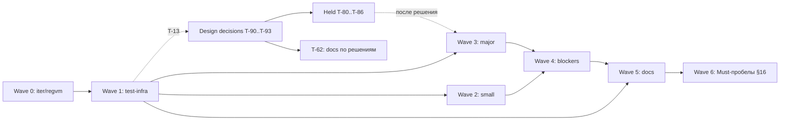

# TASKS — план работ

Волны 0–5 — план по `AUDIT_REPORT.md` (ветка `iter/regvm` @ `8ab58cf`, коммит аудита; `main` @ `41bbb70`), задачи с label `audit`. Wave 6 — Must-пробелы §16 относительно спеки, label `spec-gap`. Конвенции — `CONTRIBUTING.md`.
Задач в волнах 0–5: **39** — fail-fast 5, full-fix 23, test-infra 7, docs 3, merge 1; Wave 6: **10** (feature). Отдельно: 4 design-decision issue (T-90…T-93, не на доске) и 8 задач, ждущих их решения (T-80…T-86, T-62).
Нумерация: каждая волна начинается с нового десятка (T-10 — набор тестов из §7 аудита). `depends_on` всегда ссылается на меньший номер — граф ацикличен по построению.

Статус задач — только на [доске](https://github.com/users/it1ro/projects/5) «Brig — разработка» (GitHub Projects v2, проект 5). `TASKS.md` хранит план: волны, зависимости, DoD и ссылку на issue у каждой T-NN, но не статусы, поэтому не устаревает при смене статуса. Эпики: Wave 5 — [#49](https://github.com/it1ro/brig-lang/issues/49), Wave 6 — [#124](https://github.com/it1ro/brig-lang/issues/124).

Задачи, созданные по ходу работ (в план ниже не входят):

| T-NN | Issue | Задача | Finding | Волна |
|---|---|---|---|---|
| T-16 | [#65](https://github.com/it1ro/brig-lang/issues/65) | CI: установка golangci-lint падает на checksum | — | Wave 1 |
| T-44 | [#50](https://github.com/it1ro/brig-lang/issues/50) | Fail-fast: параметры-паттерны и variadic в лямбдах `fn (…)` | родственна S-F2 (найдена в T-01) | Wave 3 |
| T-45 | [#57](https://github.com/it1ro/brig-lang/issues/57) | exit-коды: классификация ошибок в cmd/brig | A-F7 (по итогам T-14) | Wave 3 |
| T-46 | [#58](https://github.com/it1ro/brig-lang/issues/58) | runModule прогоняет sema | A-F7 (по итогам T-14) | Wave 3 |
| T-47 | [#60](https://github.com/it1ro/brig-lang/issues/60) | RECVTIMER: валидация ms | I-F14 (по итогам T-15) | Wave 3 |
| T-48 | [#61](https://github.com/it1ro/brig-lang/issues/61) | wakeExpired: детерминированный порядок (deadline, seq) | I-F14 (по итогам T-15) | Wave 3 |
| T-49 | [#91](https://github.com/it1ro/brig-lang/issues/91) | compileVar: локальная fn предка перекрывает локаль промежуточной функции | — (найдена при ревью T-51) | Wave 3 |
| T-55 | [#92](https://github.com/it1ro/brig-lang/issues/92) | vm.Verify: timeout-ребро RECVTAKE и структурные инварианты MATCHLOCAL | I-F1 | Wave 3 |
| T-56 | [#94](https://github.com/it1ro/brig-lang/issues/94) | Локальная fn: затенение на промежуточном уровне | A-F6 | Wave 3 |
| T-57 | [#99](https://github.com/it1ro/brig-lang/issues/99) | sema: guard клозов fn не проверяется | — (найдена в T-52) | Wave 3 |
| T-63 | [#113](https://github.com/it1ro/brig-lang/issues/113) | Docs: актуализировать TASKS.md, удалить STATUS.md, правила для spec-gap | — | Wave 5 |
| T-94 | [#55](https://github.com/it1ro/brig-lang/issues/55) | DD: §12.4 vs `after_clause` (inline after) | §8 аудита (из T-60) | — |

## Verification needed

Findings с тегом `[inferred]`. Задача-фикс не создаётся до результата проверки. `I-F4`, `I-F6`, `I-F11` тоже `[inferred]`, но аудит сам пометил их `ok` / «не дыра» — они в разделе «False positives / no-op».

| Finding | Что проверить | Команда/тест | Если подтвердится | Если нет |
|---|---|---|---|---|
| A-F1 (T-13) | Все акторы исполняются в одной goroutine кооперативным run-loop (`internal/vm/scheduler.go:313-428`) | `rg -n 'go func\|go s\.' internal/vm`; тест `TestVerifyAF1SingleGoroutineScheduler`: spawn 100 акторов, `runtime.NumGoroutine()` растёт меньше чем на 100 | T-90 остаётся открытым; после решения — T-80 | A-F1 → `false-positive`, T-90 закрывается как неактуальный, T-80 не создаётся |
| A-F7 (T-14) | (1) «срез: не реализовано» → exit 3 вместо 1; (2) `internal: upvalue out of range` → exit 2 вместо 3; (3) `runModule` (`internal/compiler/compiler_test.go:13-33`) не прогоняет sema | (1)(2) `go run ./cmd/brig run <probe>.brig; echo $?` по `cmd/brig/main.go:162-166, 208-211`; (3) тест `TestVerifyAF7RunModuleSkipsSema`: `print(trap(1+1))` компилируется через `runModule`, а `brig check` отвергает | Создать issue «exit-коды: классификация ошибок в cmd/brig» (full-fix, wave 3) и/или «runModule прогоняет sema» (test-infra, wave 3) — по подтверждённым пунктам | Неподтверждённый пункт → `false-positive` |
| I-F14 (T-15) | (1) Большой `ms` в `RECVTIMER` молча усекается или переполняется (`scheduler.go:888-894`); (2) `wakeExpired` (`scheduler.go:366`) даёт недетерминированный порядок в `ready` | (1) тест `TestVerifyIF14HugeTimerMs`: `after 9223372036854775807`; (2) программа из N акторов с одинаковым таймаутом: `for i in $(seq 20); do go run ./cmd/brig run p.brig; done \| sort \| uniq -c` — больше одной строки значит недетерминизм | Issue «RECVTIMER: валидация ms» и/или «wakeExpired: детерминированный порядок (deadline, seq)» (full-fix, wave 3) | `false-positive` |

## Design decisions required

Код по этим findings не пишется до решения автора языка. Для каждого заведён issue с label `design-decision` (не на доске). Задачи, которые ждут решения, — T-80…T-86 (Wave 3) и T-62 (Wave 5, запись решений в doc 02 и спеку): issues созданы, на доске в Blocked. После решения задача переходит в Todo, а если выбранный вариант её отменяет — закрывается как won't-fix (так сказано в её DoD). Полные блоки — в разделе «Задачи».

| Finding | Вопрос | Варианты | Что блокирует |
|---|---|---|---|
| A-F1 (T-90) | «1 актор = 1 goroutine» (§15.2, architecture.md:148) — норматив или деталь реализации? | **A:** описать кооперативный однопоточный loop как соответствующий спеке (правка §15.2 и architecture.md); детерминизм §15.4 сохраняется. **B:** переписать scheduler на goroutine-per-actor: L+, гонки, детерминизм §15.4 теряется. **C:** спека фиксирует только наблюдаемую семантику (порядок, fairness), модель потоков — свобода реализации | T-80; follow-up из T-15 (порядок таймеров) |
| A-F3 (T-91) | Не-Bool в `if`/`and`/`or` — это `:type_error` (тир 1: §7.2, §8.1, §16) или truthiness (K-2 в doc 02)? | **A:** строгий Bool везде, включая правый операнд `and`/`or`; правый операнд тогда не хвостовой, T-82 закрывается как won't-fix, doc 02 §4 табл. п.6 правится. **B:** строгий Bool для условия и левого операнда, правый не проверяется (как `andalso` в Erlang); T-82 делается. **C:** оставить K-2 и править §7.2/§16 (тир 1) | T-81, T-82; семантика не-Bool guard в T-51/T-52 |
| A-F4 (T-92) | Ловится ли `:type_error` через `trap`? | **A:** да (§10.4): `arithErr`, `NOT`, `Compare` → ловимый `ErrRaise(:type_error)`. **B:** нет (K-3): `decArithErr` становится фатальным, §10.4 правится. **C:** арифметика и сравнения ловятся, внутренние инварианты VM — нет (явный список в doc 02) | T-83; при A-F3=A — вид ошибки из `JMPIF` |
| I-F8 (T-93) | Как сравниваются числа разных видов в `==`/`<`, паттернах, ключах Map/Set? | **A:** паттерны и ключи — строго по Kind (`runtime.MatchEqual`), `==`/`<` — точно по значению (Int×Float через `big.Rat`), Decimal×Float → `:type_error` везде. **B:** Decimal×Float → `false` везде (включая `==`), без ошибок. **C:** Decimal×Float сравниваются точно через `big.Rat` везде | T-84, T-85, T-86 |

### Задачи, ждущие решения

| T-NN | Issue | Задача | Finding | Ждёт |
|---|---|---|---|---|
| T-80 | [#105](https://github.com/it1ro/brig-lang/issues/105) | Scheduler: привести доки или код к решению A-F1 | A-F1 | [#40](https://github.com/it1ro/brig-lang/issues/40) |
| T-81 | [#106](https://github.com/it1ro/brig-lang/issues/106) | JMPIF/JMPIFNOT: не-Bool → :type_error | A-F3 | [#41](https://github.com/it1ro/brig-lang/issues/41) |
| T-82 | [#107](https://github.com/it1ro/brig-lang/issues/107) | Компилятор: правый операнд and/or в хвостовой позиции | I-F3 | [#41](https://github.com/it1ro/brig-lang/issues/41) |
| T-83 | [#108](https://github.com/it1ro/brig-lang/issues/108) | Единая классификация type errors | A-F4 | [#42](https://github.com/it1ro/brig-lang/issues/42) |
| T-84 | [#109](https://github.com/it1ro/brig-lang/issues/109) | Паттерны: точное сравнение литералов (MatchEqual) | I-F8 | [#43](https://github.com/it1ro/brig-lang/issues/43) |
| T-85 | [#110](https://github.com/it1ro/brig-lang/issues/110) | Точное сравнение Int×Float | I-F8 | [#43](https://github.com/it1ro/brig-lang/issues/43) |
| T-86 | [#111](https://github.com/it1ro/brig-lang/issues/111) | Decimal×Float: единое поведение в INDEX, Map/Set, паттернах | I-F8 | [#43](https://github.com/it1ro/brig-lang/issues/43) |
| T-62 | [#112](https://github.com/it1ro/brig-lang/issues/112) | Docs: записать решения DD #41–#43 в doc 02 и спеку | A-F3, A-F4, I-F8 | #41, #42, #43 |

### T-90 · DD: модель планировщика (1 актор = 1 goroutine)
<!-- meta
priority: P2
type: design-decision
effort: small
model: human
wave: —
depends_on: —
findings: [A-F1]
extra_labels: design-decision
-->
- **Issue:** [#40](https://github.com/it1ro/brig-lang/issues/40)
- **Файлы:** docs/architecture.md:148, docs/01-language-design.md §15.2, internal/vm/scheduler.go:313-428
- **Тест-якорь:** — (решение, не код); факты — из T-13
- **DoD:** в issue записан выбранный вариант (A/B/C из таблицы) и ссылка на коммит/раздел, где он зафиксирован. Issue закрыт.
- **НЕ делать:** писать код до решения; трогать scheduler; решать заодно I-F14.

### T-91 · DD: truthiness или строгий Bool
<!-- meta
priority: P1
type: design-decision
effort: small
model: human
wave: —
depends_on: —
findings: [A-F3]
extra_labels: design-decision
-->
- **Issue:** [#41](https://github.com/it1ro/brig-lang/issues/41)
- **Файлы:** docs/02-register-based-virtual-machine.md (K-2, §4 табл. п.6), docs/01-language-design.md §7.2, §8.1, §16
- **Тест-якорь:** — ; пробы `p/t7_if_nonbool.brig`, `p/w3_andor_nonbool.brig`
- **DoD:** в issue записан выбранный вариант (A/B/C) и судьба T-82 (делается / won't-fix). Issue закрыт.
- **НЕ делать:** писать код до решения; менять `compileAndOr`; решать заодно A-F4.

### T-92 · DD: ловится ли :type_error
<!-- meta
priority: P1
type: design-decision
effort: small
model: human
wave: —
depends_on: —
findings: [A-F4]
extra_labels: design-decision
-->
- **Issue:** [#42](https://github.com/it1ro/brig-lang/issues/42)
- **Файлы:** docs/02-register-based-virtual-machine.md (K-3), docs/01-language-design.md §10.4, internal/vm/vm.go:113,356
- **Тест-якорь:** — ; проба `p/x1_typeerr.brig`
- **DoD:** в issue записан выбранный вариант (A/B/C). Issue закрыт.
- **НЕ делать:** писать код до решения; менять `decArithErr`/`arithErr`; решать заодно A-F3.

### T-93 · DD: равенство чисел разных видов
<!-- meta
priority: P1
type: design-decision
effort: small
model: human
wave: —
depends_on: —
findings: [I-F8]
extra_labels: design-decision
-->
- **Issue:** [#43](https://github.com/it1ro/brig-lang/issues/43)
- **Файлы:** internal/vm/pattern.go:67, internal/runtime/value.go:361-370, internal/vm/vm.go:361-363, docs/01-language-design.md §4.8
- **Тест-якорь:** — ; пробы `p/w1_pat_exact.brig`, `p/w2_bigprec.brig`, `p/v6_mixed.brig`
- **DoD:** в issue записан выбранный вариант (A/B/C) для каждого из трёх мест (паттерны, `==`/`<`, ключи Map/Set). Issue закрыт.
- **НЕ делать:** писать код до решения; вводить `MatchEqual`; решать заодно A-F4.

## Waves

**Wave 0 — на ветке `iter/regvm`, до merge.** Вход: аудит на `8ab58cf`. Коммиты идут прямо в `iter/regvm` (integration-ветка, `CONTRIBUTING.md` §3), формат `<type>(<scope>): <subject> [T-NN]`; issue закрывается ссылкой на коммит. Каждая задача сама создаёт свой тест-якорь: правило «тесты §7 до фиксов» действует с Wave 1. Отклонение от «только fail-fast»: T-06 (lint, O-F3) — без него `make all` красный и merge невозможен. Выход: T-07 закрыт, теги `stack-vm-final` и `regvm-merged` на origin.

**Wave 1 — test-infra и разблокировка.** Вход: T-07. Выход: набор §7 в `main` (упавшие тесты — через `t.Skip("blocked: T-NN")`), golden `.ast` содержательны, skills актуальны, по трём `[inferred]` findings есть вердикт.

**Wave 2 — small fixes слоя 1.** Вход: T-10 и T-11 (golden `.ast` осмысленны). Выход: все задачи волны закрыты, `make all` зелёный.

**Wave 3 — major fixes.** Вход: T-10; для T-37 — T-30. Задачи, завязанные на A-F1/A-F3/A-F4/I-F8, сюда не входят (T-80…T-86). Выход: все задачи волны закрыты, ни одного `t.Skip("blocked: T-3x")` в репо.

**Wave 4 — blockers full-fix.** Вход: T-11, T-20, T-23, T-36. Выход: fail-fast из T-01, T-02, T-04 удалены, канонические примеры §6.1/§6.5/§12.4 и интерполяция дают правильный результат.

**Wave 5 — docs cleanup.** Вход: T-12; для T-61 — все волны 0–4. Выход: §8 и §5 аудита закрыты, `TASKS.md` и `AUDIT_REPORT.md` связаны с issues. T-60 переоткрыт 2026-09-26: его PR #52 закрыт без merge. T-62 ждёт design decisions, T-63 синхронизирует план с доской.

**Wave 6 — Must-пробелы §16.** Вход: волны 0–4 закрыты. Задачи с label `spec-gap` и Task type `feature` реализуют Must-фичи §16, которые парсятся, но не компилируются или отсутствуют: `match`, `with`, pipe, записи, вариадики, `Sys.args()`/`link`/`mailbox_size()`, term order, формат диагностики, stack trace. Зависимости: T-71 ждёт T-70; T-74 ждёт T-70 и T-73. Почти все задачи волны правят `internal/compiler/compiler.go`, поэтому по `MAINTAINING.md` §5 их не берут параллельно; исключения — T-77 (`runtime.Compare`) и T-79 (scheduler, `cmd/brig`). Выход: `rg -n 'срез: (pipe|record literal|неподдерживаемое выражение)' internal/compiler` пуст, `make check-examples` → `failed 0`.

## Задачи

### T-01 · Fail-fast: мультиклозы, guard и параметры-паттерны fn
<!-- meta
priority: P0
type: fail-fast
effort: small
model: sonnet
wave: 0
depends_on: —
findings: [S-F2]
-->
- **Issue:** [#1](https://github.com/it1ro/brig-lang/issues/1)
- **Файлы:** internal/parser/stmt.go:111-146, internal/compiler/compiler.go:357-371
- **Тест-якорь:** `TestAuditMultiClauseNotSilentlyDropped` в `internal/compiler/audit_regress_test.go` (создать)
- **DoD:** `Compile` возвращает ошибку, если `len(clauses)>1`, есть guard или параметр не `IdentPattern`/`..name`. Программы `p/t10_multiclause.brig`, `p/u2_guard_fn.brig`, `p/u1_spec65.brig` дают ошибку компиляции, а не `fact(5)=1` / `"positive"` / `pow(2,10)=1`. `TestAuditMultiClauseNotSilentlyDropped`, `TestRecursion`, `TestLocalFn` зелёные. `make all` и `BRIG_VERIFY=1 go test ./...` возвращают 0. `go run ./cmd/check-examples -- docs/01-language-design.md` → `checked 62, failed 0`.
- **НЕ делать:** реализовывать `Params []ast.Pattern` (T-50); трогать doc-файлы; рефакторить вокруг фикса; чинить разбор `when ident ->` (S-F4, T-20).

### T-02 · Fail-fast: guard в ветках recv
<!-- meta
priority: P1
type: fail-fast
effort: medium
model: sonnet
wave: 0
depends_on: —
findings: [S-F3]
-->
- **Issue:** [#2](https://github.com/it1ro/brig-lang/issues/2)
- **Файлы:** internal/parser/expr.go:937-941, :970-974; internal/ast/construct.go:89-92 (`RecvBranchArg`); internal/ast/format.go; internal/ast/equal.go; internal/compiler/compiler.go:1438 (`compileRecv`)
- **Тест-якорь:** `TestAuditRecvGuardSurvivesRoundTrip` (создать, parser) и `TestAuditRecvGuardRejected` (создать, compiler)
- **DoD:** `RecvBranchArg` содержит поле `Guard ast.Expr`; парсер его заполняет; `Format` печатает `when <guard>`; `ast.Equal` сравнивает `Guard`. `Compile` возвращает ошибку, если `Guard != nil`; `p/t9_guard.brig` даёт ошибку компиляции, а не `:big`. Отвергать guard в парсере нельзя: doc 01:1084 содержит guard в `recv`, и `check-examples` → `checked 62, failed 0`. Оба теста зелёные, `make all` → 0.
- **НЕ делать:** компилировать guard (T-52); трогать doc-файлы; рефакторить разбор recv; чинить `when ident ->` (S-F4, T-20).

### T-03 · Fail-fast: гибрид ensure теряет блок
<!-- meta
priority: P1
type: fail-fast
effort: small
model: sonnet
wave: 0
depends_on: —
findings: [S-F5]
-->
- **Issue:** [#3](https://github.com/it1ro/brig-lang/issues/3)
- **Файлы:** internal/parser/expr.go:887-906
- **Тест-якорь:** `TestAuditEnsureHybridRejected` в `internal/parser/negative_test.go` (создать)
- **DoD:** `ensure expr NEWLINE INDENT …` (проба `p/u3_ensure_hybrid.brig`) → ошибка парсинга. Блочная форма `ensure NEWLINE INDENT …` → ошибка с текстом, содержащим `ensure` и `MVP`. Тест зелёный. `check-examples` → `checked 62, failed 0`. `make all` → 0.
- **НЕ делать:** реализовывать блочную форму ensure (Out of scope); трогать doc-файлы; рефакторить разбор trap; чинить область видимости ensure (I-F5, T-37).

### T-04 · Fail-fast: интерполяция строк → явная ошибка
<!-- meta
priority: P0
type: fail-fast
effort: small
model: sonnet
wave: 0
depends_on: —
findings: [S-F1]
-->
- **Issue:** [#4](https://github.com/it1ro/brig-lang/issues/4)
- **Файлы:** internal/compiler/compiler.go:1844-1848
- **Тест-якорь:** `TestAuditInterpolationFailsFast` в `internal/compiler/audit_regress_test.go` (создать)
- **DoD:** компиляция `"x = \(x)"` (`p/t3_interp.brig`) → ошибка с текстом `interpolation`. Строка с экранированным `\\(` компилируется в литерал. Тест зелёный. `make run-examples` → 0. `check-examples` → `checked 62, failed 0` (он только парсит). `make all` → 0.
- **НЕ делать:** строить узел Interp в лексере/парсере (T-53); трогать doc-файлы; рефакторить декодирование строк; чинить числовые литералы в том же файле (S-F7, T-22).

### T-05 · REPL: nil-deref на любой строке
<!-- meta
priority: P0
type: full-fix
effort: small
model: sonnet
wave: 0
depends_on: —
findings: [O-F1]
-->
- **Issue:** [#5](https://github.com/it1ro/brig-lang/issues/5)
- **Файлы:** internal/compiler/compiler.go:494 (`CompileReplLine`), internal/repl/repl.go:81
- **Тест-якорь:** `TestAuditReplSnapshot` в `internal/repl/audit_repl_test.go` (создать): `x=5; f=()->x; x=10; f()==5`
- **DoD:** `CompileReplLine` инициализирует `c.image`. `printf 'x = 5\n' | go run ./cmd/brig repl` возвращает 0 без panic. Тест зелёный. `make all` → 0.
- **НЕ делать:** перепроектировать REPL / переиспользование `Scheduler` (§9 аудита); трогать doc-файлы и устаревшие комментарии `cmd/brig/main.go` (T-60); рефакторить `repl.go`.

### T-06 · Lint: 10 замечаний golangci-lint
<!-- meta
priority: P0
type: test-infra
effort: small
model: sonnet
wave: 0
depends_on: —
findings: [O-F3]
-->
- **Issue:** [#6](https://github.com/it1ro/brig-lang/issues/6)
- **Файлы:** по выводу `golangci-lint run ./...`: internal/vm/opcodes.go, internal/vm/pattern.go:15, internal/vm/prelude_json.go:10 (`InstallJsonPrelude` → `InstallJSONPrelude`), internal/vm/regs_test.go:104, internal/runtime/json.go:71, internal/vm/vm.go:197,249 и др.
- **Тест-якорь:** `golangci-lint run ./...` (существующая команда)
- **DoD:** `golangci-lint run ./...` → rc=0. `make all` → 0. `git diff` не меняет `.golangci.yml` и не добавляет новых `//nolint`. `BRIG_VERIFY=1 go test ./...` → 0.
- **НЕ делать:** отключать линтеры в конфиге; менять поведение кода; трогать doc-файлы; переписывать print-only тесты (O-F2, T-30).

### T-07 · Merge iter/regvm → main
<!-- meta
priority: P0
type: merge
effort: small
model: human
wave: 0
depends_on: T-01, T-02, T-03, T-04, T-05, T-06
findings: []
-->
- **Issue:** [#7](https://github.com/it1ro/brig-lang/issues/7)
- **Файлы:** git (ветка `iter/regvm` на origin); `AUDIT_REPORT.md`, `CONTRIBUTING.md`, `TASKS.md`, `MAINTAINING.md` уже закоммичены в `iter/regvm` и попадают в `main` squash-коммитом
- **Тест-якорь:** `make all` и `BRIG_VERIFY=1 go test ./...` на `main` после merge
- **DoD:** тег `stack-vm-final` стоит на `main` до merge (`41bbb70`) и запушен. В `main` один squash-коммит из `iter/regvm` с `[T-07]` в subject и списком T-01…T-06 в body. `AUDIT_REPORT.md`, `CONTRIBUTING.md`, `TASKS.md` есть в `main`. Тег `regvm-merged` стоит на squash-коммите и запушен. На `main` `make all` → 0, `BRIG_VERIFY=1 go test ./...` → 0. `iter/regvm` удалена локально и на origin.
- **НЕ делать:** merge-commit или rebase-merge (только squash, `CONTRIBUTING.md` §5); чинить что-либо в ходе merge; `push --force` в `main`; трогать doc-файлы.

### T-10 · Набор регресс-тестов из §7 аудита
<!-- meta
priority: P0
type: test-infra
effort: medium
model: sonnet
wave: 1
depends_on: T-07
findings: [I-F2]
-->
- **Issue:** [#8](https://github.com/it1ro/brig-lang/issues/8)
- **Файлы:** internal/compiler/audit_regress_test.go (дополнить; стиль `regvm_test.go`), internal/vm/verify_test.go (создать; чанки через `NewChunk`/`Emit`), internal/ast/audit_pretty_test.go (создать)
- **Тест-якорь:** создать тесты §7. Проходят сразу: `TestAuditNoTailCallInsideTrap`, `TestVerifyRejectsTailCallUnderTrap`, `TestVMTailCallUnderTrapGuard` (`RunMain` без Verify → `internal: TAILCALL under active trap`). Со `t.Skip("blocked: T-NN")`: `TestAuditAndOrRightOperandIsTail` (T-82), `TestAuditLocalFnCapturesEnclosingParam` (T-39), `TestAuditBigIntLiteral` и `TestAuditLeadingZeroIsDecimal` (T-22), `TestAuditDownReasonCarriesRaiseValue` (T-40), `TestAuditTrapInsideNativeCallback` (T-34), `TestAuditEnsureSeesBodyLocals` (T-37), `TestAuditLiteralPatternIsExact` (T-84), `TestVerifyMatchLocalBranchUndefinedReg` и `TestVerifyRecvAfterUndefinedReg` (T-36), `TestAuditPrettyPrintsFuncDecl` (T-11). Уже созданы в Wave 0: `TestAuditMultiClauseNotSilentlyDropped`, `TestAuditRecvGuardSurvivesRoundTrip`, `TestAuditReplSnapshot`.
- **DoD:** все перечисленные тесты существуют. `rg -c 't.Skip\("blocked: T-' internal` в сумме даёт 11. Каждый skip-тест падает, если убрать `t.Skip` (вывод прогона — в body PR). `make all` → 0, `BRIG_VERIFY=1 go test ./...` → 0.
- **НЕ делать:** чинить какой-либо finding; трогать doc-файлы; переписывать print-only тесты (O-F2, T-30); переводить `runModule` на sema (A-F7, T-14).

### T-11 · ast.Pretty и ast.Walk не видят Decl
<!-- meta
priority: P1
type: test-infra
effort: medium
model: sonnet
wave: 1
depends_on: T-10
findings: [S-F13]
-->
- **Issue:** [#9](https://github.com/it1ro/brig-lang/issues/9)
- **Файлы:** internal/ast/decl.go:14,25,40,69 (`IsExpression` у Decl), internal/ast/pretty.go:35, internal/ast/visitor.go:31, testdata/golden/*.ast
- **Тест-якорь:** `TestAuditPrettyPrintsFuncDecl` (снять skip) и `TestWalkVisitsFuncDecl` (создать)
- **DoD:** оба теста зелёные. `rg -lx '\(program \)' testdata/golden` находит только файлы с действительно пустой программой (список — в body PR). `make update-golden` — прогнать, diff просмотреть глазами; golden — отдельным коммитом `test(ast): regenerate golden files [T-11]`. `make all` → 0.
- **НЕ делать:** менять `ast.Format`; трогать doc-файлы; рефакторить visitor сверх фикса порядка case; чинить идемпотентность guard (S-F12, T-20).

### T-12 · Обновить устаревшие skills
<!-- meta
priority: P2
type: docs
effort: small
model: sonnet
wave: 1
depends_on: T-11
findings: []
-->
- **Issue:** [#10](https://github.com/it1ro/brig-lang/issues/10)
- **Файлы:** .claude/skills/brig-compiler/SKILL.md, .claude/skills/brig-vm/SKILL.md, .claude/skills/brig-overview/SKILL.md, .claude/skills/brig-parser-ast/SKILL.md, .claude/skills/brig-testing-workflow/SKILL.md
- **Тест-якорь:** `rg`-проверки из DoD (существующая команда)
- **DoD:** каждое расхождение из таблицы «Шаг 0» аудита исправлено: brig-compiler не утверждает, что проверка `trapDepth` существует (ссылка на T-31), «предки» → «только прямой родитель» (T-35), `and`/`or` → CALL (T-82); brig-vm различает pid, «никогда не существовавший» и «завершившийся» (T-40), указывает потерю `val` в `:down` (T-40) и что Verify не моделирует MATCHLOCAL/after (T-36); brig-overview — иерархия источников как в AUDIT_PROMPT. `rg -n '65' .claude/skills` не находит «65/65» и «65 блоков». `rg -n 'brig-cli' .claude/skills` пуст.
- **НЕ делать:** править `docs/` (T-60); менять код; создавать несуществующие skills `brig-cli/docs/sync/test`.

### T-13 · Verify: A-F1 — однопоточный scheduler
<!-- meta
priority: P2
type: test-infra
effort: small
model: sonnet
wave: 1
depends_on: T-07
findings: [A-F1]
extra_labels: verification
-->
- **Issue:** [#11](https://github.com/it1ro/brig-lang/issues/11)
- **Файлы:** internal/vm/scheduler.go:313-428
- **Тест-якорь:** `TestVerifyAF1SingleGoroutineScheduler` (создать)
- **DoD:** команда и тест из таблицы «Verification needed» прогнаны, вывод — комментарием в issue. Если подтверждено: тест закоммичен, в T-90 добавлена ссылка на результат. Если нет: label `false-positive` на этом issue, T-90 закрыт с комментарием.
- **НЕ делать:** менять scheduler; трогать doc-файлы (T-80 после решения T-90); чинить порядок таймеров (I-F14, T-15).

### T-14 · Verify: A-F7 — exit-коды и тесты в обход sema
<!-- meta
priority: P2
type: test-infra
effort: small
model: sonnet
wave: 1
depends_on: T-07
findings: [A-F7]
extra_labels: verification
-->
- **Issue:** [#12](https://github.com/it1ro/brig-lang/issues/12)
- **Файлы:** cmd/brig/main.go:162-166, 208-211; internal/compiler/compiler_test.go:13-33
- **Тест-якорь:** `TestVerifyAF7RunModuleSkipsSema` (создать)
- **DoD:** три пункта из таблицы «Verification needed» прогнаны, вывод (`echo $?` по каждой пробе) — комментарием в issue. По каждому подтверждённому пункту создан issue по шаблону `TASKS.md` и добавлен на доску (Wave 3). По неподтверждённому — запись `false-positive` в комментарии.
- **НЕ делать:** менять exit-коды в этой сессии; переводить `runModule` на sema; чинить падение локальной fn с захватом (I-F7, T-38).

### T-15 · Verify: I-F14 — таймеры
<!-- meta
priority: P2
type: test-infra
effort: small
model: sonnet
wave: 1
depends_on: T-07
findings: [I-F14]
extra_labels: verification
-->
- **Issue:** [#13](https://github.com/it1ro/brig-lang/issues/13)
- **Файлы:** internal/vm/scheduler.go:366 (`wakeExpired`), :888-894 (`RECVTIMER`)
- **Тест-якорь:** `TestVerifyIF14HugeTimerMs` (создать)
- **DoD:** тест и цикл 20 прогонов из таблицы «Verification needed» выполнены, вывод — комментарием в issue. По каждому подтверждённому пункту создан issue по шаблону `TASKS.md` на доске (Wave 3). По неподтверждённому — `false-positive`.
- **НЕ делать:** чинить таймеры в этой сессии; менять модель scheduler (A-F1, T-90); трогать doc-файлы.

### T-20 · Parser: guard через parseOr и идемпотентный round-trip guard
<!-- meta
priority: P1
type: full-fix
effort: small
model: sonnet
wave: 2
depends_on: T-11
findings: [S-F4, S-F12]
-->
- **Issue:** [#14](https://github.com/it1ro/brig-lang/issues/14)
- **Файлы:** internal/parser/expr.go:34 (`tryLambda` из разбора guard), :937-941, :970-974; internal/parser/stmt.go:90-99, 190-199, 225-232 (`normalizeGuardString`, `stripOuterParens`)
- **Тест-якорь:** `TestParseGuardSingleIdent` (создать; пробы `fn_guard_ident`, `recv_guard_ident`) и `TestRoundTripGuardParenString` (создать; `fn f(x) when x == ")" -> 1`)
- **DoD:** guard разбирается через `parseOr()`. `fn f(x) when x -> 1` и `n when ok -> …` парсятся без `expected '->'`. Для `fn f(x) when x == ")" -> 1` `EQUAL=true IDEMPOTENT=true`. `make test-parser` и `make test-roundtrip` → 0. `make update-golden` — прогнать, diff просмотреть глазами. `make all` → 0.
- **НЕ делать:** переводить guard fn в `ast.Expr` (T-50); компилировать guard (T-51/T-52); трогать doc-файлы; рефакторить разбор лямбд.

### T-21 · Parser: NEWLINE обязателен между стейтментами
<!-- meta
priority: P1
type: full-fix
effort: small
model: sonnet
wave: 2
depends_on: T-11
findings: [S-F6]
-->
- **Issue:** [#15](https://github.com/it1ro/brig-lang/issues/15)
- **Файлы:** internal/parser/stmt.go:13-26 (`parseStmtList`)
- **Тест-якорь:** `TestParseRequiresNewlineBetweenStmts` (создать; пробы `two_stmts_one_line`, `p/u4_two_stmt_line.brig`, `p/z1.brig`)
- **DoD:** после `parseStmt` требуется NEWLINE, DEDENT, EOF или `until`; `x = 1 y = 2` → ошибка парсинга. Тест зелёный. `check-examples` → `checked 62, failed 0`. `make update-golden` — прогнать, diff просмотреть глазами. `make all` → 0.
- **НЕ делать:** чинить лексер `0b102` (S-F11, T-23); NEWLINE-sep в args/params (S-F8, T-24); трогать doc-файлы; рефакторить `parseStmt`.

### T-22 · Числовые литералы: base 10 по умолчанию и произвольная точность
<!-- meta
priority: P1
type: full-fix
effort: small
model: sonnet
wave: 2
depends_on: T-10
findings: [S-F7]
-->
- **Issue:** [#16](https://github.com/it1ro/brig-lang/issues/16)
- **Файлы:** internal/compiler/compiler.go:1786-1791
- **Тест-якорь:** `TestAuditBigIntLiteral`, `TestAuditLeadingZeroIsDecimal` (снять skip); `TestIntLiteralBases` (создать)
- **DoD:** разбор по префиксу (`0x`/`0b`/`0o` → 16/2/8, иначе 10) через `big.Int.SetString` + `runtime.IntBig`. `010` → Int 10; `08` → Int 8; `99999999999999999999` → Int (печатается без изменений); `-9223372036854775808` → Int. Тесты зелёные. Если меняется bytecode — `make update-bytecode`, прогнать, diff просмотреть глазами. `make all` → 0.
- **НЕ делать:** чинить `0x_1` в лексере (S-F11, T-23); трогать разбор Float; трогать doc-файлы; рефакторить таблицу констант.

### T-23 · Lexer: `0x_1`, `0b102`, ATOM после `)`
<!-- meta
priority: P2
type: full-fix
effort: small
model: sonnet
wave: 2
depends_on: T-10
findings: [S-F11]
-->
- **Issue:** [#17](https://github.com/it1ro/brig-lang/issues/17)
- **Файлы:** internal/lexer/lexer.go (числовые литералы, правило §1.5 для `:`)
- **Тест-якорь:** негативные кейсы в `internal/lexer/lexer_test.go` (создать): `0x_1` → ошибка, `0b102` → ошибка, `f():x` после `)` → COLON (проба `p/z4.brig`)
- **DoD:** три кейса зелёные. `make test-lexer` → 0. `go test ./internal/lexer -run '^$' -fuzz FuzzLex -fuzztime 10s` → PASS. `make all` → 0.
- **НЕ делать:** требовать NEWLINE в парсере (S-F6, T-21); менять escape-последовательности; трогать doc-файлы; разбор значения литерала (S-F7, T-22).

### T-24 · Parser: NEWLINE-sep, паттерн `()`, порядок в with
<!-- meta
priority: P3
type: full-fix
effort: medium
model: sonnet
wave: 2
depends_on: T-11
findings: [S-F8, S-F9, S-F10]
-->
- **Issue:** [#18](https://github.com/it1ro/brig-lang/issues/18)
- **Файлы:** internal/parser/expr.go:377 (`parseArgs`), :470 (tuple), :797-813 (`with`); internal/parser/stmt.go:134 (`parseParams`); internal/parser/pattern.go:98-103
- **Тест-якорь:** `TestParseNewlineSepArgsParamsTuple`, `TestParseUnitPattern`, `TestParseWithInterleave` (создать; пробы `args_newline_sep`, `params_newline_sep`, `unit_pattern`, `with_interleave`)
- **DoD:** три теста зелёные. `make test-parser` и `make test-roundtrip` → 0. `make update-golden` — прогнать, diff просмотреть глазами. `make all` → 0.
- **НЕ делать:** компилировать `with`/`match` (K-8); требовать NEWLINE между стейтментами (S-F6, T-21); трогать doc-файлы; рефакторить разбор list/map/record.

### T-30 · Переписать print-only тесты на утверждения
<!-- meta
priority: P1
type: test-infra
effort: medium
model: sonnet
wave: 3
depends_on: T-10
findings: [O-F2]
-->
- **Issue:** [#19](https://github.com/it1ro/brig-lang/issues/19)
- **Файлы:** internal/compiler/compiler_test.go:60-260, 478-490
- **Тест-якорь:** существующие `TestTrapEnsureLifo`, `…LifoOnError`, `TestEnsureAllRunOnFailure`, `TestTrapEnsureRaisesIn*`, `TestTrapCatchesDivisionByZero`, `TestTrapBlockPropagatesThroughFn`, `TestAndOr`, `TestLocalFn`, `TestClosure*`, `TestMutualRecursion`, `TestLocalFnRecursion`
- **DoD:** каждый перечисленный тест сравнивает результат с ожидаемым и падает через `t.Fatalf`/`t.Errorf` при несовпадении. Для LIFO: `result == Error(:first_registered)` при двух `ensure raise(...)`. Если текущее поведение неверно по аудиту — `t.Skip("blocked: T-NN")`, а не подгонка ожидания. `go test ./internal/compiler` → 0.
- **НЕ делать:** менять компилятор; переводить `runModule` на sema (A-F7, T-14); трогать doc-файлы; чинить область видимости ensure (I-F5, T-37).

### T-31 · Компилятор: проверка TAILCALL при trapDepth>0
<!-- meta
priority: P1
type: full-fix
effort: small
model: sonnet
wave: 3
depends_on: T-10
findings: [A-F2]
-->
- **Issue:** [#20](https://github.com/it1ro/brig-lang/issues/20)
- **Файлы:** internal/compiler/compiler.go:1037 (`compileGenericCall`), :1069 (`compileGlobalCall`), :1292-1411 (`trapDepth`)
- **Тест-якорь:** `TestCompilerRejectsTailCallUnderTrap` (создать, white-box: `funcCompiler` с `trapDepth=1` и `d.tail=true` → ошибка); `TestAuditNoTailCallInsideTrap` (существует)
- **DoD:** `if d.tail && fc.trapDepth > 0 { fc.fail(...) }` в обоих местах; `rg -n 'trapDepth' internal/compiler/compiler.go` показывает чтение. Оба теста зелёные. `BRIG_VERIFY=1 go test ./...` → 0.
- **НЕ делать:** проверки I-1/I-3 (T-32, T-33); хвостовость `and`/`or` (T-82); менять `vm.Verify` (T-36); трогать doc-файлы.

### T-32 · Компилятор: инвариант I-1 (стек-нейтральность compileExpr)
<!-- meta
priority: P2
type: full-fix
effort: medium
model: opus
wave: 3
depends_on: T-10
findings: [A-F2]
-->
- **Issue:** [#21](https://github.com/it1ro/brig-lang/issues/21)
- **Файлы:** internal/compiler/compiler.go:678 (`compileExpr`)
- **Тест-якорь:** `TestCompileExprStackNeutral` (создать, white-box: выражение, не освобождающее регистр, → ошибка с `I-1`)
- **DoD:** `compileExpr` через `defer` сверяет `nextReg` на выходе с входом (с учётом правил dest); нарушение → `fc.fail` с `I-1`. Тест зелёный. `go test ./...` и `BRIG_VERIFY=1 go test ./...` → 0 (существующие программы не нарушают I-1).
- **НЕ делать:** проверку `trapDepth` (T-31) и I-3 (T-33); менять аллокатор регистров; трогать doc-файлы.

### T-33 · Компилятор: инвариант I-3 (запись в bound-регистр)
<!-- meta
priority: P2
type: full-fix
effort: medium
model: opus
wave: 3
depends_on: T-10
findings: [A-F2]
-->
- **Issue:** [#22](https://github.com/it1ro/brig-lang/issues/22)
- **Файлы:** internal/compiler/compiler.go:138, 164 (`bound[]`), :244 (`emit`)
- **Тест-якорь:** `TestEmitRejectsWriteToBoundReg` (создать, white-box)
- **DoD:** `emit` через `vm.RegUse` проверяет, что A не пишется в bound-регистр (кроме `MATCHLOCAL`); нарушение → `fc.fail` с `I-3`. `rg -n 'bound\[' internal/compiler/compiler.go` показывает чтение. Тест зелёный. `BRIG_VERIFY=1 go test ./...` → 0.
- **НЕ делать:** проверки I-1/trapDepth (T-31, T-32); менять `vm.RegUse`; трогать doc-файлы.

### T-34 · callSync: unwind raise в колбэке прелюдии
<!-- meta
priority: P1
type: full-fix
effort: small
model: sonnet
wave: 3
depends_on: T-10
findings: [A-F5]
-->
- **Issue:** [#23](https://github.com/it1ro/brig-lang/issues/23)
- **Файлы:** internal/vm/scheduler.go:1062 (`callSync`, :1096-1097), :1113 (`tryUnwindRaise`)
- **Тест-якорь:** `TestAuditTrapInsideNativeCallback` (снять skip)
- **DoD:** при `stepFailed` `callSync` вызывает `s.tryUnwindRaise(tmp)` по образцу `runSlice`. `p/v4_trap_across_callsync.brig` (`map(fn (x) -> trap(g(x)), xs)`) завершается с rc=0 и печатает `Error(:bad)`-элементы. Тест зелёный. `BRIG_VERIFY=1 go test ./...` → 0.
- **НЕ делать:** объединять два run-loop; менять классификацию type errors (A-F4, T-83); трогать doc-файлы; чинить удаление мёртвых акторов (I-F9, T-40).

### T-35 · Локальные fn: поиск у предков и манглинг в лямбдах
<!-- meta
priority: P2
type: full-fix
effort: medium
model: sonnet
wave: 3
depends_on: T-10
findings: [A-F6]
-->
- **Issue:** [#24](https://github.com/it1ro/brig-lang/issues/24)
- **Файлы:** internal/compiler/compiler.go:748-758 (`compileVar`), :605 (`compileLocalFn`), :1588 (`prefix+"lambda$"`)
- **Тест-якорь:** `TestLocalFnVisibleFromGrandchild` (создать; `p/t5_…`) и `TestLambdaLocalFnNoNameCollision` (создать; `p/t6_…`)
- **DoD:** `compileVar` ищет `localFns` по всей цепочке предков. Лямбды одной функции получают уникальные префиксы; одноимённые локальные fn в разных лямбдах не перезаписывают друг друга в `image.Functions`. `p/t5_…` не даёт `undefined: h`; `p/t6_…` печатает два разных значения, а не `2 2`. Тесты зелёные. `make update-bytecode` — прогнать, diff просмотреть глазами. `make all` → 0.
- **НЕ делать:** захват в локальной fn (I-F7, T-38/T-39); трогать doc-файлы; рефакторить `resolveUpvalue`.

### T-36 · vm.Verify: рёбра MATCHLOCAL и RECVTAKE→after
<!-- meta
priority: P1
type: full-fix
effort: large
model: opus
wave: 3
depends_on: T-10
findings: [I-F1]
-->
- **Issue:** [#25](https://github.com/it1ro/brig-lang/issues/25)
- **Файлы:** internal/vm/verify.go:285 (`applyWrites`), :304-316 (`successors`); internal/vm/pattern.go (новый `CompiledPattern.Slots()`)
- **Тест-якорь:** `TestVerifyMatchLocalBranchUndefinedReg`, `TestVerifyRecvAfterUndefinedReg` (снять skip); `TestCompiledPatternSlots` (создать)
- **DoD:** у `MATCHLOCAL` преемники `{ip+1, ip+2}`, на ребре `ip+2` слоты паттерна помечены как определённые; у `RECVTAKE` с `sBx≠0` — `{ip+1, ip+1+sBx}`. Три теста зелёные. `BRIG_VERIFY=1 go test ./...` → 0 (нет ложных срабатываний на существующих программах).
- **НЕ делать:** менять набор опкодов; проверку `trapDepth` в компиляторе (T-31); компилировать guard в recv (T-52); трогать doc-файлы.

### T-37 · ensure: область видимости тела и точка регистрации
<!-- meta
priority: P1
type: full-fix
effort: medium
model: opus
wave: 3
depends_on: T-30
findings: [I-F5]
-->
- **Issue:** [#26](https://github.com/it1ro/brig-lang/issues/26)
- **Файлы:** internal/compiler/compiler.go:1281 (`compileTrap`), :1388-1407
- **Тест-якорь:** `TestAuditEnsureSeesBodyLocals` (снять skip); `TestEnsureNotRunBeforeRegistration` (создать; `p/v2_…`); LIFO-тесты из T-30 (существуют)
- **DoD:** ensure компилируется в области тела; пример §10.3 (`ensure close(f1)`) не даёт `undefined: f1`. На каждый ensure — флаг регистрации (LOADK true в точке текста, JMPIFNOT перед выполнением); `p/v2_…` не печатает `:should_not_run`. LIFO и «последняя побеждает» (`p/v3_…` → `Error(:first_registered)`) зелёные. `make update-bytecode` — прогнать, diff просмотреть глазами. `BRIG_VERIFY=1 go test ./...` → 0.
- **НЕ делать:** реализовывать блочную форму ensure (Out of scope); трогать `callSync` (A-F5, T-34); трогать doc-файлы; рефакторить схему флаг-регистра D-5.

### T-38 · Fail-fast: локальная fn с захватом
<!-- meta
priority: P1
type: fail-fast
effort: small
model: sonnet
wave: 3
depends_on: T-10
findings: [I-F7]
-->
- **Issue:** [#27](https://github.com/it1ro/brig-lang/issues/27)
- **Файлы:** internal/compiler/compiler.go:605-677 (`compileLocalFn`, child с `parent=fc` на :618)
- **Тест-якорь:** `TestLocalFnCaptureFailsFast` (создать; `p/t1_localfn_capture.brig`)
- **DoD:** `compileLocalFn` возвращает ошибку компиляции при `len(child.upvalues) > 0`. `go run ./cmd/brig run p/t1_localfn_capture.brig` выводит ошибку компиляции, в выводе нет `internal: upvalue`. Тест зелёный. `make all` → 0.
- **НЕ делать:** лямбда-лифтинг (T-39); поиск у предков (A-F6, T-35); менять exit-коды (A-F7, T-14); трогать doc-файлы.

### T-39 · Локальная fn с захватом: полная реализация
<!-- meta
priority: P2
type: full-fix
effort: large
model: opus
wave: 3
depends_on: T-35, T-38
findings: [I-F7]
-->
- **Issue:** [#28](https://github.com/it1ro/brig-lang/issues/28)
- **Файлы:** internal/compiler/compiler.go:605-677 (`compileLocalFn`), :748-758 (`compileVar`), места вызова локальных fn
- **Тест-якорь:** `TestAuditLocalFnCapturesEnclosingParam` (снять skip); `TestLocalFnRecursiveCapture` (создать: рекурсивная и взаимно рекурсивная локальная fn с захватом)
- **DoD:** fail-fast из T-38 удалён. Захват реализован (лямбда-лифтинг со скрытыми параметрами или замыкание + letrec — выбор в body PR). Пример §6.5 даёт результат из спеки. Оба теста зелёные. `make update-bytecode` — прогнать, diff просмотреть глазами. `BRIG_VERIFY=1 go test ./...` → 0.
- **НЕ делать:** менять замыкания лямбд; манглинг имён (A-F6, T-35); трогать doc-файлы; менять соглашение о вызовах сверх нужного.

### T-40 · Акторы: удаление мёртвых и значение raise в :down
<!-- meta
priority: P1
type: full-fix
effort: medium
model: sonnet
wave: 3
depends_on: T-10
findings: [I-F9, I-F10]
-->
- **Issue:** [#29](https://github.com/it1ro/brig-lang/issues/29)
- **Файлы:** internal/vm/scheduler.go:291 (`notifyWatchers`), :414, :437-441 (`fail()`), обработка `actorDone`/`actorFailed`, `s.actors`
- **Тест-якорь:** `TestAuditDownReasonCarriesRaiseValue` (снять skip); `TestWatchDeadActorGetsDown` (создать; `p/s2_watch_dead.brig`); `TestSendToDeadActor` (создать; `p/s3_send_dead.brig`)
- **DoD:** актор удаляется из `s.actors` при `actorDone`/`actorFailed` (кроме `mainPid`). `watch` на завершившийся актор даёт `(:down, ref, :noproc)`. `send` на него → `Ok(())`, после 100 отправок нет `Error(:busy)`, `mailbox_size` = 0. Причина `:down` — `(:raise, val)` со значением из `errors.As(a.err, &rerr)` (`p/s1_down_reason.brig`). Три теста зелёные. `go test -race ./internal/vm` → 0.
- **НЕ делать:** менять модель scheduler (A-F1, T-90); таймеры (I-F14, T-15); реализовывать `link` (A-F8); трогать doc-файлы.

### T-41 · Позиции 0:0 в bytecode
<!-- meta
priority: P2
type: full-fix
effort: small
model: sonnet
wave: 3
depends_on: T-10
findings: [O-F4]
-->
- **Issue:** [#30](https://github.com/it1ro/brig-lang/issues/30)
- **Файлы:** internal/compiler/compiler.go (выставление `fc.pos` перед LOADK/GETGLOBAL callee), testdata/bytecode/*.txt
- **Тест-якорь:** `TestBytecodePositionsNonZero` (создать)
- **DoD:** `grep -c ' 0:0 ' testdata/bytecode/*.txt` даёт 0 по каждому файлу. Тест зелёный. `make update-bytecode` — прогнать, diff просмотреть глазами; bytecode — отдельным коммитом. `make all` → 0.
- **НЕ делать:** менять формат дизассемблера; менять порядок инструкций; трогать doc-файлы.

### T-42 · JSON: маркер $bytes, Inf, Float 1.0
<!-- meta
priority: P2
type: full-fix
effort: medium
model: sonnet
wave: 3
depends_on: T-10
findings: [I-F13]
-->
- **Issue:** [#31](https://github.com/it1ro/brig-lang/issues/31)
- **Файлы:** internal/runtime/json.go, internal/vm/prelude_json.go
- **Тест-якорь:** `TestJSONBytesMarkerCollision`, `TestJSONEncodeInfIsError`, `TestJSONFloatRoundTrip` в `internal/runtime/json_test.go` (создать)
- **DoD:** `%{"$bytes"=>"aGk="}` после encode → decode равен исходной Map, а не `b"hi"`. Encode `Inf`/`NaN` → ошибка, а не `+Inf` в выводе (RFC 8259). Float `1.0` после round-trip остаётся Float. Три теста зелёные. `make all` → 0.
- **НЕ делать:** менять поведение при дубликатах ключей (спека молчит — это вопрос автору языка, не решение в задаче); менять лимиты глубины; трогать doc-файлы.

### T-43 · sema: полная проверка позиции trap
<!-- meta
priority: P2
type: full-fix
effort: small
model: sonnet
wave: 3
depends_on: T-10
findings: [I-F15]
-->
- **Issue:** [#32](https://github.com/it1ro/brig-lang/issues/32)
- **Файлы:** internal/sema/sema.go
- **Тест-якорь:** `TestTrapPositionRestricted` в `internal/sema/sema_test.go` (создать)
- **DoD:** `x = 1 + trap(y)` и `if c then trap(y) else z` → ошибка sema. `x = trap(y)` и `trap(y)` как expr_stmt принимаются (§10.2). Тест зелёный. `go run ./cmd/brig check` на `examples/*.brig` → 0. `make all` → 0.
- **НЕ делать:** менять компилятор; trap в колбэках прелюдии (A-F5, T-34); трогать doc-файлы.

### T-50 · S-F2: параметры-паттерны и guard fn в AST и парсере
<!-- meta
priority: P1
type: full-fix
effort: large
model: opus
wave: 4
depends_on: T-11, T-20
findings: [S-F2]
-->
- **Issue:** [#33](https://github.com/it1ro/brig-lang/issues/33)
- **Файлы:** internal/ast/decl.go (`Params []ast.Pattern`, `Guard ast.Expr`), internal/ast/format.go, equal.go, pretty.go; internal/parser/stmt.go:90-146, 190-199, 219-232; internal/sema/sema.go; internal/compiler/compiler.go:357-371 (fail-fast из T-01 — на новый AST)
- **Тест-якорь:** `TestParseFnPatternParams` (создать); golden round-trip (существует)
- **DoD:** `FuncDecl` хранит параметры и guard как узлы AST; `rg -n 'normalizeGuardString|stripOuterParens' internal` пуст. Тест зелёный. `make test-roundtrip` → 0. `make update-golden` — прогнать, diff просмотреть глазами. Fail-fast T-01 по-прежнему срабатывает (`TestAuditMultiClauseNotSilentlyDropped` зелёный). Пакетов больше двух — в PR указано, почему одним PR (AST-контракт). `make all` → 0.
- **НЕ делать:** компилировать мультиклозы (T-51); guard в recv (T-52); трогать doc-файлы; рефакторить остальные Decl.

### T-51 · S-F2: компиляция мультиклозных fn и guard
<!-- meta
priority: P1
type: full-fix
effort: large
model: opus
wave: 4
depends_on: T-36, T-50
findings: [S-F2]
-->
- **Issue:** [#34](https://github.com/it1ro/brig-lang/issues/34)
- **Файлы:** internal/compiler/compiler.go:357-371 и разбор клауз fn
- **Тест-якорь:** `TestAuditMultiClauseNotSilentlyDropped` (ожидание — корректный результат); `TestFunctionClauseRaise` (создать)
- **DoD:** fail-fast из T-01 удалён. Клаузы проверяются по порядку (паттерны + guard); если не подошла ни одна — `:function_clause`. `fact(5)` = 120, `classify(-5)` — ветка из §6.1, пример §6.5 `pow(2,10)` = 1024. Оба теста зелёные. `make update-bytecode` — прогнать, diff просмотреть глазами. `BRIG_VERIFY=1 go test ./...` → 0.
- **НЕ делать:** решать семантику не-Bool guard (A-F3, T-91); компилировать guard в recv (T-52); менять правила хвостовых вызовов; трогать doc-файлы.

### T-52 · S-F3: компиляция guard в recv
<!-- meta
priority: P1
type: full-fix
effort: medium
model: opus
wave: 4
depends_on: T-02, T-51
findings: [S-F3]
-->
- **Issue:** [#35](https://github.com/it1ro/brig-lang/issues/35)
- **Файлы:** internal/compiler/compiler.go:1438 (`compileRecv`), internal/sema/sema.go
- **Тест-якорь:** `TestRecvGuardSelectsBranch` (создать; `p/t9_guard.brig`, пример §12.4 с `when has_pending(...)`)
- **DoD:** fail-fast из T-02 удалён. Ложный guard переводит к следующей ветке по §12.4. `p/t9_guard.brig` для 5 не даёт `:big`. Тест зелёный. `make update-bytecode` — прогнать, diff просмотреть глазами. `BRIG_VERIFY=1 go test ./...` → 0.
- **НЕ делать:** решать противоречие §12.4 и `after_clause` в `brig.ebnf` (T-60); семантику не-Bool guard (A-F3, T-91); трогать doc-файлы.

### T-53 · S-F1: интерполяция в лексере и парсере (узел Interp)
<!-- meta
priority: P1
type: full-fix
effort: large
model: opus
wave: 4
depends_on: T-11, T-23
findings: [S-F1]
-->
- **Issue:** [#36](https://github.com/it1ro/brig-lang/issues/36)
- **Файлы:** internal/lexer/lexer.go, internal/lexer/escape.go; internal/parser/expr.go:401-405; internal/ast (узел `Interp(parts, exprs)`), format.go, equal.go, pretty.go; internal/sema/sema.go (обход exprs)
- **Тест-якорь:** `TestLexInterpolationParts` (создать), `TestParseInterpolation` (создать), негатив `"a \(1 +) b"` → ошибка парсинга (создать)
- **DoD:** выражения внутри `\(...)` попадают в AST и видны sema. Тесты зелёные. `check-examples` → `checked 62, failed 0` (19 интерполяций в doc 01 теперь действительно разбираются). Fuzz `FuzzLex`, `FuzzRoundTrip` по 10s → PASS. `make update-golden` — прогнать, diff просмотреть глазами. Лексер и парсер одним PR — AST-контракт, указано в PR. `make all` → 0.
- **НЕ делать:** компилировать Interp (T-54); интерполяцию в Bytes/Regex; трогать doc-файлы.

### T-54 · S-F1: компиляция интерполяции
<!-- meta
priority: P1
type: full-fix
effort: medium
model: sonnet
wave: 4
depends_on: T-53
findings: [S-F1]
-->
- **Issue:** [#37](https://github.com/it1ro/brig-lang/issues/37)
- **Файлы:** internal/compiler/compiler.go:1844-1848 и компиляция нового узла Interp
- **Тест-якорь:** `TestInterpolationConcat` (создать); `TestAuditInterpolationFailsFast` (удалить вместе с fail-fast)
- **DoD:** fail-fast из T-04 удалён. `x = 5; "x = \(x)"` → `"x = 5"`; вложенные выражения и не-строковые значения проходят через `to_str`. Тест зелёный. `make update-bytecode` — прогнать, diff просмотреть глазами. `BRIG_VERIFY=1 go test ./...` → 0.
- **НЕ делать:** менять лексер/парсер (T-53); менять `to_str`; трогать doc-файлы.

### T-60 · Docs: §8 и §5 аудита, пробелы вне K-8
<!-- meta
priority: P2
type: docs
effort: medium
model: sonnet
wave: 5
depends_on: T-12
findings: [A-F8]
-->
- **Issue:** [#38](https://github.com/it1ro/brig-lang/issues/38)
- **Примечание:** **Переоткрыт 2026-09-26.** PR #52 был нацелен в `iter/regvm` и закрыт без merge, правки в `main` не попали. Коммиты лежат в ветке `docs/T-60-audit-docs` (например `7fdd75b`, `eea576e`), их можно перенести cherry-pick. Пункты про `STATUS.md` и вставленные копии README/STATUS в `docs/architecture.md` из DoD убраны: их закрывает T-63 (#113).
- **Файлы:** docs/02-register-based-virtual-machine.md (шапка-черновик, K-8, пробелы A-F8), docs/01-language-design.md (§12.4 :1061, Part III :2416), cmd/brig/main.go (:6, :27, :230), Makefile (`ebnf-check` :104)
- **Тест-якорь:** `rg`-проверки из DoD; `check-examples` (существует)
- **DoD:** `rg -n 'Я не компилировал' docs` пуст; `rg -n 'regeneration from §16 pending' Makefile` пуст; `rg -n 'токены лексера\|brig-cli' cmd/brig/main.go` пуст; `rg -n '65/65' --glob '!AUDIT_REPORT.md' --glob '!TASKS.md'` пуст; K-8 в doc 02 описывает текущее состояние (мультиклозы, guard в `recv`, захват в локальных `fn` сделаны; `match`/`with` — T-70/T-71, вариадики — T-78); пробелы A-F8 (pipe `|>`, record-литералы, `link`, `Sys.args()`, `mailbox_size()` без аргументов) перечислены в doc 02 рядом с K-8 со ссылками на T-72, T-73, T-75; фраза §12.4 про «только блочную форму» заменена по решению #55 (`else` — только блок, `after` — как тело ветки); `make check-examples` → `failed 0`.
- **НЕ делать:** менять код или семантику; менять skills (T-12); решать design decisions T-90…T-93; трогать `TASKS.md` и `STATUS.md` (T-63).

### T-61 · Закрыть TASKS.md и AUDIT_REPORT.md ссылками
<!-- meta
priority: P3
type: docs
effort: small
model: sonnet
wave: 5
depends_on: T-60
findings: []
-->
- **Issue:** [#39](https://github.com/it1ro/brig-lang/issues/39)
- **Файлы:** TASKS.md, AUDIT_REPORT.md
- **Тест-якорь:** `gh issue list --repo it1ro/brig-lang --label audit --state open` (существующая команда)
- **DoD:** у каждого T-NN в `TASKS.md` — ссылка на issue и статус. В шапке `AUDIT_REPORT.md` — ссылка на доску и `TASKS.md`; у каждого ID в §4 — ссылка на issue или пометка `false-positive`/`no-op`/`design-decision`. `gh issue list --label audit --state open` возвращает только issues с label `design-decision` или задачи, созданные после решений T-90…T-93.
- **НЕ делать:** менять формулировки findings; менять код; трогать CONTRIBUTING.md.

### T-62 · Docs: записать решения DD #41–#43 в doc 02 и спеку
<!-- meta
priority: P2
type: docs
effort: medium
model: sonnet
wave: 5
depends_on: T-91, T-92, T-93
findings: [A-F3, A-F4, I-F8]
-->
- **Issue:** [#112](https://github.com/it1ro/brig-lang/issues/112)
- **Файлы:** docs/02-register-based-virtual-machine.md (K-2, K-3, §4 табл. п.6, новый раздел о сравнении чисел разных видов), docs/01-language-design.md (§4.8, §7.2, §8.1, §10.4, §16, Part III changelog)
- **Тест-якорь:** `rg`-проверки из DoD; `check-examples` (существует)
- **DoD:** K-2 соответствует варианту #41, K-3 — варианту #42; в doc 02 есть раздел о сравнении Int/Float/Decimal в `==`/`<`, паттернах и ключах Map/Set по варианту #43; §4 табл. п.6 doc 02 соответствует судьбе T-82; если меняется тир 1 (#41 = C, #42 = B), правка есть в Part III changelog и версия спеки поднята; `rg -n 'проваливается' docs/02-register-based-virtual-machine.md` не находит truthiness, если #41 ≠ C; `make check-examples` → `failed 0`.
- **НЕ делать:** менять код (T-81…T-86); описывать модель планировщика (T-80); решать design decisions.

### T-63 · Docs: актуализировать TASKS.md, удалить STATUS.md, правила для spec-gap
<!-- meta
priority: P2
type: docs
effort: small
model: sonnet
wave: 5
depends_on: T-61
findings: []
-->
- **Issue:** [#113](https://github.com/it1ro/brig-lang/issues/113)
- **Файлы:** TASKS.md, STATUS.md (удалить), README.md, CONTRIBUTING.md, MAINTAINING.md, docs/architecture.md, docs/02-register-based-virtual-machine.md, .claude/skills/brig-overview, .claude/skills/brig-workflow
- **Тест-якорь:** `rg`-проверки из DoD
- **DoD:** `STATUS.md` удалён вместе с его копией и копией README в `docs/architecture.md`; `rg -n 'STATUS\.md' --glob '!AUDIT_REPORT.md' --glob '!TASKS.md' --glob '!docs/02-register-based-virtual-machine.md'` пуст (в AUDIT_REPORT.md и плане миграции doc 02 — исторические упоминания, в TASKS.md — описания задач); в `TASKS.md` нет статусов задач (`rg -n 'Статус:\*\*' TASKS.md` пуст), статус — только на доске; в `TASKS.md` у T-62, T-63, T-70…T-86 есть ссылка на issue, раздел Wave 6 описан в формате волн 0–5, шапка и счётчики актуальны; правила в CONTRIBUTING.md, MAINTAINING.md и skill `brig-workflow` принимают label `audit` или `spec-gap` и Task type `feature`; `make check-examples` → `failed 0`.
- **НЕ делать:** менять код; менять формулировки findings в AUDIT_REPORT.md; решать design decisions; править спеку (docs/01).

### T-70 · Компиляция match (§8.3)
<!-- meta
priority: P1
type: feature
effort: medium
model: opus
wave: 6
depends_on: —
findings: [K-8]
-->
- **Issue:** [#114](https://github.com/it1ro/brig-lang/issues/114)
- **Файлы:** internal/compiler/compiler.go (`compileExpr` ~1003 — сейчас `срез: неподдерживаемое выражение *ast.matchExpr`; новый `compileMatch` по образцу веток `compileRecv` ~1962: `compilePattern` ~2200 + `MATCHLOCAL`/`JMP`), internal/sema/sema.go (`MatchExpr` :425), internal/vm/verify.go (только если нужны новые рёбра)
- **Тест-якорь:** создать в internal/compiler: §8.3 (литералы, конструкторы, кортежи, списки с `..rest`, Map-паттерн, `as`), §8.1 (`if c then a else b` и `match c` с `true`/`false` дают одинаковый результат), непокрытый `match` → `(:case_clause, val)` (§10.4), хвостовая ветка → `TAILCALL`
- **DoD:** `match` компилируется для всех паттернов, которые уже поддерживает `compilePattern`; ветки проверяются по порядку, срабатывает первая совпавшая; без совпадения — авто-raise `(:case_clause, val)`; ветки наследуют `dest.tail` (doc 02, стр. ~289): `fn loop(n) -> match n` с веткой `_ -> loop(n - 1)` в `--dump-bytecode` даёт `TAILCALL`, а `loop(1000000)` не растит кадры; `BRIG_VERIFY=1 go test ./...` → 0; `make all` → 0; `make check-examples` → `failed 0`.
- **НЕ делать:** `with`/`else` (T-71); record-паттерны (T-74); guards в `match` (запрещены §9.7); переписывать `compileIf` через `match`; менять точность сравнения литералов (T-84).

### T-71 · Компиляция with/else (§8.2)
<!-- meta
priority: P1
type: feature
effort: medium
model: opus
wave: 6
depends_on: T-70
findings: [K-8]
-->
- **Issue:** [#122](https://github.com/it1ro/brig-lang/issues/122)
- **Файлы:** internal/compiler/compiler.go (новый `compileWith`, переиспользует код веток из T-70), internal/sema/sema.go (`WithExpr` :463), internal/parser (только если канонический пример §8.2 не парсится)
- **Тест-якорь:** создать: канонический `process` из §8.2; `with` без `else`, где несовпавшее значение пролетает наружу; `with` с неполным `else` → `(:case_clause, val)`; binds только в начале, тело — с первого statement без `<-`; хвостовой вызов в теле и в ветке `else` → `TAILCALL`
- **DoD:** `with`/`else` компилируется по §8.2 и §10.4: binds проверяются по порядку, первый несовпавший уходит в `else` (или наружу, если `else` нет); ветки `else` проверяются по порядку; без совпадения в `else` — `(:case_clause, val)`; последний statement тела и ветки `else` наследуют `dest.tail`; канонический пример §8.2 даёт `Ok(c)` и `Error(e)` на соответствующих входах; `BRIG_VERIFY=1 go test ./...` → 0; `make check-examples` → `failed 0`.
- **НЕ делать:** guards в `with`/`else` (запрещены §6.1); менять `match` сверх выноса общего кода веток; record-паттерны (T-74); трогать doc-файлы.

### T-72 · Pipe |> (§7.5)
<!-- meta
priority: P2
type: feature
effort: small
model: sonnet
wave: 6
depends_on: —
findings: [A-F8]
-->
- **Issue:** [#115](https://github.com/it1ro/brig-lang/issues/115)
- **Файлы:** internal/compiler/compiler.go (`compileExpr` ~1001 — сейчас `срез: pipe не реализован`; `compileCall` ~1355), internal/sema/sema.go (`checkPipe` :547 — уже запрещает акторные примитивы)
- **Тест-якорь:** создать: `3 |> double()`, `x |> f(a, b)` ≡ `f(x, a, b)`, `xs |> f(..ys)` ≡ `f(xs, ..ys)` (§5.4), `x |> Json.encode()` (форма `M.f(a)`), цепочка из трёх pipe, pipe в хвостовой позиции → `TAILCALL`
- **DoD:** `x |> f(a…)` компилируется как вызов `f(x, a…)` (§7.5) для RHS `f`, `f(a)` и `M.f(a)`; спред в RHS работает по §5.4; хвостовой pipe даёт `TAILCALL`; акторный примитив в RHS по-прежнему отвергается sema; `BRIG_VERIFY=1 go test ./...` → 0; `make check-examples` → `failed 0`.
- **НЕ делать:** форму `obj.method(a)` — до записей (T-73) она даёт явную ошибку компиляции; менять приоритет `|>` в парсере; добавлять модуль `List.*` в прелюдию; трогать doc-файлы.

### T-73 · Записи: номинальные и анонимные (§4.7)
<!-- meta
priority: P1
type: feature
effort: large
model: opus
wave: 6
depends_on: —
findings: [A-F8]
-->
- **Issue:** [#116](https://github.com/it1ro/brig-lang/issues/116)
- **Файлы:** internal/runtime/value.go (новые виды: номинальная и анонимная запись; `Equal`, `Compare`, `Inspect`, `Serialize`), internal/runtime/json.go, internal/compiler/compiler.go (регистрация `type X {…}` рядом с обработкой деклараций ~431; литерал ~1399 — сейчас `срез: record literal не реализован`; доступ к полю через `MemberExpr`), internal/vm (опкоды построения записи и чтения поля, `RegUse` для Verify), internal/vm/prelude_json.go
- **Тест-якорь:** создать: `type User { id: Int, name: Str }`, `User{ id: 1, name: "a" }`, анонимная `{ id: 1 }`, `u.id`, update `User{ ..u, name: "b" }`, конвертация `{ ..u }` и `User{ ..r }` (§4.7); равенство по §4.8 (`X{…} != Y{…}`, номинальная ≠ анонимной); `Json.encode(User{ id: 1 })` → `{"id":1}`, с `{ type_tag: true }` → `{"__type__":"User","id":1}`
- **DoD:** все примеры §4.7 компилируются и дают указанный результат; равенство и `Inspect` записей соответствуют §4.8; литерал с неизвестным типом или неизвестным полем — ошибка компиляции с позицией; чтение отсутствующего поля — runtime raise; `BRIG_VERIFY=1 go test ./...` → 0; `make all` → 0; `make check-examples` → `failed 0`.
- **НЕ делать:** record-паттерны (T-74); term order записей (T-77); типовые аннотации и runtime-контракты (Should); `obj.method(a)` в pipe (T-72); трогать doc-файлы.

### T-74 · Record-паттерны (§9.6)
<!-- meta
priority: P1
type: feature
effort: medium
model: sonnet
wave: 6
depends_on: T-73, T-70
findings: [A-F8]
-->
- **Issue:** [#123](https://github.com/it1ro/brig-lang/issues/123)
- **Файлы:** internal/compiler/compiler.go (`compilePattern` ~2200: `recordPattern` из AST), internal/vm/pattern.go, internal/sema (запрет `..` в record-паттерне, если его не отвергает парсер)
- **Тест-якорь:** создать: `User{ id: id, name: name }`, частичный `User{ id: id }` (§9.6) в `match`, параметре `fn` и ветке `recv`; `User{…}` не матчит `Admin{…}` и анонимную запись; анонимный паттерн матчит только анонимную запись (§4.8); `User{ ..r }` в паттерне → ошибка компиляции
- **DoD:** record-паттерны работают во всех позициях паттернов (§9.2: `fn`, `match`, `recv`, `with`), сопоставление частичное по полям; вид записи учитывается по §4.8; `..` в record-паттерне отвергается на этапе компиляции с позицией; `BRIG_VERIFY=1 go test ./...` → 0; `make check-examples` → `failed 0`.
- **НЕ делать:** менять представление записей (T-73); or-паттерны (§9.7); менять точность литералов в паттернах (T-84); трогать doc-файлы.

### T-75 · Прелюдия: Sys.args(), Prelude.*, link, mailbox_size()
<!-- meta
priority: P2
type: feature
effort: small
model: sonnet
wave: 6
depends_on: —
findings: [A-F8]
-->
- **Issue:** [#117](https://github.com/it1ro/brig-lang/issues/117)
- **Файлы:** internal/compiler/compiler.go (`isPreludeModule` и модульный dispatch в `compileCall` ~1359, `compileMailboxSize` ~1662, специальные формы ~1385), internal/vm/prelude.go (`sys_args` :411), internal/vm/scheduler.go (опкод наблюдения — для `link`), internal/sema/sema.go (`link` уже в `actorPrimitives` :124)
- **Тест-якорь:** создать: `Sys.args()` в `fn main()` (§16 Must, entry point); `import Prelude` + `Prelude.len([1])` при затенённом `len` (§11.5); `link(pid)` — родитель получает `:down` после смерти ребёнка, значение ref не возвращается (§12); `mailbox_size()` без аргументов — размер собственной очереди
- **DoD:** `brig run p.brig a b` с `print(Sys.args())` печатает аргументы; `Prelude.<name>` доступен после `import Prelude` и вызывает функцию прелюдии даже при затенении; `link(pid)` ≡ `watch(pid)` без возврата ref; `mailbox_size()` и `mailbox_size(self())` дают одно и то же; `BRIG_VERIFY=1 go test ./...` → 0.
- **НЕ делать:** добавлять модули `List.*`/`Str.*` сверх существующих; менять семантику `watch`/`:down` (T-40); менять HWM; трогать doc-файлы.

### T-76 · Диагностика: формат error: file:line:col (§E)
<!-- meta
priority: P2
type: feature
effort: medium
model: sonnet
wave: 6
depends_on: —
findings: []
-->
- **Issue:** [#118](https://github.com/it1ro/brig-lang/issues/118)
- **Файлы:** cmd/brig/main.go (вывод ошибок :93-176), internal/compiler/compiler.go (ошибки `fmt.Errorf` без позиции, например `срез: …`, `клозы разной арности`), internal/lexer и internal/parser (типы ошибок — только если в них нет `line:col`), testdata/negative
- **Тест-якорь:** negative-тесты в testdata (существуют) + создать CLI-тест: ошибка лексера, парсера, sema и компилятора печатается в stderr одной строкой формата §E.1
- **DoD:** все compile-time диагностики `brig run` и `brig check` печатаются в stderr как `error: <file>:<line>:<col>: <message>` (§E.1), `info` — как `info: …` (уже так); `line` и `col` считаются с 1, `col` — в code points (§E.2); у ошибок компилятора есть позиция узла AST; exit-коды не меняются (T-45): `rg -n 'brig run: .*compile:' cmd/brig` пуст; обновление golden negative — отдельным коммитом; `BRIG_VERIFY=1 go test ./...` → 0.
- **НЕ делать:** stack trace для runtime-ошибок (T-79); менять тексты сообщений сверх префикса и позиции; менять классификацию exit-кодов; трогать doc-файлы.

### T-77 · Term order: тотальный < между видами (§7.4)
<!-- meta
priority: P2
type: feature
effort: medium
model: sonnet
wave: 6
depends_on: —
findings: []
-->
- **Issue:** [#119](https://github.com/it1ro/brig-lang/issues/119)
- **Файлы:** internal/runtime/value.go (`Compare` :515), internal/vm/scheduler.go (сравнения ~640 — только если меняется вызов)
- **Тест-якорь:** создать табличный unit-тест в internal/runtime по списку term order §7.4: по одной паре соседних видов (`1 < true`, `true < (1 to 2)`, `(1 to 2) < :a`, `:a < b"x"`, `b"x" < "x"`, `"x" < ()`, `(1,) < %[1]`, `%[1] < [1]`, `[1] < %{}`, `%{} < set([])`, …) и внутривидовые правила (длина, затем поэлементно; Map и Set — по отсортированным элементам); `self() < other_pid` не падает
- **DoD:** `<`, `>`, `<=`, `>=` тотальны на всех видах из списка §7.4 и упорядочивают их в указанном порядке; `Pid` и `Ref` сравниваются между собой (стабильно в пределах запуска); `Decimal`↔`Float` по-прежнему `:type_error`; `go test ./internal/runtime` → 0; `BRIG_VERIFY=1 go test ./...` → 0.
- **НЕ делать:** менять сравнение чисел разных видов (DD #43, T-85, T-86); порядок записей (появятся в T-73, дописать туда); `Function` — вне списка §7.4, до ответа автора остаётся `:type_error` (вопрос — комментарием в issue); трогать doc-файлы.

### T-78 · Вариадики: клозы разной арности, лямбды, захват (§6.3)
<!-- meta
priority: P1
type: feature
effort: medium
model: opus
wave: 6
depends_on: —
findings: [K-8]
-->
- **Issue:** [#120](https://github.com/it1ro/brig-lang/issues/120)
- **Файлы:** internal/compiler/compiler.go (`compileClauses` :581-605 — `клозы разной арности`, `variadic-параметр с захватом не реализован`; `checkLambdaParams` :546), internal/vm/scheduler.go (`bindArgs` для variadic), internal/compiler/regvm_test.go:35
- **Тест-якорь:** `TestVariadicSum` (internal/compiler/regvm_test.go:35, `t.Skip("K-8: …")`) + создать: канонический `sum` из §6.3 (`fn sum() -> 0` / `fn sum(x, ..rest)`), `sum(..nums)`, лямбда `fn (..args) -> args`, локальная `fn` с `..rest` и захватом
- **DoD:** мультиклозная `fn` допускает клозы разной арности, если различие покрывается variadic-хвостом; выбор клоза — по порядку; при несовпадении — `(:function_clause, args)`; `fn (..args) ->` собирает аргументы в `List`; локальная `fn` с variadic и захватом компилируется; пример §6.3 печатает `6`; skip в regvm_test.go:35 снят; `BRIG_VERIFY=1 go test ./...` → 0; `make check-examples` → `failed 0`.
- **НЕ делать:** параметры-паттерны в лямбдах (Should §16, fail-fast T-44 для них остаётся); клозы разной фиксированной арности без variadic (это разные функции); менять TCO `TAILCALL` c variadic сверх нужного `bindArgs`; трогать doc-файлы.

### T-79 · Stack trace для непойманного raise
<!-- meta
priority: P2
type: feature
effort: medium
model: sonnet
wave: 6
depends_on: —
findings: []
-->
- **Issue:** [#121](https://github.com/it1ro/brig-lang/issues/121)
- **Файлы:** internal/vm/vm.go (`ErrRaise` :23), internal/vm/scheduler.go (путь raise без обработчика: `tryUnwindRaise`, завершение актора), cmd/brig/main.go (печать runtime-ошибки)
- **Тест-якорь:** создать CLI-тест: `fn g(x) -> raise(:boom)` / `fn f(x) -> g(x) + 1` / `fn main() -> f(1)` — stderr содержит строку ошибки и затем кадры `g`, `f`, `main` с `file:line:col`
- **DoD:** stack trace — отдельный debug-канал (§17 Q1): значение ошибки, `trap` и `:down` не меняются; при непойманном raise CLI печатает в stderr после строки ошибки по строке на кадр: `  at <fn> (<file>:<line>:<col>)`, от места raise к `main`; позиции берутся из позиций инструкций (T-41); кадры, заменённые `TAILCALL`, в trace не попадают, и это описано в комментарии к коду; exit-код 2 не меняется; стоимость — только на пути непойманного raise (пойманный через `trap` trace не собирает); `BRIG_VERIFY=1 go test ./...` → 0.
- **НЕ делать:** класть trace в значение ошибки или делать его доступным программе; менять формат compile-time диагностик (T-76); менять exit-коды; трогать doc-файлы.

### T-80 · Scheduler: привести доки или код к решению A-F1
<!-- meta
priority: P2
type: docs
effort: medium
model: sonnet
wave: 3
depends_on: T-90, T-13
findings: [A-F1]
-->
- **Issue:** [#105](https://github.com/it1ro/brig-lang/issues/105)
- **Файлы:** docs/architecture.md:148 («1 актор = 1 goroutine»), docs/02-register-based-virtual-machine.md (раздел о планировщике), docs/01-language-design.md §15.2; при варианте B — internal/vm/scheduler.go
- **Тест-якорь:** `TestVerifyAF1SingleGoroutineScheduler` (internal/vm/af1_test.go:18, существует)
- **DoD:** при варианте A или C из #40: `rg -n '1 актор = 1 goroutine' docs` пуст; §15.2, architecture.md и doc 02 описывают принятую модель (A: кооперативный однопоточный loop; C: только наблюдаемая семантика — порядок и fairness); детерминизм §15.4 назван явно; `TestVerifyAF1SingleGoroutineScheduler` зелёный; `make check-examples` → `failed 0`. При варианте B эта задача закрывается и разбивается на отдельные full-fix issues (Effort large, opus); код в ней не пишется.
- **НЕ делать:** переписывать scheduler в рамках этой задачи; менять порядок таймерных пробуждений (T-48, сделано); трогать K-2/K-3 и сравнение чисел (T-62); решать другие design decisions.

### T-81 · JMPIF/JMPIFNOT: не-Bool → :type_error
<!-- meta
priority: P1
type: full-fix
effort: medium
model: sonnet
wave: 3
depends_on: T-91
findings: [A-F3]
-->
- **Issue:** [#106](https://github.com/it1ro/brig-lang/issues/106)
- **Файлы:** internal/vm/scheduler.go (`JMPIFNOT` ~661, `JMPIF` ~669, `NOT` ~607), internal/compiler/compiler.go (`compileAndOr` ~1274, если проверка операндов делается в компиляторе)
- **Тест-якорь:** создать. Восстановить `p/t7_if_nonbool.brig` и `p/w3_andor_nonbool.brig` по A-F3 из `AUDIT_REPORT.md` как тесты: `if 5 then …`, `1 or 2`, `true and 5`, не-Bool guard в fn-клозе и в ветке `recv` (T-51/T-52)
- **DoD:** при варианте A или B из #41: `if 5 then …` не входит в then-ветку, а поднимает `(:type_error, …)`; левый операнд `and`/`or` на не-Bool → `:type_error`; правый операнд проверяется только при варианте A; не-Bool guard ведёт себя как `if`. Ловимость ошибки — такая же, как у остальных type errors на момент задачи (T-83). `make test-vm test-compiler` → 0, `BRIG_VERIFY=1 go test ./...` → 0, `make check-examples` → `failed 0`. При варианте C issue закрывается как won't-fix со ссылкой на #41.
- **НЕ делать:** делать правый операнд `and`/`or` хвостовым (T-82); менять классификацию type errors (T-83); трогать doc-файлы (K-2 в doc 02 и §7.2 правит T-62).

### T-82 · Компилятор: правый операнд and/or в хвостовой позиции
<!-- meta
priority: P2
type: full-fix
effort: medium
model: sonnet
wave: 3
depends_on: T-91, T-10
findings: [I-F3]
-->
- **Issue:** [#107](https://github.com/it1ro/brig-lang/issues/107)
- **Файлы:** internal/compiler/compiler.go (`compileAndOr` ~1274: правый операнд компилируется с `val(acc)` вместо `d`), testdata/bytecode (golden)
- **Тест-якорь:** `TestAuditAndOrRightOperandIsTail` (internal/compiler/audit_regress_test.go:297, `t.Skip("blocked: T-82")`)
- **DoD:** при варианте B или C из #41: в хвостовом контексте правый операнд компилируется с `d`, левая ветка эмитит `RETURN acc`; `fn loop(n) -> n == 0 or loop(n - 1)` в `--dump-bytecode` даёт `TAILCALL`, а не `CALL … RETURN`; `loop(1000000)` не растит кадры; skip снят, `rg -n 'blocked: T-82' internal` пуст; строка «`and`/`or` → CALL» в `.claude/skills/brig-compiler` поправлена; обновление golden — отдельным коммитом; `BRIG_VERIFY=1 go test ./...` → 0. При варианте A issue закрывается как won't-fix, а `TestAuditAndOrRightOperandIsTail` переписывается в утверждение, что правый операнд не хвостовой (со ссылкой на #41).
- **НЕ делать:** проверять операнды `and`/`or` на Bool (T-81); менять проверку TAILCALL при `trapDepth>0` (T-31); менять AST-форму `BinaryExpr`; трогать doc-файлы.

### T-83 · Единая классификация type errors
<!-- meta
priority: P1
type: full-fix
effort: medium
model: opus
wave: 3
depends_on: T-92
findings: [A-F4]
-->
- **Issue:** [#108](https://github.com/it1ro/brig-lang/issues/108)
- **Файлы:** internal/vm/vm.go (`decArithErr` :113, `arithErr` :356), internal/vm/scheduler.go (`NOT` ~607, сравнения через `runtime.Compare` ~640), internal/runtime/value.go (`Compare` :515)
- **Тест-якорь:** создать. Восстановить `p/x1_typeerr.brig` по A-F4 из `AUDIT_REPORT.md`: `trap(dec"1" + "a")`, `trap(1 + "a")`, `trap(not 1)`, `trap(1 < "a")`
- **DoD:** все четыре случая ведут себя одинаково по варианту из #42. A: каждый даёт `Error((:type_error, …))`. B: каждый завершает актор, `brig run` → exit 2. C: арифметика и сравнения ловятся, неловимы только внутренние инварианты VM, и этот список совпадает с doc 02 (запись делает T-62). Если T-81 уже сделана, `JMPIF` на не-Bool использует ту же классификацию. `make test-vm` → 0, `BRIG_VERIFY=1 go test ./...` → 0.
- **НЕ делать:** объединять два run-loop (`callSync` и основной); менять семантику Bool в `if`/`and`/`or` (T-81); менять сравнение Decimal×Float (T-86); трогать doc-файлы.

### T-84 · Паттерны: точное сравнение литералов (MatchEqual)
<!-- meta
priority: P1
type: full-fix
effort: small
model: sonnet
wave: 3
depends_on: T-93
findings: [I-F8]
-->
- **Issue:** [#109](https://github.com/it1ro/brig-lang/issues/109)
- **Файлы:** internal/runtime/value.go (новая `MatchEqual` рядом с `Equal` :361), internal/vm/pattern.go (`PatLiteral` :112, ключи Map-паттерна :183 — по решению)
- **Тест-якорь:** `TestAuditLiteralPatternIsExact` (internal/compiler/audit_regress_test.go:528, `t.Skip("blocked: T-84")`)
- **DoD:** при варианте A из #43 (паттерны строго по Kind): паттерн `1` не матчит `1.0` и `dec"1"`, паттерн `1.0` не матчит `1`; skip снят, `rg -n 'blocked: T-84' internal` пуст; `go test ./internal/runtime ./internal/vm` → 0, `BRIG_VERIFY=1 go test ./...` → 0. При другом варианте тест-якорь переписывается под решение и проходит.
- **НЕ делать:** менять `==`/`<` (T-85); менять Decimal×Float в `INDEX` и `Map.*` (T-86); трогать doc-файлы.

### T-85 · Точное сравнение Int×Float
<!-- meta
priority: P1
type: full-fix
effort: medium
model: sonnet
wave: 3
depends_on: T-93
findings: [I-F8]
-->
- **Issue:** [#110](https://github.com/it1ro/brig-lang/issues/110)
- **Файлы:** internal/runtime/value.go (`Equal` :361-370 — Int×Float через `numToFloat`, `Compare` :515)
- **Тест-якорь:** создать. Восстановить `p/w2_bigprec.brig` по I-F8 из `AUDIT_REPORT.md`: `2^53 + 1 == 2^53.0`, `2^53 + 1 > 2^53.0`, Set из `[2^53 + 1, 2^53.0]`
- **DoD:** Int×Float сравниваются точно (`big.Rat`/`big.Float`): `2^53 + 1 == 2^53.0` → `false`, `2^53 + 1 > 2^53.0` → `true`, Set из двух значений выше содержит 2 элемента; `==` транзитивно на тройке Int/Float/Int из теста; unit-тесты в internal/runtime; `go test ./internal/runtime` → 0, `BRIG_VERIFY=1 go test ./...` → 0.
- **НЕ делать:** менять сопоставление литералов в паттернах (T-84); менять Decimal×Float (T-86); менять разбор числовых литералов в лексере; трогать doc-файлы.

### T-86 · Decimal×Float: единое поведение в INDEX, Map/Set, паттернах
<!-- meta
priority: P1
type: full-fix
effort: medium
model: sonnet
wave: 3
depends_on: T-93
findings: [I-F8]
-->
- **Issue:** [#111](https://github.com/it1ro/brig-lang/issues/111)
- **Файлы:** internal/vm/scheduler.go (`INDEX` ~800, поиск ключа ~1100), internal/vm/prelude.go (:103, :286, :304, :317 — `runtime.Equal` в `set`/`Map.*`), internal/vm/pattern.go (Decimal/Float-литералы), internal/vm/vm.go (комментарии :208-210, :298)
- **Тест-якорь:** создать. Восстановить `p/v6_mixed.brig` по I-F8 из `AUDIT_REPORT.md`: табличный тест Decimal×Float для `==`, `<`, `m[k]`, `set`, `Map.get/put/delete` и паттерна
- **DoD:** все места таблицы ведут себя одинаково по варианту из #43 (A: `:type_error` везде, кроме паттернов и ключей, где сравнение строго по Kind; B: `false` без ошибок; C: точное сравнение через `big.Rat`); комментарии в vm.go соответствуют коду; `make test-vm` → 0, `BRIG_VERIFY=1 go test ./...` → 0.
- **НЕ делать:** менять Int×Float (T-85); вводить `MatchEqual` для Int/Float-литералов (T-84); записывать решение в doc 02 (T-62); трогать doc-файлы.

## False positives / no-op

| Finding | Вердикт аудита | Почему не задача |
|---|---|---|
| I-F4 | ok | TAILCALL + `clear(regs[NumParams:cap])` корректны (`scheduler.go:129-139, 701-711`), memmove-семантика `bindArgs` |
| I-F6 | nit, «не дыра» | Преинициализация `dst` в trap+ensure — мёртвая запись на обоих путях, ложного пропуска нет; повторная верификация не нужна |
| I-F11 | ok | `MATCHLOCAL`+`JMP` эмитятся парой в единственном месте (`compileRecv:1469-1470`), Verify проверяет пару |
| I-F12 | ok | Граница small-int/big.Int корректна вблизи `MinInt64` (`p/x2_minint.brig`) |

## Out of scope

- Design decisions A-F1, A-F3, A-F4, I-F8 — до ответа автора языка; ждущие их T-80…T-86 и T-62 заведены и стоят в Blocked (см. выше).
- Блочная форма `ensure` (S-F5) — MVP-задел; T-03 явно её отвергает.
- Дубликаты ключей в JSON (I-F13) — спека молчит.
- Всё из §9 аудита: мини-блоки офсайда в скобках (§D.6/D.7), якоря `trap`/`if` в глубину, §D.8; гонки в `RunMainWithArgs`/REPL и переиспользование `Scheduler`; арность native в прелюдии, `Test.*`, `Serialize`, `FormatDecimal`; парсер типов; `make fuzz` 3×60s.
