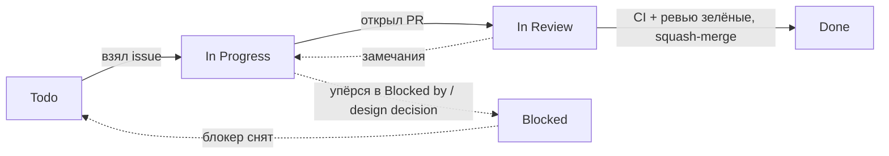
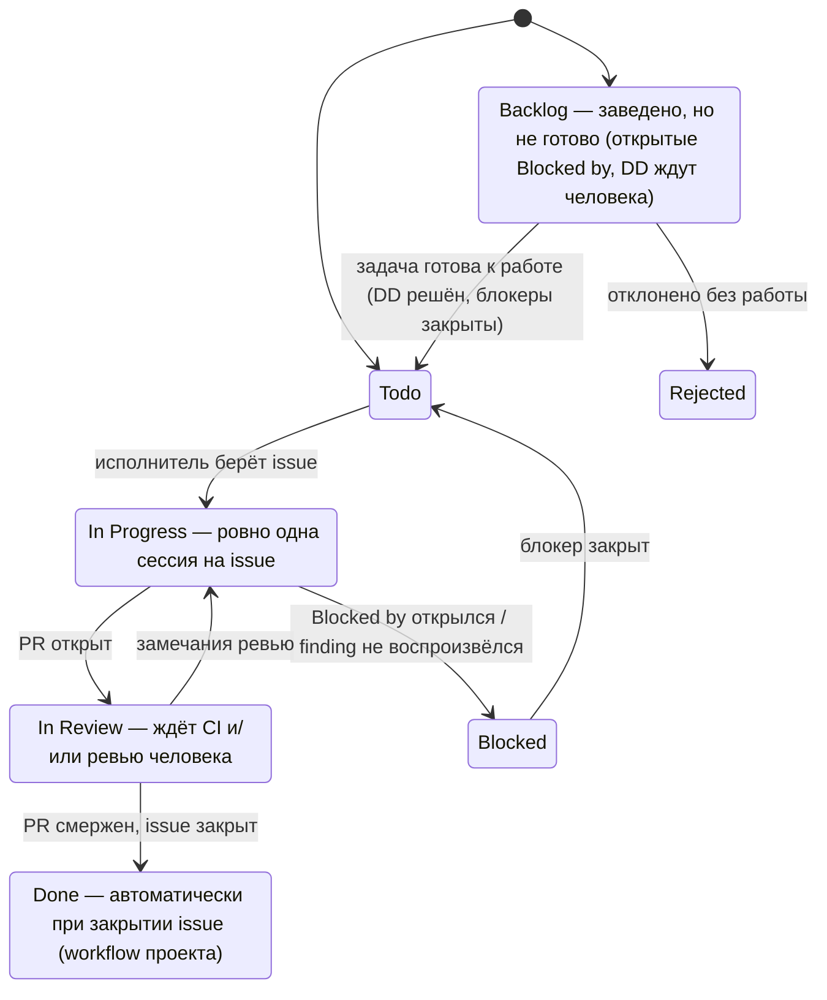
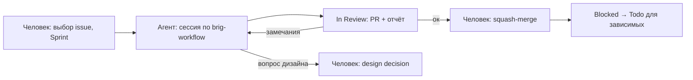

# Как мы работаем с репозиторием

Этот документ — единственное место с правилами и командами для работы с
Brig: доска, ветки, коммиты, PR, DoR/DoD, режимы работы (вручную / агентом /
в связке). Если правило меняется — меняется здесь, и на это есть PR с
меткой `docs`.

Не дублируем: правила языка — в `docs/01-language-design.md`, дизайн VM —
в `docs/02-register-based-virtual-machine.md`. Пошаговый протокол сессии
LLM-агента (Старт → Работа → Финиш, стек PR) — в skill
`.claude/skills/brig-workflow/SKILL.md`; здесь — только политика (что агенту
можно/нельзя, какой режим когда). Задачи ведутся и ищутся только на
Kanban-доске (GitHub Projects v2); `tasks/` — карта плана (milestones, архив волн 0–15,
зависимости, ссылки на issues; без статусов), при расхождении права доска.

## 1. TL;DR



1. Берёшь issue с доски, переводишь в In Progress.
2. Создаёшь от `main` ветку `<type>/<T-NN>-<slug>`.
3. Открываешь PR в `main` с `Closes #<issue>` в body.
4. `make all` и `BRIG_VERIFY=1 go test ./...` зелёные — squash-merge.
5. Ветка удалена, issue в Done.

Каждая сессия начинается с одного issue и заканчивается зелёным CI.

## 2. Доска и issue

| Что | Где | Зачем |
|---|---|---|
| Доска | [github.com/users/it1ro/projects/5](https://github.com/users/it1ro/projects/5), `gh project view 5 --owner it1ro --web` | Единственный список задач и их статусов |
| Задачи с DoD | issues `it1ro/brig-lang` с label `audit` (findings аудита) или `spec-gap` (пробелы относительно спеки §16; уровень §16 — label `must`) | Body issue — источник DoD (файлы, тест-якорь, DoD, «НЕ делать») |
| План целиком | milestones `it1ro/brig-lang` (M1…); `tasks/` (`README.md` — индекс, `decisions.md`, архив `wave-N.md` 0–15) | Milestone — проверяемая цель, описание — критерий выхода; `tasks/` — карта без статусов: milestones, design decisions, архив волн |
| Находки | `AUDIT_REPORT.md`, `AUDIT_REPORT-2.md` | Описание каждого finding (первый аудит — S-F*, A-F*, I-F*, O-F*; второй — P-*, S-*, G-*, R-*, F-*) и пробных программ |
| Контекст для агентов | `.claude/skills/*/SKILL.md` | Инварианты подсистем и протокол сессии (`brig-workflow`) |

- Следующая задача — из Todo: сначала меньший milestone (M1 раньше M2),
  внутри него — выше Priority (P0 первым). Задачи волн 0–15 без milestone
  — по старому правилу: меньший Wave. Задачи, которых нет на доске, не берутся в работу.
- Новый issue сразу добавляется на доску: `gh project item-add 5 --owner it1ro --url <issue-url>`.
- Один issue = одна сессия. Не помещается в Effort large — дели на
  несколько issue.
- Обязательные поля: **Task type**, Effort, Model, Priority и milestone
  issue. Поле **Wave** и label `wave-N` — только для задач волн 0–15.
- Задачи по итогам аудита или сессии планирования — sub-issues эпика
  (для третьего аудита — #276).
- Label происхождения: `audit` — finding из `AUDIT_REPORT.md` или
  `AUDIT_REPORT-2.md`, `spec-gap` — пробел реализации относительно спеки
  (§16). Задача без одного из них не берётся. Дополнительно `edit-spec` —
  перенос утверждённого решения research в спеку.
- Статус задачи — только на доске. `tasks/` хранит карту плана без статусов;
  DoD — в теле issue. Новые задачи сразу заводятся issues, блоков в
  `tasks/` для них нет (архив волн 0–15 — см. `tasks/README.md`).
- Зависимость — строкой в body, не label: `Blocked by #42`.
- Issue остаётся в Blocked, пока все issue из `Blocked by` не закрыты.

### 2.1 Поля и labels

Поля: **Priority** (P0…P3), **Task type** (fail-fast, full-fix, test-infra,
docs, merge, feature), **Effort** — размер задачи (low / medium / large),
**Model** — исполнитель (`sonnet · рутина`, `opus · сложное`, `human ·
вручную`), **Wave** (0…15, архив; тема волны — в `tasks/wave-N.md` и label `wave-N`; новые задачи не заполняют),
**Sprint** (итерации по 2 недели с понедельника 2026-09-28).

Поле называется **`Task type`**, а не `Type`: имя `Type` GitHub зарезервировал
под встроенные issue types. В опциях Model код стоит до ` · `; в тексте и в
`board_set` достаточно кода (`Model opus`).

Цвета labels: у группы свой оттенок и уровень насыщенности, порядок внутри
группы — светлота.

| Группа | Labels | Цвет |
|---|---|---|
| Приоритет | `P0`/`blocker`, `P1`, `P2`, `P3` | насыщенные тёплые: красный → оранжевый → жёлтый → светло-жёлтый |
| Task type | `feature`, `full-fix`, `fail-fast`, `test-infra`, `docs`, `merge` | пастель, у каждого типа свой тон |
| Источник | `audit`, `spec-gap`, `must`, `edit-spec` | фиолетовые, от светлого к тёмному |
| Модель | `sonnet`, `opus`; `human` | синие, от светлого к тёмному; `human` — коричневый |
| Волна (архив) | `wave-0` … `wave-15` | серые, от светлого к тёмному |
| Процесс | `design-decision`, `verification`, `epic` | маджента, зелёный, чёрный |
| Закрыто без работы | `false-positive`, `duplicate`, `invalid`, `wontfix` | белый |

### 2.2 Статусы



Порядок выбора: сначала меньший milestone, внутри — выше Priority. Из Backlog
агент задачи не берёт. Эпики (#44–#49, #124) и первые DD (#40–#43) на доске
не стоят; новые DD стоят в Backlog до решения.

### 2.3 Разовая настройка

**В веб-интерфейсе доски** (через API это не делается):

1. New view → Board, Group by: Status, Sort: Milestone, затем Priority. Отдельный
   вид с фильтром `status:Todo` удобен как «что брать дальше».
2. Settings → Workflows: включены «Item closed → Done» и «Pull request
   merged → Done».
3. Sprint: проставить задачам, которые берутся в ближайшие две недели
   (начать с Wave 0 в Sprint 1).

**В shell** — функции для работы с доской (положить в `~/.bashrc` или
вставить в терминал):

```bash
export BRIG_P=5 BRIG_O=it1ro BRIG_R=it1ro/brig-lang BRIG_PID=PVT_kwHOAoQ_k84Bksrz

# id карточки на доске по номеру issue
board_item() {
  gh project item-list $BRIG_P --owner $BRIG_O --limit 200 --format json \
    --jq ".items[] | select(.content.number==$1) | .id"
}

# board_set <issue#> <поле> <значение>, например: board_set 21 Status "In Progress"
board_set() {
  local item fid oid
  item=$(board_item "$1")
  read -r fid oid < <(gh project field-list $BRIG_P --owner $BRIG_O --format json \
    --jq ".fields[] | select(.name==\"$2\") | [.id, (.options[] | select(.name==\"$3\" or (.name | startswith(\"$3 · \"))) | .id)] | @tsv")
  gh project item-edit --id "$item" --project-id $BRIG_PID --field-id "$fid" --single-select-option-id "$oid"
}

# кто ждёт этот issue: board_dependents 7
board_dependents() {
  gh issue list --repo $BRIG_R --state open --search "\"Blocked by #$1\" in:body" \
    --json number,title --jq '.[] | "#\(.number) \(.title)"'
}

# какие блокеры ещё открыты: board_open_blockers 8 (пусто — можно в Todo)
board_open_blockers() {
  gh issue view "$1" --repo $BRIG_R --json body --jq .body | grep -o 'Blocked by #[0-9]*' | grep -o '[0-9]*' |
    while read -r n; do
      [ "$(gh issue view "$n" --repo $BRIG_R --json state --jq .state)" = OPEN ] && echo "#$n open"
    done
}
```

## 3. Ветки

- Формат: `<type>/<T-NN>-<slug>`, `type` — из таблицы п. 4. Примеры:
  `fix/T-14-newline-required`, `feat/T-30-multiclause-fn`, `test/T-10-audit-suite`.
- Ветка создаётся от свежего `main`, живёт не дольше одной сессии и
  squash-мержится в `main`.
- После merge удаляется локально и на origin:
  `git branch -D fix/T-14-newline-required && git push origin --delete fix/T-14-newline-required`.
- **Force-push — только в собственную ветку задачи**: ветку
  `<type>/<T-NN>-<slug>`, созданную под этот тикет тем, кто её пушит
  (человеком или агентом в его сессии). Типичные случаи — rebase на свежий
  `main` и перестройка стека PR после squash-merge нижнего. Только
  `git push --force-with-lease=<ветка>:<ожидаемый sha>`, не голый `--force`.
  Force-push в `main`, `iter/*`, теги и чужие ветки (в т.ч. ветки других
  задач) запрещён.
- **Исключение — integration-ветка** `iter/<short-name>` (прецедент:
  `iter/regvm`), только когда изменение нельзя разбить на PR. До старта —
  baseline-тег на `main`: `git tag baseline/regvm main && git push origin baseline/regvm`.
  В `main` попадает одним squash-коммитом. Срок жизни ≤ 2 недели; не
  укладывается — дроби на обычные ветки.

## 4. Коммиты

Формат: `<type>(<scope>): <subject> [T-NN]`.

| type       | когда                                      |
| ---------- | ------------------------------------------ |
| `feat`     | новая возможность языка, CLI, REPL         |
| `fix`      | исправление ошибки                         |
| `refactor` | изменение структуры без изменения поведения |
| `test`     | тесты, golden-файлы, тест-инфраструктура   |
| `docs`     | `docs/`, `README.md`, этот файл            |
| `chore`    | служебное: конфиги, зависимости, чистка    |
| `perf`     | ускорение без изменения поведения          |
| `build`    | `Makefile`, `go.mod`, сборка               |
| `ci`       | `.github/workflows/`, настройки CI         |

- `scope` — пакет или файл: `compiler`, `parser`, `vm`, `lexer`, `ast`, `sema`,
  `repl`, `cmd/brig`, `docs`. Строчные латинские буквы, цифры, `-` и `/`; scope
  необязателен (`ci: …`).
- Hook `commit-msg` (`make git-hooks`) проверяет тип из таблицы, scope, subject
  строчными, без кириллицы, ≤ 72 символов; тест хука — `scripts/test-commit-msg.sh`.
- `[T-NN]` в конце subject обязателен, но не enforced hook-ом: проверяется глазами
  при ревью PR и в squash-сообщении merge-коммита.
- Черновые коммиты внутри integration-ветки — без `[T-NN]`. Требование действует
  для всего, что попадает в `main`.
- Body — для неочевидного контекста. Title в body не повторяется.

```
fix(parser): require NEWLINE between statements [T-14]

Grammar: stmt_list ::= stmt { NEWLINE stmt }. Раньше `x = 1 y = 2`
разбирался как два стейтмента молча.
```

## 5. Pull requests

- Из `<type>/<T-NN>-<slug>` в `main`. Title — формат коммита (п. 4).
- Body, минимум:

```
Closes #<issue>

Что сделано:
- …

Что НЕ сделано в этом PR:
- …

Как проверялось:
- make all
- BRIG_VERIFY=1 go test ./...
```

- Перед merge зелёные: `make all` и `BRIG_VERIFY=1 go test ./...`.
- **Golden-файлы.** PR меняет AST — `make update-golden`, bytecode — `make update-bytecode`.
  Diff просмотрен глазами и вынесен в отдельный коммит того же PR: `test(parser): regenerate golden files [T-14]`.
- **Апрувы.**
  - Сейчас: апрув не нужен, self-merge при зелёном CI.
  - Team: 2+: минимум один апрув от человека, не автора PR. Мерж без апрува по таймауту
    молчания запрещён.
- **Стратегия merge.** Squash по умолчанию. Rebase-merge — когда коммиты PR семантически
  независимы. Merge-commit не используется: integration-ветки тоже squash (п. 3).
- **Прямой push в `main`** сейчас разрешён. Branch protection в GitHub Settings → Branches включается (team: 2+).

## 6. Definition of Ready / Definition of Done

- **DoR:**
  - заполнены Task type, Effort, Model, Priority, milestone;
  - указан тест-якорь: существующий (`internal/parser/parser_test.go`) или «создать»;
  - DoD в issue проверяемый: «`make test-parser` возвращает 0», а не «парсер работает лучше».
- **DoD:**
  - CI зелёный, тесты из issue зелёные;
  - issue закрыт и в Done;
  - изменён публичный синтаксис или API — раздел в `docs/` обновлён в том же PR:
    feature-задача правит разделы, перечисленные в её «Файлах» (§8); новую семантику
    вносит docs-задача до реализации.
- `CHANGELOG.md` в DoD не входит: генерируется через `make changelog` (git-cliff), в PR не правится.

## 7. Как работают: вручную, агентом, в связке

Пошаговый протокол сессии (Вход → Старт → Работа → Финиш → Стек PR) описан
один раз, в skill `.claude/skills/brig-workflow/SKILL.md` — он же
исполняется агентом. Здесь — какой режим когда применять и что агенту
нельзя.

### 7.1 Вручную

Одна задача от Todo до Done:

```bash
gh issue view 15 --repo it1ro/brig-lang            # прочитать DoD и «НЕ делать»
board_set 15 Status "In Progress"
git switch main && git pull && git switch -c fix/T-21-newline-required
# ... правка + тест-якорь из issue ...
make all && BRIG_VERIFY=1 go test ./...
git commit -m "fix(parser): require NEWLINE between statements [T-21]"
git push -u origin fix/T-21-newline-required
gh pr create --title "$(git log -1 --format=%s)" --body-file pr.md   # pr.md — шаблон §5 с "Closes #15"
board_set 15 Status "In Review"
gh pr checks --watch
gh pr merge --squash --delete-branch               # issue закроется, карточка уйдёт в Done
for n in $(board_dependents 15 | grep -o '^#[0-9]*' | tr -d '#'); do
  [ -z "$(board_open_blockers $n)" ] && board_set $n Status Todo
done
```

Что проверить глазами перед merge (тот же чек-лист — при приёмке PR
агента):

- DoD из issue выполнен **дословно**: каждая команда из DoD возвращает то, что написано.
- Ни один пункт «НЕ делать» не нарушен (типичное нарушение — «попутный» фикс соседнего finding).
- Если в PR есть `make update-golden`/`update-bytecode` — diff golden/bytecode прочитан и лежит отдельным коммитом.
- Если задача снимала `t.Skip("blocked: T-NN")` — skip действительно удалён, тест зелёный.
- Для PR агента дополнительно: body заполнен — разделы «Что НЕ сделано» и
  «Как проверялось» не пустые, а «Как проверялось» содержит реальные
  команды с результатом.

### 7.2 Агентом

Агент — Claude Code или Cursor Agent, запущенный в корне репозитория. Skills
из `.claude/skills/` подхватываются автоматически; протокол сессии — в skill
`brig-workflow`, контекст подсистем — в `brig-overview`, `brig-lexer`,
`brig-parser-ast`, `brig-sema`, `brig-compiler`, `brig-vm`,
`brig-testing-workflow`.

**Модель** берётся из поля Model issue. Для Effort large — только она;
low/medium — любая. `human` агенту не отдаётся (design decisions и всё,
явно помеченное `human`).

**Промпт сессии** (скопировать, подставить номер):

```text
Возьми issue #<N> в it1ro/brig-lang и выполни его по протоколу skill brig-workflow.
Режим: <автономный | со сдачей на ревью>.
Работай строго в рамках DoD и «НЕ делать» из issue. Найденное по пути — новый issue, не правка.
```

- **Автономный** — агент доводит до squash-merge при зелёном CI и сам
  переводит зависимые задачи в Todo (`brig-workflow`, «Финиш»). Подходит для low/medium
  задач типов fail-fast, test-infra, простых full-fix.
- **Со сдачей на ревью** — агент останавливается на In Review с открытым PR;
  merge делает человек. Для всего, что трогает `compiler.go`, `scheduler.go`,
  `verify.go`, golden/bytecode, и для всех задач Effort large.

**Что агент не делает никогда:** не берёт issue без label `audit` или
`spec-gap` и вне доски; не трогает design-decision issues; не правит
`docs/`, `README.md`, `WORKFLOW.md` вне задач с Task type `docs`; не меняет
семантику языка сверх DoD; не делает merge в режиме ревью; не ставит Sprint.

**Параллельные агенты.** Можно, если задачи не пересекаются по файлам: по
одному агенту на issue, каждый в своём worktree
(`git worktree add ../brig-T-22 -b fix/T-22-int-literals main`). Две
задачи, трогающие `compiler.go`, одновременно не запускать — конфликты
при squash.

### 7.3 В связке (рекомендуемый)

Агенты пишут код, человек принимает решения и держит качество.



| Работа | Кто |
|---|---|
| Design decisions (#40–#43); перевод T-80…T-86, T-62 в Todo или won't-fix | Человек |
| T-07: теги `stack-vm-final`/`regvm-merged`, squash `iter/regvm` → `main` | Человек |
| Вердикт по verification (T-13…T-15): подтвердить или закрыть как `false-positive` | Агент собирает доказательства, человек утверждает |
| Реализация fail-fast / full-fix / test-infra / feature | Агент |
| Ревью diff'ов golden/bytecode, merge PR в `compiler`/`vm` | Человек |
| Задачи docs (T-12, T-60, T-61) | Агент, ревью человека |
| Новые issues, найденные по пути | Агент создаёт, человек ставит Priority и Sprint |

Точки передачи: статус **In Review** (агент → человек), комментарий в issue
с вопросом и статус **Blocked** (агент → человек, если упёрся в неясность
спеки или в design decision), статус **Todo** у зависимых задач (человек →
агент после merge).

## 8. Особые случаи

**Wave 0 (T-01…T-06) — на ветке `iter/regvm`, без PR.** Коммиты
`<type>(<scope>): <subject> [T-NN]` идут прямо в `iter/regvm`; issue
закрывается вручную: `gh issue close 1 --comment "Сделано в <sha> на
iter/regvm"`. Ветка есть на origin: `git fetch && git switch iter/regvm`.
T-07 выполняет человек:

```bash
git tag stack-vm-final main && git push origin stack-vm-final
git switch main && git merge --squash iter/regvm   # AUDIT_REPORT.md, план работ и пр. уже в ветке
git commit        # subject с [T-07], в body — список T-01…T-06
make all && BRIG_VERIFY=1 go test ./...
git tag regvm-merged && git push origin main regvm-merged
git branch -D iter/regvm && git push origin --delete iter/regvm
```

**`t.Skip("blocked: T-NN")`.** T-10 добавляет тесты из §7 аудита; упавшие
сейчас помечаются этим skip'ом. Задача T-NN обязана снять свой skip —
`rg -n 'blocked: T-NN' internal` после неё пуст.

**Пробные программы `p/*.brig` в репозитории нет.** Аудит гонял их во
временной копии. Если DoD ссылается на `p/…`, программа восстанавливается
по описанию finding в `AUDIT_REPORT.md` и становится тестом, а не файлом в
`p/`.

**Verification (T-13…T-15).** Результат — комментарий с выводом команд.
Подтвердилось — новый issue по строке таблицы «Verification needed» в
`tasks/README.md`. Не подтвердилось — label `false-positive`, issue закрыт.

**Design decision принят.** Записать вариант в issue (#40–#43) и закрыть.
Задачи, ждущие решения (#105–#112, см. `tasks/wave-3.md`), уже заведены и
стоят в Blocked: у каждой, чьи блокеры закрыты, прочитать DoD — если
выбранный вариант её отменяет, закрыть как won't-fix, иначе перевести в
Todo.

**Новый issue, найденный по пути:**

```bash
gh issue create --repo it1ro/brig-lang --title "T-NN · <имя>" --body-file body.md \
  --label "<audit|spec-gap>,<task type>,<P>,<model>[,must]" --milestone "<M…>"
gh api -X POST repos/it1ro/brig-lang/issues/<эпик>/sub_issues \
  -F sub_issue_id=$(gh api repos/it1ro/brig-lang/issues/<N> --jq .id)   # если задача из аудита
gh project item-add 5 --owner it1ro --url <url>
board_set <N> Priority <P>; board_set <N> "Task type" <type>; board_set <N> Effort <low|medium|large>
board_set <N> Model <model>; board_set <N> Status Todo   # Backlog, если есть открытый Blocked by
```

Номер T-NN — следующий свободный: `max(номера T-NN в titles issues,
номера в tasks/) + 1` (с T-240 — сквозная нумерация, без десятков по волнам). Проверка —
`make plan-check ONLINE=1`.

**Перенос запланированной волны на доску (архив волн 0–15).** Задачи идут в порядке таблицы
«Порядок и параллельность» из `tasks/wave-N.md`. Для каждого блока: body
issue = блок без заголовка, плюс `> Blocked by #M` для каждой задачи из
`depends_on`, у которой уже есть issue; дальше — команды выше. После
создания блок в `tasks/wave-N.md` заменяется строкой таблицы со ссылкой на
issue.

**Задача требует менять спецификацию или публичный синтаксис.**
Feature-задача правит в том же PR разделы спеки, перечисленные в её
«Файлах»: строки таблиц прелюдии, снятие пометки `pending`, пример к
реализованной фиче. Нужна правка раздела, которого нет в «Файлах», или
новая семантика, которой в спеке нет, — агент останавливается, пишет в
issue, какой раздел спеки нужно поменять, и переводит issue в Blocked;
правку делает человек или отдельный issue с Task type `docs`.

**Задача не помещается в сессию.** Не продолжать в следующей сессии:
разбить на несколько issues (каждый — со своим DoD), исходный закрыть со
ссылками.

## 9. Мелкие правила

- Коммиты атомарные: рефакторинг и фикс — разные коммиты (`refactor(vm): …`, затем `fix(vm): …`).
- Красный CI — не мержим, даже если «локально работает».
- `gofmt -l .` пуст перед PR.
- Не коммитим `bin/`, `coverage.out`, временные `.brig` из сессий; перед PR — `git status` чист от них.
- PR затрагивает больше двух пакетов — в issue записано, почему одним PR.

## 10. Шпаргалка

```bash
gh project view 5 --owner it1ro --web                                   # доска
gh issue list --repo it1ro/brig-lang --label wave-0 --state open         # волна
gh issue list --repo it1ro/brig-lang --label design-decision            # ждут решения
gh issue list --repo it1ro/brig-lang --label verification               # проверки
board_set <N> Status "In Progress"                                      # статус
board_dependents <N>; board_open_blockers <N>                           # зависимости
make ci-quick                                                           # быстрый прогон
make all && BRIG_VERIFY=1 go test ./...                                 # перед PR
```
