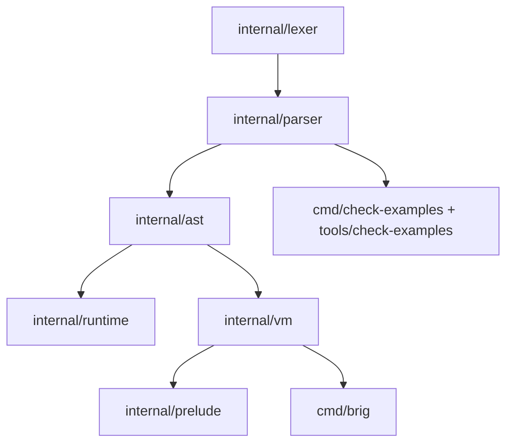

# Архитектура интерпретатора Brig

Референсная реализация — **на Go** (решение v0.3.0, §13). Дизайн-инварианты:
иммутабельные значения (#13), безусловный TCO вне активного `ensure` (#11),
регистровая байткод-VM, общий heap, один бинарник.

## Слои

```
.brig source
   │
   ▼
internal/lexer     токены + offside NEWLINE/INDENT/DEDENT   (A3, A5)   ✅ этап 1
   │
   ▼
internal/parser    recursive descent по brig.ebnf            (A1, §16)  ⏳ этап 2
   │
   ▼
internal/ast       узлы, visitor, равенство, pretty          (A1)       ⏳
   │
   ▼
internal/...       компилятор bytecode + VM (регистровая)    (§13)      ⏳
   │
   ├── internal/vm       интерпретатор, TCO, ensure-кадры    (§8.4)
   ├── internal/runtime  значения: Vec/Map/Set, term order   (§2, §5.3)
   └── internal/prelude  встроенные функции                  (§9.1)
```

## Поток сборки

| Слой      | Вход                           | Выход                       |
| --------- | ------------------------------ | --------------------------- |
| lexer     | текст `.brig`                  | `[]Token` (NEWLINE/INDENT/DEDENT) |
| parser    | `[]Token` + режим module/repl  | AST (§9: top-level ограничения)   |
| compiler  | AST                           | bytecode (регистровый)     |
| vm        | bytecode                      | значение / raise           |

## Режимы парсинга (§9)

- **module** (файлы): top-level только `module/import/alias/type/fn`;
  точка входа — `module Main` + `fn main` (§9.1).
- **repl**: top-level `let` и выражения (скилл `brig-cli`, §10.7: каждая
  строка — новая top-level область, замыкания — лексический снимок N12).

## Зависимость слоёв (снизу вверх)



Пакеты ниже по списку никогда не импортируют вышестоящие (нет циклических
зависимостей; `parser` не видит `vm`, `vm` не видит `cmd/*`).

## Тестовая инфраструктура

- `make check-examples` — A2: все ` ```brig `-блоки дизайн-доков парсятся.
- `testdata/{positive,negative,golden}` — позитивные/негативные кейсы и goldens
  (обновление — `make update-golden`, осознанное действие).
- Фаззинг: `FuzzLex`, `FuzzParse` (вне CI, `make fuzz`, скилл `brig-test`).
- Property-based: иммутабельность коллекций, offside round-trip, term order.

## Статус Трека B

- [x] этап 1: лексер (A3 + A5 top-level; A5.4 offside внутри скобок — TODO)
- [x] этап 1: check-examples (A2, парсер-заглушка: offside + инварианты)
- [ ] этап 2: recursive descent парсер по `brig.ebnf`
- [ ] этап 3: AST + round-trip форматтер
- [ ] этап 4: компилятор + VM, акторы, прелюдия