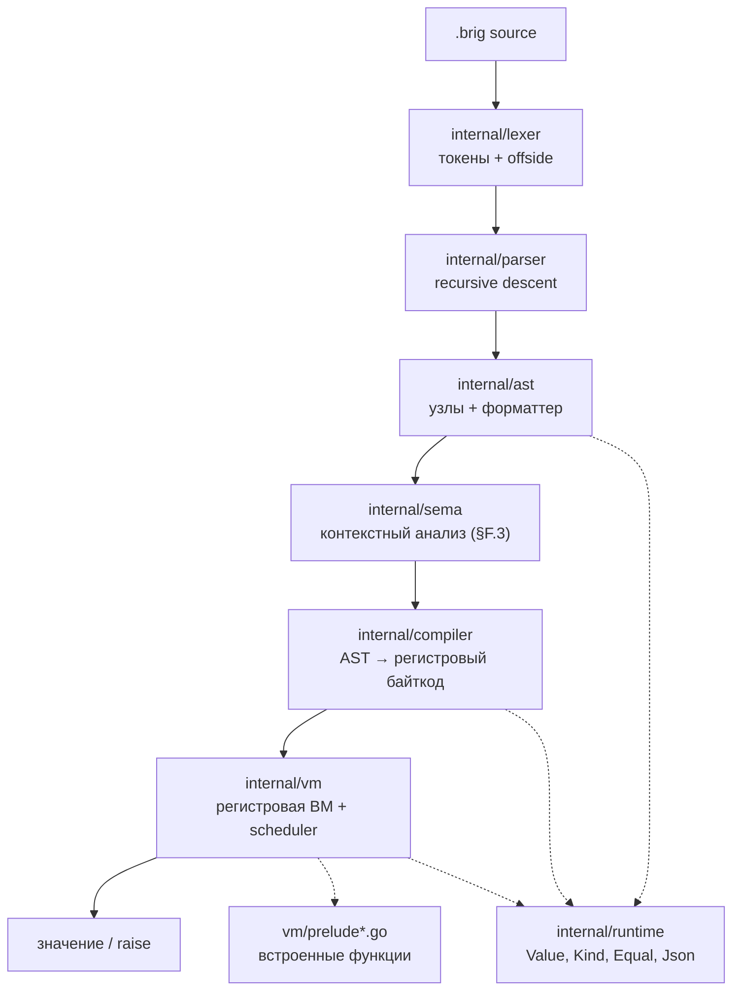
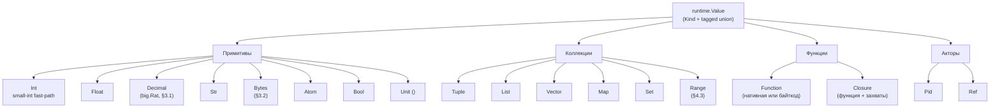
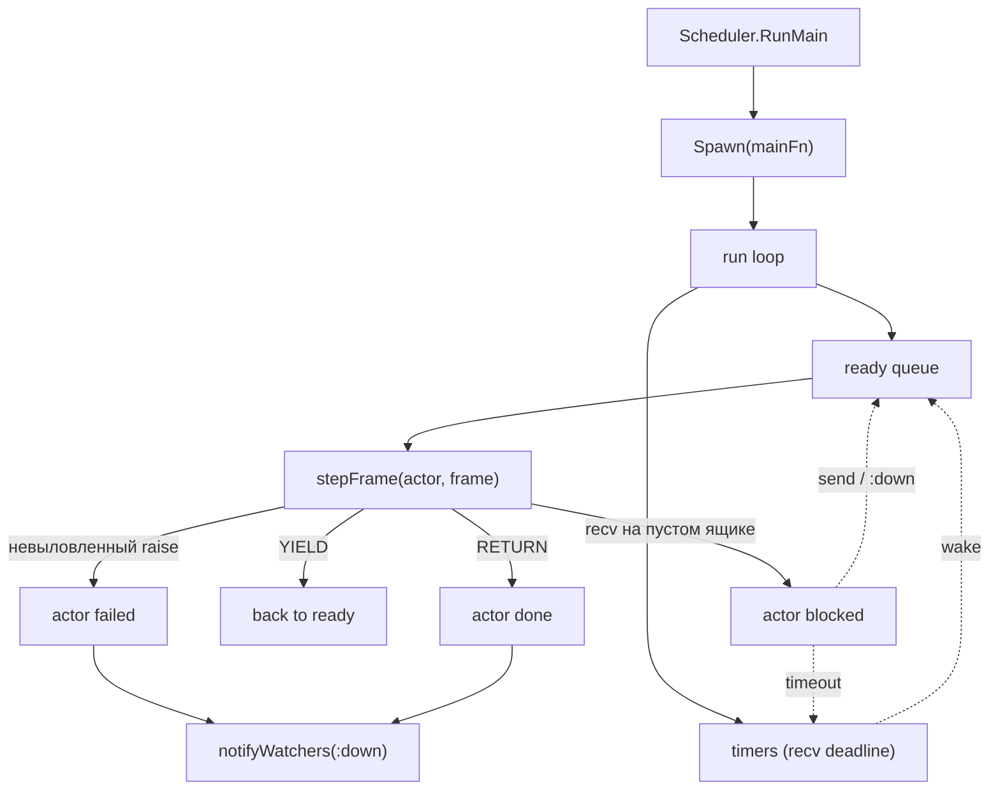
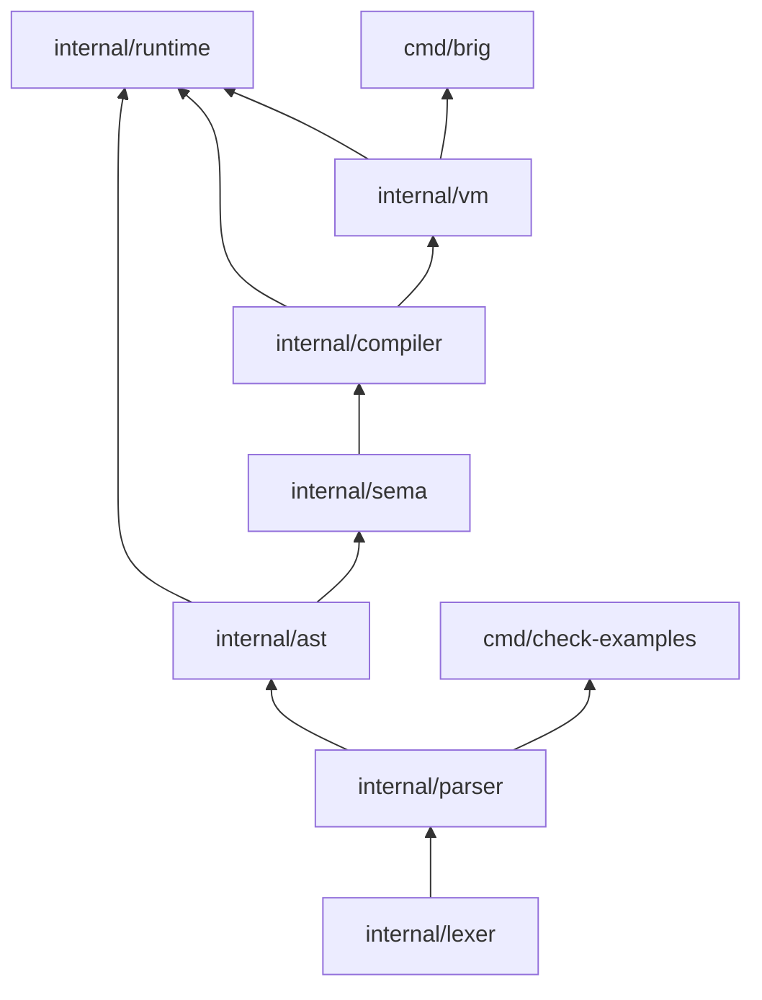

# Архитектура интерпретатора Brig

Референсная реализация — **на Go** (решение v0.3.0, §13). Дизайн-инварианты:
иммутабельные значения (#13), TCO вне активного `ensure` (#11), общий heap,
один бинарник.

> **VM — регистровая (§15.1).** 4-байтные инструкции `[op|A|B|C]`, до 256
> регистров на кадр, явный `TAILCALL`, дизассемблер `--dump-bytecode` с
> `line:col`. Устройство — в разделе «Register VM design» ниже.

---

## Слои



`internal/prelude/doc.go` — зарезервированный пустой пакет. Фактически
прелюдия живёт в `internal/vm/prelude.go`, `prelude_json.go`,
`prelude_test_fw.go`, чтобы не плодить цикл `vm → prelude → vm`.

---

## Поток сборки

| Слой       | Вход              | Выход                                         |
| ---------- | ----------------- | --------------------------------------------- |
| `lexer`    | текст `.brig`     | `[]Token` (`NEWLINE`/`INDENT`/`DEDENT`/`EOF`) |
| `parser`   | `[]Token` + режим | `*ast.Program`                                |
| `sema`     | AST               | диагностики (§F.3)                            |
| `compiler` | AST               | `*ProgramImage` (map функций → `*vm.Chunk`)   |
| `vm`       | `*ProgramImage`   | значение / `*ErrRaise` / `error`              |

---

## Режимы парсинга (§9.3, §11.3)

- **`module`** (файлы): top-level — только `module` / `import` / `alias` /
  `type` / `fn`. Top-level `let` и выражения — ошибка парсинга.
  Точка входа — `fn main()`.
- **`repl`**: top-level `let` и выражения разрешены. Каждая строка — новая
  top-level лексическая область (N12: замыкания захватывают лексический
  снимок своей строки).

Разбор — один и тот же код, флаг `parser.Mode`.

---

## Модель значений (§4.8)



### Small-int fast-path

Поле `Value.intBig *big.Int` — **приватное**. Когда `IsSmall == true`,
`intBig == nil`, а значение лежит в `SmallInt int64`. Инвариант:

```
IsSmall == true   ⇒   intBig == nil
IsSmall == false  ⇒   intBig != nil   (для Kind == KindInt)
```

Единственный способ прочитать целое — `AsBig()`, который соблюдает оба
представления. Прямой доступ к `intBig` извне `runtime` невозможен: поле
не экспортируется. Запрет на `.Int` в остальном коде enforced через
`make check-smallint` (входит в `ci-quick` и `all`).

Причина такого устройства — предыдущий класс nil-deref багов: поле было
публичным, инвариант держался на дисциплине, `b.Int.Sign()` в арифметике
падал на маленьких операндах. Инкапсуляция закрывает класс на уровне
компилятора.

### Decimal (§3.1)

`Value.Dec *big.Rat`. Trailing zeros не хранятся — `dec"1.50"` и `dec"1.5"`
эквивалентны (нормализация через `big.Rat`). Канонизация —
`runtime.FormatDecimal` (минимальная десятичная форма для терминирующих
дробей, `p/q` для нетерминирующих).

Правила смешения (§7.4):

- `Decimal × Decimal` и `Decimal × Int` — точно, через `big.Rat`.
- `Decimal × Float` — `:type_error`. Для `==`/`!=` и `<`/`>`/`<=`/`>=`
  ошибка catchable через `trap` (`checkMixedEq` / `checkMixedCmp` в
  `internal/vm/vm.go`).

---

## Модель акторов (§12, §15.2)



**Ключевые инварианты:**

- **1 актор = 1 goroutine.** Go-планировщик (с 1.14) делает преемптивную
  остановку; VM дополнительно ведёт счётчик редукций для детерминированных
  yield-точек.
- **`:down` приоритетен.** Доставляется в начало очереди, временно превышая
  HWM. Пользовательские сообщения действуют по HWM: `send` возвращает
  `Error(:busy)`.
- **`recv` на пустом ящике — блокировка.** Актор паркуется, `stepFrame`
  возвращает `stepBlock`, `runSlice` снимает его с ready.
- **TryUnwindRaise.** `raise` всплывает по стеку кадров актора до ближайшего
  `trap` handler. Если handler не найден до дна стека — актор падает,
  наблюдатели через `watch` получают `:down`.

### `link` / `spawn_linked` (MVP)

В текущей реализации `link(pid)` ≡ `watch(pid)` — это **наблюдение**, а не
автоматическая смерть. `spawn_linked` = `spawn` + `watch` со стороны
родителя. Автоматической эскалации ошибок через границы акторов нет —
только `:down` от наблюдателя.

---

## Регистровая VM — короткий обзор

Полный дизайн — в `docs/02-register-based-virtual-machine.md`.

- **Инструкция** — 4 байта, `type Instr uint32`, форматы ABC/ABx/AsBx.
  `Chunk.Code` — `[]Instr`, `ip` — индекс инструкции.
- **Кадр** — `Frame{chunk, ip, regs, captures, handlers, callDst}`. Размер
  `regs` фиксирован на функцию (`Chunk.NumRegs`), динамический между
  функциями. Параметры — в `R0..R(NumParams-1)`.
- **Вызов** — `CALL A B C`: callee в `R[A]`, аргументы в `R[A+1..A+B]`,
  результат в `R[C]`. Native принимает свежий слайс (K-5).
- **TCO** — явный `TAILCALL A B`, эмитится компилятором в хвостовых
  позициях. Не эмитится внутри активного `TRAPBEGIN..TRAPEND`; проверяется
  линейно в `vm.Verify`.
- **trap / ensure** — `TRAPBEGIN A sBx` кладёт handler
  `{ip: ip+1+sBx, errReg: A}`; `MAKEOK`/`MAKEERROR` формируют `Result`.
  LIFO `ensure` и «побеждает последняя» ошибка — как в §10.3.
- **Паттерны** — `MATCHLOCAL A Bx` + обязательный следующий `JMP` (fail).
- **Аллокатор** — bump-указатель (`nextReg`, `releaseToMark`); стековая
  дисциплина вместо списка свободных регистров.
- **Дизассемблер** — `--dump-bytecode`, `line:col` на инструкцию (Must §15.1).
  Вывод детерминирован (`sort.Strings` в `cmd/brig/main.go`).

**`vm.Verify`.** Линейный верификатор (`internal/vm/verify.go`): регистры
и окна в `< NumRegs`, цели переходов внутри кода, `MATCHLOCAL` + `JMP`,
`TAILCALL` вне trap-регионов, нет падения с конца, definite assignment
(прямой анализ «регистр определён на всех путях»). Включается
`compiler.Verify = true` в тестах (`verify_on_test.go`) или `BRIG_VERIFY=1`
в CLI.

---

## Граница сериализации (§14.8, §13.1)

`runtime.Code` — маркерный интерфейс байткода. Объявлен в `runtime`,
реализуется `*vm.Chunk`. Это даёт типобезопасность `FuncValue.Body`
без циклического импорта `runtime → vm`.

| Значение             | Сериализация | Альтернатива                     |
| -------------------- | ------------ | -------------------------------- |
| `Function`           | ❌           | MFA `{ module, function, args }` |
| `Closure`            | ❌           | MFA `{ module, function, args }` |
| `Pid`, `Ref`         | ❌           | —                                |
| Примитивы, коллекции | ✅           | —                                |

В shared-heap модели (§15.1) функции передаются по ссылке без сериализации.
`Serialize()` вызывается при выходе за пределы общего хипа.

---

## Зависимость слоёв



Направление стрелок — «импортируется из». Пакеты ниже по графу **никогда**
не импортируют вышестоящие: нет циклов, `parser` не видит `vm`, `vm` не
видит `cmd/*`, `runtime` не видит `vm` — связь через `runtime.Code`.

---

## Тестовая инфраструктура

| Цель                   | Что проверяет                                                           |
| ---------------------- | ----------------------------------------------------------------------- |
| `make test`            | `go test ./...`                                                         |
| `make test-race`       | то же с race-detector (важно: акторы + замыкания)                       |
| `make check-smallint`  | нет прямого `.Int` в `internal/` вне тестов                             |
| `make check-examples`  | все ` ```brig `-блоки дизайн-дока парсятся (65/65)                      |
| `make update-golden`   | пересборка `testdata/golden/*.{ast,round.brig}`                         |
| `make update-bytecode` | пересборка `testdata/bytecode/*.txt`                                    |
| `make fuzz`            | `FuzzLex`, `FuzzParse`, `FuzzRoundTrip` — 3×60s                         |
| `make ci-quick`        | `check-smallint` + `fmt-check` + `vet` + focused tests + `run-examples` |
| `make all`             | `check-smallint` + `fmt` + `vet` + `test` + `lint` + `build`            |

Fuzz-сиды живут в `internal/*/testdata/fuzz/*/` и играют роль постоянных
регрессионных кейсов. Bytecode-goldens — `testdata/bytecode/*.txt` —
фиксируют instruction numbering, `line:col`, `TAILCALL` placement,
`trap/ensure` layout.

---

## Статус реализации

См. `STATUS.md` — там актуальный чеклист спринтов. Здесь — только
крупные вехи.

- [x] **Этап 1:** лексер (A3 + A5), fuzz, негативные тесты
- [x] **Этап 2:** recursive descent парсер, golden, негативные
- [x] **Этап 3:** AST, visitor, `Equal`, round-trip форматтер
- [x] **Этап 4 (часть):** регистровая VM, замыкания, локальные fn, взаимная
      рекурсия, лямбды, TCO, `trap`/`ensure`
- [x] **Этап 4.8:** акторы — spawn/send/recv/watch/unwatch/self/make_ref/
      mailbox_size, scheduler loop, HWM, `:down` с приоритетом
- [x] **Этап 4 (остаток):** `Range`, `Set`, `Vec`/`Map` как модули,
      `Bytes`; `Regex` — отложен (Should); `Decimal` — реализован (§3.1)
- [x] **Контекстный анализ (§F.3):** запрет `trap` в аргументах,
      pipe-запрет акторных примитивов, info-диагностика shadowing
- [x] **REPL:** persistent VM, лексический снимок замыканий (N12)
- [x] **Sprint 7:** регистровая VM с полным дизассемблером (§15.1 Must),
      `vm.Verify`, bytecode-goldens

---

_Обновляется при значимых архитектурных изменениях. Для чеклиста задач
использовать `STATUS.md`._

````

---

## `README.md`

```markdown
# Brig

<p align="center"></p>

Референсный интерпретатор Brig.

Brig — язык с отступами, неизменяемыми значениями, акторами и оптимизацией хвостовых вызовов. Переменные нельзя переприсваивать. Дизайн и спецификация — в `docs/01-language-design.md`.

---

## Что такое Brig

Один абзац вместо списка фич:

> Brig использует отступы вместо блоков, гарантирует неизменяемость значений, работает на регистровой виртуальной машине с байткодом и оптимизирует хвостовые вызовы вне активного `ensure`. В нём есть акторы: порождение, `recv`, `watch`, порог перегрузки. Вместо `nil` — `Option` и `Result`. Функции могут иметь несколько вариантов, есть сопоставление с образцом. Модули — пространства имён без состояния. Акторы — рантайм. Один бинарник, общий heap, без внешних вызовов в первой версии.

Принципы — §0 в дизайн-документе. Фичи по приоритетам — §16.

---

## Быстрый старт

```sh
git clone <repo> brig && cd brig

make build            # bin/brig + bin/check-examples
make test             # тесты
make ci-quick         # fmt-check + vet + быстрые тесты + все examples
make all              # полный прогон: check-smallint, fmt, vet, test, lint, build
````

Запуск программы:

```sh
make run FILE=examples/hello.brig
# или
./bin/brig run examples/hello.brig
./bin/brig run --dump-bytecode examples/trap.brig
./bin/brig check examples/actors.brig
./bin/brig repl
```

Все цели Makefile — в `Makefile`. Кратко о ключевых:

| Цель                   | Что делает                                             |
| ---------------------- | ------------------------------------------------------ |
| `make all`             | полный локальный прогон всего, что должно быть зелёным |
| `make ci-quick`        | быстрая проверка без полного линтера (для pre-commit)  |
| `make test-race`       | race-detector — важен для акторов и замыканий          |
| `make check-examples`  | прогон всех ```brig-блоков дизайн-дока через парсер    |
| `make fuzz`            | 3 фаззера по 60s: лексер, парсер, round-trip           |
| `make update-golden`   | пересборка `testdata/golden/*.{ast,round.brig}`        |
| `make update-bytecode` | пересборка `testdata/bytecode/*.txt`                   |
| `make changelog`       | генерация `CHANGELOG.md` (нужен `git-cliff`)           |

---

## Структура

Один проход `lexer → parser → ast → compiler → vm`. Никаких циклов, никаких «вышестоящих» импортов. Диаграмма зависимостей — в `docs/architecture.md`.

```
cmd/                    # точки входа: brig, check-examples
internal/
  lexer/                # токены + offside
  parser/               # recursive descent → AST
  ast/                  # узлы, форматтер, Equal, visitor
  sema/                 # контекстный анализ (§F.3)
  compiler/             # AST → регистровый байткод
  vm/                   # регистровая ВМ + scheduler акторов + прелюдия
  runtime/              # Value, Kind, Equal, Serialize
  repl/                 # REPL с сохранением состояния
  examples/             # A2-инструмент: fenced-блоки из docs
docs/                   # спецификация, архитектура
examples/               # .brig-программы, гоняются через make run-examples
testdata/               # golden, bytecode, negative, fuzz-сиды
```

---

## Источники истины

README — обзор. Если он противоречит чему-то ниже — верь тому, что ниже.

| Что искать                  | Где смотреть                                |
| --------------------------- | ------------------------------------------- |
| Спецификация языка (v0.4.7) | `docs/01-language-design.md`                |
| Дизайн регистровой VM       | `docs/02-register-based-virtual-machine.md` |
| Архитектура и слои          | `docs/architecture.md`                      |
| Текущий статус и роадмап    | `STATUS.md`                                 |
| История изменений           | `CHANGELOG.md`                              |
| Все команды и цели          | `Makefile`                                  |

`docs/01-language-design.md` — главный документ: Part I (дизайн), Part II (формальная спецификация, EBNF, лексер, offside, диагностика), Part III (changelog). Дизайн-код живёт там же.

---

## Что важно знать о реализации

- **Регистровая VM.** §15.1 Must: 4-байтные инструкции `[op|A|B|C]`, до 256 регистров на кадр, явный `TAILCALL`, дизассемблер `--dump-bytecode` с `line:col`. Полное устройство — в `docs/02-register-based-virtual-machine.md`.
- **Аннотации типов — только документация.** §14.4: их не проверяют ни статически, ни в рантайме. Runtime-контракты — Should.
- **`internal/prelude/doc.go` пуст.** Прелюдия лежит в `internal/vm/prelude.go`, чтобы не плодить цикл `vm → prelude → vm`.

---

## Лицензия MIT

#### Author: Ilmir Karimov

````

---

## `STATUS.md`

```markdown
# Brig — текущее состояние и дорожная карта

Рабочий документ для ориентирования. Не нормативный; при расхождении с
`docs/01-language-design.md` (v0.4.7) — источник истины спека, а не этот файл.

Обновлять при закрытии спринтов и значимых подпунктов.

---

## Что уже работает

| Слой                 | Статус | Что именно                                                                |
| -------------------- | ------ | ------------------------------------------------------------------------- |
| `internal/lexer`     | ✅     | Токены A3, offside A5, все негативные кейсы, fuzz                         |
| `internal/parser`    | ✅     | Recursive descent по `brig.ebnf`, module/repl, golden, негативные         |
| `internal/ast`       | ✅     | Узлы, visitor, `Equal`, форматтер с round-trip, fuzz                      |
| `internal/sema`      | ✅     | Контекстный анализ §F.3 (trap, pipe, variadic, rebinding, shadowing-info) |
| `internal/compiler`  | ✅     | Регистровый байткод, Range/Index, Vec/Map/Bytes/Json/Test dispatch        |
| `internal/vm`        | ✅     | Регистровая ВМ, TCO (`TAILCALL`), trap/ensure, акторы, scheduler, `Verify` |
| `internal/prelude`   | ✅     | `print/log/…` + Range/Set/Vec/Map/Bytes/Decimal/Json/Test                 |
| `internal/repl`      | ✅     | Persistent REPL (§11.4, N12)                                              |
| `cmd/brig`           | ✅     | `check`, `run`, `run --dump-bytecode`, `repl`; `BRIG_VERIFY=1`            |
| `cmd/check-examples` | ✅     | 65/65 блоков дизайн-дока                                                  |
| CI / Makefile        | ✅     | `check-smallint` в `all`; CI workflow → `make all`                        |

**Сделано в акторах (§12):** spawn / spawn_linked / send / self / make_ref /
watch / unwatch / mailbox_size / recv (+ else/after) / HWM / `:down` с
приоритетом / scheduler loop / callSync / tryUnwindRaise.

**Сделано в обработке ошибок (§10):** `raise`, `trap` (инлайн и блочный),
`ensure` с LIFO-семантикой, TCO-ограничение внутри активного `ensure`,
авто-raise `:division_by_zero` / `:recv_clause` / `:function_clause`.

**Сделано в TCO (§15.3):** миллион хвостовых вызовов в `TestTailRecursion`,
хвостовая рекурсия сквозь `recv` в `TestTailRecursionThroughRecv`.
Хвостовость распознаётся компилятором точно (`dest.tail`), эвристика
`isTailCall` удалена.

**Сделано в Sprint 5:** `Range` (§4.3), `Set` (§4.6), `Vec`/`Map` как
модули (§4.4/§4.5), `Bytes` (§3.2), `Decimal` (§3.1).

**Сделано в Sprint 5.5:** `Json.encode`/`Json.decode` (§4.7, Must),
тест-фреймворк `Test.describe`/`Test.it`/`Test.run` + assertions (§16, Must).

**Сделано в Sprint 6:** sema (контекстный анализ §F.3), persistent REPL
(`internal/repl/`, `CompileReplLine`, `RunMainWithArgs`).

**Сделано в Sprint 7:** регистровая VM (S7.1–S7.6). `Instr uint32`, 256
регистров на кадр, `CALL`/`TAILCALL`, `MATCHLOCAL` + JMP, `TRAPBEGIN`
`errReg`, bump-аллокатор, полный дизассемблер `--dump-bytecode` с
`line:col`, bytecode-goldens (`testdata/bytecode/*.txt`), `vm.Verify`
(линейный dataflow-проход). D-1..D-5 закрыты. Полный дизайн —
`docs/02-register-based-virtual-machine.md`.

---

## Спринт 4.5 — завершён

- [x] `Value.Int` → приватный `intBig` + `AsBig()` (small-int nil-deref)
- [x] `intDiv/rem/pow/neg` — small-int fast-path
- [x] `OpRecvTimer` — small-int `after`
- [x] Форматтер: `0 .A` вместо `0.A`
- [x] Sealed interfaces для `LiteralExpr`/`BytesExpr`/`RegexExpr`/`DecimalExpr`
- [x] `make changelog`

---

## Спринт 5 — завершён

Всё помечено **Must** в §16 дизайна. Без этого многие golden-файлы парсились,
но не исполнялись.

### 5.1 `Range` как значение первого класса (§4.3)

- [x] `runtime.KindRange`, `Value.RangeStart/RangeEnd int64`
- [x] `runtime.Equal` для Range (структурное)
- [x] Term order: сразу после `Bool`, перед атомами (§7.4)
- [x] `ast.RangeExpr` — accessor
- [x] `compiler.compileExpr` — `case ast.RangeExpr` → `RANGE`
- [x] `RANGE` в `opcodes.go`, обработка в `stepFrame`
- [x] `list(1 to 10)` → `[1, …, 10]` в `prelude`
- [x] Убывающий вычисляемый range → `raise((:range_error, (start, end)))`
- [x] Убывающий литеральный (`1 to 0`) → ошибка парсинга
- [x] `TestRangeMaterialize`, `TestRangeEquality`, `TestRangeError`
- [x] `examples/range.brig`

### 5.2 `Set` конструктор (§4.6)

- [x] `runtime.KindSet`, `Value.Set []Value`
- [x] `runtime.Equal` для Set (по набору элементов)
- [x] Term order: размер, затем по отсортированным элементам
- [x] `prelude.def("set", -1, ...)` — вариадический
- [x] `TestSetBasics`

### 5.3 `Vec` и `Map` как модули (§4.4, §4.5)

- [x] `isPreludeModule` dispatch в `compileCall`
- [x] `Vec.push/set/get/len`, `Map.put/get/remove/keys`
- [x] Immutability — все возвращают новое значение, не мутируют
- [x] `m["a"]` → `Option` (`INDEX` в компиляторе)
- [x] `TestVecPush`, `TestVecSet`, `TestVecGet`, `TestVecLen`
- [x] `TestMapGetPut`, `TestMapRemove`, `TestMapKeys`, `TestMapIndex`

### 5.4 `Bytes`, `Decimal`, `Regex` (§3.1–§3.3, feature-flagged)

- [x] `runtime.KindBytes`, `Value.Bytes []byte`
- [x] `compileBytesLiteral`, escape-декодирование (§C.3)
- [x] `Bytes.to_str` / `Str.to_bytes`
- [x] `runtime.KindDecimal`, `Value.Dec *big.Rat` (§3.1)
- [x] `internal/runtime/decimal.go`: `ParseDecimal`, `FormatDecimal`
- [x] `compileDecimalLiteral`, `parseLiteralValue` для Decimal-паттернов
- [x] Арифметика `+ - * / neg **`, `div`/`rem`/`intDiv` → `:type_error`
- [x] `checkMixedEq` (==/!=), `checkMixedCmp` (< > <= >=) — `Decimal×Float`
- [x] Decimal-правила Equal/Compare по значению (trailing zeros нормализуются)
- [x] `TestDecimal*`
- [ ] `Regex` — отложен (Should, feature-flagged; нужен движок)

---

## Спринт 5.5 — завершён

### 5.5.1 `Json.encode` / `Json.decode` (§4.7, Must из §16)

- [x] `runtime.JSONEncode` / `runtime.JSONDecode` в `internal/runtime/json.go`
- [x] Трансформации: `Unit ↔ null`, `Some(x)`/`Ok(x)` прозрачно,
      `Error(e) → {"error": …}`, `Bytes → {"$bytes": "base64"}`,
      варианты → `{"tag": …, "args": […]}`,
      `Function/Closure/Pid/Ref` → ошибка
- [x] `Json.encode` / `Json.decode` в прелюдии
- [x] `Json` в `isPreludeModule`
- [x] `internal/runtime/json_test.go`
- [x] `internal/compiler/json_test.go`
- [x] `examples/json.brig`

### 5.5.2 Тест-фреймворк (§16, Must)

- [x] `internal/vm/prelude_test_fw.go`
- [x] `Test.describe(name)` — задаёт текущую группу
- [x] `Test.it(name, () -> …)` — регистрирует тест
- [x] `Test.run()` — прогон, возвращает `Int(failed)`
- [x] `Test.assert_eq` / `assert_ne` / `assert` / `fail`
- [x] Поля `vm.tests` и `vm.currentGroup` в структуре `VM`
- [x] `Test` в `isPreludeModule`
- [x] `internal/compiler/test_framework_test.go`
- [x] `examples/test_demo.brig`

---

## Спринт 6 — завершён

### 6.1 Контекстный анализ (§F.3)

Слой между parser и compiler.

- [x] Пакет `internal/sema`
- [x] `trap` в позиции аргумента или элемента литерала → ошибка
- [x] Pipe-запрет акторных примитивов (`send |> f` → ошибка)
- [x] Variadic-параметр не последний → ошибка
- [x] Rebinding внутри одной лексической области → ошибка
- [x] Локальные `fn` не в начале тела → ошибка
- [x] Shadowing прелюдии → `info`-диагностика (не блокирует компиляцию)
- [x] Wire в `cmd/brig` — прогон перед compile
- [x] `internal/sema/sema_test.go`

### 6.2 REPL persistent (§11.4, N12)

- [x] Persistent VM-инстанс между строками (`internal/repl/repl.go`)
- [x] Каждая строка — новая top-level область
- [x] Замыкания захватывают лексический снимок строки (N12)
- [x] `CompileReplLine` в компиляторе
- [x] `RunMainWithArgs` в VM
- [x] `> x = 5` / `> f = () -> x` / `> x = 10` / `> f()` → `5`
- [x] Многострочный ввод при незакрытых скобках

---

## Спринт 7 — завершён

Регистровая VM по `docs/02-register-based-virtual-machine.md`.

- [x] S7.1: `Instr uint32`, `ABC/ABx/AsBx`, `Chunk[]Instr`, `MATCHLOCAL` +
      JMP, `$N`→`rN` в паттернах, `vm/regs_test.go`
- [x] S7.2: `compiler.go` — bump-аллокатор (`nextReg`, `releaseToMark`),
      `compileExpr(e, dest)`, `compileIf`/`compileTrap`/`compileRecv`/
      `compileLambda`/`compileCall`, `compilePattern`
- [x] S7.3: `scheduler.go` — `Frame`, `resolveCallee`, `bindArgs`,
      `frameFromFn`, ядро `stepFrame`, `TAILCALL`
- [x] S7.4: акторные опкоды — `SPAWN/SEND/SELF/MAKEREF/WATCH/UNWATCH/
      MAILBOXSIZE/RECVTIMER/RECVTAKE/MATCHLOCAL/YIELD`; правки
      `runSlice`/`callSync`/`tryUnwindRaise`
- [x] S7.5: дизассемблер `Function.Disassemble` с arity, `sort.Strings` в
      `cmd/brig/main.go`, bytecode-goldens `testdata/bytecode/*.txt`
- [x] S7.6: D-1..D-5 regression-тесты, `vm.Verify`, `BRIG_VERIFY=1`,
      рекурсивный `resolveUpvalue` (D-4), `--dump-bytecode` детерминирован
- [x] `docs/architecture.md`: снято «Осознанное отступление от §15.1»

---

## Открытые вопросы (решаются в коде, по измерениям)

1. **Пул `regs` в `Actor`** (free-list по размеру кадра). По умолчанию
   не включать. Решить по профилю `TestTailRecursion` и `fib(27)`.
2. **`Verify` (dataflow-проход) в `brig run` по умолчанию.** Сейчас только
   тесты и `BRIG_VERIFY=1`. Решить по замеру стоимости на `examples/*.brig`.
3. **Аудит `Arity` native в прелюдии.** D-2 превращает неверно объявленную
   арность из молчаливого дефекта в ошибку. Проверить все
   `def(name, N, ...)` в `prelude*.go`.

---

## После Sprint 7 — что осталось за рамками (K-8)

Дизайн §K-8 явно выводит за рамки миграции. Это темы следующих спринтов:

- [ ] Мультиклозные `fn` — сейчас компилируется только первый клоз.
- [ ] Параметры-паттерны в `fn` (`fn f(Some(x)) -> ...`).
- [ ] Локальные `fn` не захватывают локали.
- [ ] `match` / `with` — парсятся, но не компилируются.
- [ ] `when` в `recv` — игнорируется.
- [ ] `Regex` (§3.3) — Should, ждёт решения по движку (Go `regexp`/RE2).

**Should (не реализовано):** `Supervisor`, `Behavior`, `trace(pid)`,
порты (subprocess-FFI), паттерны в параметрах полной лямбды, сериализация
`Range`.

---

## Технический долг

### Опкоды — решено

Все мёртвые опкоды стековой ВМ удалены: `OpPop`, `OpDup`, `OpGetLocal`,
`OpSetLocal`, `OpSetUpvalue`, `OpCloseUpvalue`, `OpDefineLocalFn`.
Добавлены `MOVE` и `TAILCALL`. Итого 49 опкодов.

### `maxLocals`/`MaxRegs` — решено

`vm.MaxRegs = 256` (S7.1). `allocReg` вызывает `fc.fail(...)` —
`panic(compileError{...})`, `Compile` через `recover` превращает в
`error`. CLI печатает `compile: function "f" needs more than 256 registers`
с кодом выхода 3.

### Расхождение версий — решено

- `brig.ebnf` синхронизирован с `docs/01-language-design.md` (v0.4.7)
- `docs/architecture.md` обновлён, отражает Sprint 7
- `docs/02-register-based-virtual-machine.md` — источник истины по VM

### CI — решено

`.github/workflows/ci.yml` вызывает `make all`, `check-smallint` срабатывает.

### Открытые пункты

- [ ] `internal/prelude/doc.go` — пустой зарезервированный пакет;
      фактическая прелюдия в `internal/vm/prelude*.go`. Оставить как есть
      (документировано в обоих файлах).

---

## Что НЕ делать

- **Не начинать следующую большую миграцию параллельно с расширением
  прелюдии.** Одно переписывание за раз.
- **Не трогать `Regex` до отдельного решения по движку.** Should, не
  блокирует Must.
- **Не добавлять правила в `check-smallint` без необходимости.** Сначала
  стабилизировать, потом расширять.
- **Не переписывать `check-examples`.** 65/65 зелёный, документация
  синхронизирована.
- **Не менять AST-формы в рамках S7.x.** Миграция — только байткод и VM;
  AST, parser, sema, compiler — фиксированы.

---

## Полезные ссылки

- `docs/01-language-design.md` — единый источник истины (v0.4.7)
- `docs/02-register-based-virtual-machine.md` — дизайн регистровой VM
- `docs/architecture.md` — слои, зависимости, статус
- `Makefile` — цели `ci-quick`, `test-race`, `fuzz`, `update-bytecode`
- `brig.ebnf` — синхронизирован с v0.4.7

---

_Последнее обновление: после закрытия Sprint 7 (регистровая VM).
Следующий шаг — темы из K-8 (мультиклозы, match/with, параметры-паттерны)._
````
