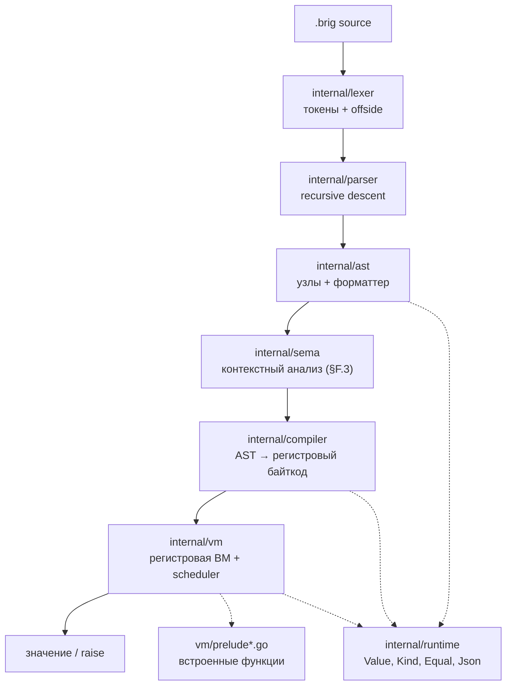
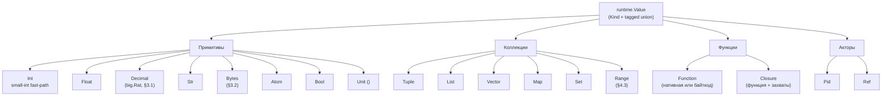
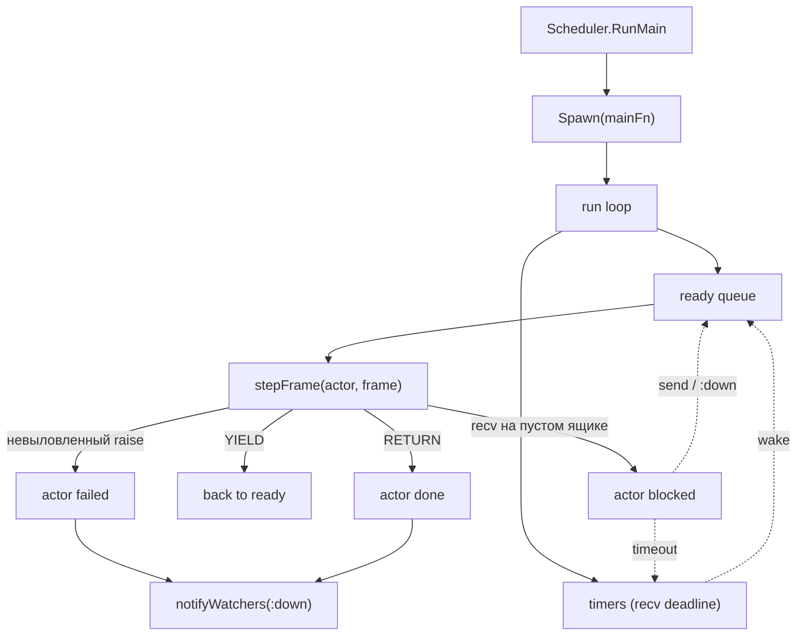
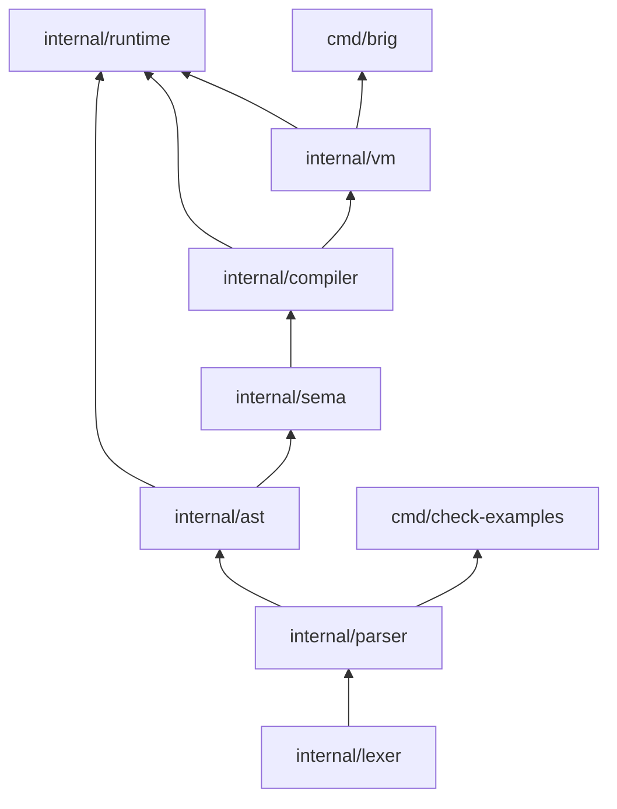

# Архитектура интерпретатора Brig

Референсная реализация — **на Go** (решение v0.3.0, §13). Дизайн-инварианты:
иммутабельные значения (#13), TCO вне активного `ensure` (#11), общий heap,
один бинарник.

> **VM — регистровая (§15.1).** 4-байтные инструкции `[op|A|B|C]`, до 256
> регистров на кадр, явный `TAILCALL`, дизассемблер `--dump-bytecode` с
> `line:col`. Устройство — в разделе «Register VM design» ниже.

---

## Слои



`internal/prelude/doc.go` — зарезервированный пустой пакет. Фактически
прелюдия живёт в `internal/vm/prelude.go`, `prelude_json.go`,
`prelude_test_fw.go`, чтобы не плодить цикл `vm → prelude → vm`.

---

## Поток сборки

| Слой       | Вход              | Выход                                         |
| ---------- | ----------------- | --------------------------------------------- |
| `lexer`    | текст `.brig`     | `[]Token` (`NEWLINE`/`INDENT`/`DEDENT`/`EOF`) |
| `parser`   | `[]Token` + режим | `*ast.Program`                                |
| `sema`     | AST               | диагностики (§F.3)                            |
| `compiler` | AST               | `*ProgramImage` (map функций → `*vm.Chunk`)   |
| `vm`       | `*ProgramImage`   | значение / `*ErrRaise` / `error`              |

---

## Режимы парсинга (§9.3, §11.3)

- **`module`** (файлы): top-level — только `module` / `import` / `alias` /
  `type` / `fn`. Top-level `let` и выражения — ошибка парсинга.
  Точка входа — `fn main()`.
- **`repl`**: top-level `let` и выражения разрешены. Каждая строка — новая
  top-level лексическая область (N12: замыкания захватывают лексический
  снимок своей строки).

Разбор — один и тот же код, флаг `parser.Mode`.

---

## Модель значений (§4.8)



### Small-int fast-path

Поле `Value.intBig *big.Int` — **приватное**. Когда `IsSmall == true`,
`intBig == nil`, а значение лежит в `SmallInt int64`. Инвариант:

```
IsSmall == true   ⇒   intBig == nil
IsSmall == false  ⇒   intBig != nil   (для Kind == KindInt)
```

Единственный способ прочитать целое — `AsBig()`, который соблюдает оба
представления. Прямой доступ к `intBig` извне `runtime` невозможен: поле
не экспортируется. Запрет на `.Int` в остальном коде enforced через
`make check-smallint` (входит в `ci-quick` и `all`).

Причина такого устройства — предыдущий класс nil-deref багов: поле было
публичным, инвариант держался на дисциплине, `b.Int.Sign()` в арифметике
падал на маленьких операндах. Инкапсуляция закрывает класс на уровне
компилятора.

### Decimal (§3.1)

`Value.Dec *big.Rat`. Trailing zeros не хранятся — `dec"1.50"` и `dec"1.5"`
эквивалентны (нормализация через `big.Rat`). Канонизация —
`runtime.FormatDecimal` (минимальная десятичная форма для терминирующих
дробей, `p/q` для нетерминирующих).

Правила смешения (§7.4):

- `Decimal × Decimal` и `Decimal × Int` — точно, через `big.Rat`.
- `Decimal × Float` — `:type_error`. Для `==`/`!=` и `<`/`>`/`<=`/`>=`
  ошибка catchable через `trap` (`checkMixedEq` / `checkMixedCmp` в
  `internal/vm/vm.go`; для `==`/`!=` — только пара верхнего уровня). В паттернах
  (`runtime.MatchEqual`) и ключах `Map`/`Set` (`runtime.KeyEqual`) —
  разные значения, без ошибки; `Int × Float` сравнивается точно.

---

## Модель акторов (§12, §15.2)



**Ключевые инварианты:**

- **Один кооперативный run-loop в одной goroutine.** Актор — запись
  `*Actor` со стеком кадров, а не goroutine. Вытеснение — по счётчику
  редукций (K-4 в doc 02); порядок исполнения воспроизводим (кроме
  wall-clock). Модель потоков — деталь реализации (§15.2, решение #40,
  вариант C): спека гарантирует только G1–G4. Эволюция в N:M (в том числе
  режим `schedulers=1`) возможна без правки тира 1.
- **`:down` приоритетен.** Доставляется в начало очереди, временно превышая
  HWM. Пользовательские сообщения действуют по HWM: `send` возвращает
  `Error(:busy)`.
- **`recv` на пустом ящике — блокировка.** Актор паркуется, `stepFrame`
  возвращает `stepBlock`, `runSlice` снимает его с ready.
- **TryUnwindRaise.** `raise` всплывает по стеку кадров актора до ближайшего
  `trap` handler. Если handler не найден до дна стека — актор падает,
  наблюдатели через `watch` получают `:down`.

### `link` / `spawn_linked` (MVP)

В текущей реализации `link(pid)` ≡ `watch(pid)` — это **наблюдение**, а не
автоматическая смерть. `spawn_linked` = `spawn` + `watch` со стороны
родителя. Автоматической эскалации ошибок через границы акторов нет —
только `:down` от наблюдателя.

---

## Регистровая VM — короткий обзор

Полный дизайн — в `docs/02-register-based-virtual-machine.md`.

- **Инструкция** — 4 байта, `type Instr uint32`, форматы ABC/ABx/AsBx.
  `Chunk.Code` — `[]Instr`, `ip` — индекс инструкции.
- **Кадр** — `Frame{chunk, ip, regs, captures, handlers, callDst}`. Размер
  `regs` фиксирован на функцию (`Chunk.NumRegs`), динамический между
  функциями. Параметры — в `R0..R(NumParams-1)`.
- **Вызов** — `CALL A B C`: callee в `R[A]`, аргументы в `R[A+1..A+B]`,
  результат в `R[C]`. Native принимает свежий слайс (K-5).
- **TCO** — явный `TAILCALL A B`, эмитится компилятором в хвостовых
  позициях. Не эмитится внутри активного `TRAPBEGIN..TRAPEND`; проверяется
  линейно в `vm.Verify`.
- **trap / ensure** — `TRAPBEGIN A sBx` кладёт handler
  `{ip: ip+1+sBx, errReg: A}`; `MAKEOK`/`MAKEERROR` формируют `Result`.
  LIFO `ensure` и «побеждает последняя» ошибка — как в §10.3.
- **Паттерны** — `MATCHLOCAL A Bx` + обязательный следующий `JMP` (fail).
- **Аллокатор** — bump-указатель (`nextReg`, `releaseToMark`); стековая
  дисциплина вместо списка свободных регистров.
- **Дизассемблер** — `--dump-bytecode`, `line:col` на инструкцию (Must §15.1).
  Вывод детерминирован (`sort.Strings` в `cmd/brig/main.go`).

**`vm.Verify`.** Линейный верификатор (`internal/vm/verify.go`): регистры
и окна в `< NumRegs`, цели переходов внутри кода, `MATCHLOCAL` + `JMP`,
`TAILCALL` вне trap-регионов, нет падения с конца, definite assignment
(прямой анализ «регистр определён на всех путях»). Включается
`compiler.Verify = true` в тестах (`verify_on_test.go`) или `BRIG_VERIFY=1`
в CLI.

---

## Граница сериализации (§14.8, §13.1)

`runtime.Code` — маркерный интерфейс байткода. Объявлен в `runtime`,
реализуется `*vm.Chunk`. Это даёт типобезопасность `FuncValue.Body`
без циклического импорта `runtime → vm`.

| Значение             | Сериализация | Альтернатива                     |
| -------------------- | ------------ | -------------------------------- |
| `Function`           | ❌           | MFA `{ module, function, args }` |
| `Closure`            | ❌           | MFA `{ module, function, args }` |
| `Pid`, `Ref`         | ❌           | —                                |
| Примитивы, коллекции | ✅           | —                                |

В shared-heap модели (§15.1) функции передаются по ссылке без сериализации.
`Serialize()` вызывается при выходе за пределы общего хипа.

---

## Зависимость слоёв



Направление стрелок — «импортируется из». Пакеты ниже по графу **никогда**
не импортируют вышестоящие: нет циклов, `parser` не видит `vm`, `vm` не
видит `cmd/*`, `runtime` не видит `vm` — связь через `runtime.Code`.

---

## Тестовая инфраструктура

| Цель                   | Что проверяет                                                           |
| ---------------------- | ----------------------------------------------------------------------- |
| `make test`            | `go test ./...`                                                         |
| `make test-race`       | то же с race-detector (важно: акторы + замыкания)                       |
| `make check-smallint`  | нет прямого `.Int` в `internal/` вне тестов                             |
| `make check-examples`  | все ` ```brig `-блоки дизайн-дока парсятся (`failed 0`)                |
| `make update-golden`   | пересборка `testdata/golden/*.{ast,round.brig}`                         |
| `make update-bytecode` | пересборка `testdata/bytecode/*.txt`                                    |
| `make fuzz`            | `FuzzLex`, `FuzzParse`, `FuzzRoundTrip` — 3×60s                         |
| `make ci-quick`        | `check-smallint` + `fmt-check` + `vet` + focused tests + `run-examples` |
| `make all`             | `check-smallint` + `fmt` + `vet` + `test` + `lint` + `build`            |

Fuzz-сиды живут в `internal/*/testdata/fuzz/*/` и играют роль постоянных
регрессионных кейсов. Bytecode-goldens — `testdata/bytecode/*.txt` —
фиксируют instruction numbering, `line:col`, `TAILCALL` placement,
`trap/ensure` layout.

---

## Статус реализации

Задачи и их статус — на [доске](https://github.com/users/it1ro/projects/5)
и в `TASKS.md`. Здесь — только крупные вехи.

- [x] **Этап 1:** лексер (A3 + A5), fuzz, негативные тесты
- [x] **Этап 2:** recursive descent парсер, golden, негативные
- [x] **Этап 3:** AST, visitor, `Equal`, round-trip форматтер
- [x] **Этап 4 (часть):** регистровая VM, замыкания, локальные fn, взаимная
      рекурсия, лямбды, TCO, `trap`/`ensure`
- [x] **Этап 4.8:** акторы — spawn/send/recv/watch/unwatch/self/make_ref/
      mailbox_size, scheduler loop, HWM, `:down` с приоритетом
- [x] **Этап 4 (остаток):** `Range`, `Set`, `Vec`/`Map` как модули,
      `Bytes`; `Regex` — отложен (Should); `Decimal` — реализован (§3.1)
- [x] **Контекстный анализ (§F.3):** запрет `trap` в аргументах,
      pipe-запрет акторных примитивов, info-диагностика shadowing
- [x] **REPL:** persistent VM, лексический снимок замыканий (N12)
- [x] **Sprint 7:** регистровая VM с полным дизассемблером (§15.1 Must),
      `vm.Verify`, bytecode-goldens

---

_Обновляется при значимых архитектурных изменениях. Список задач — доска
и `TASKS.md`._
