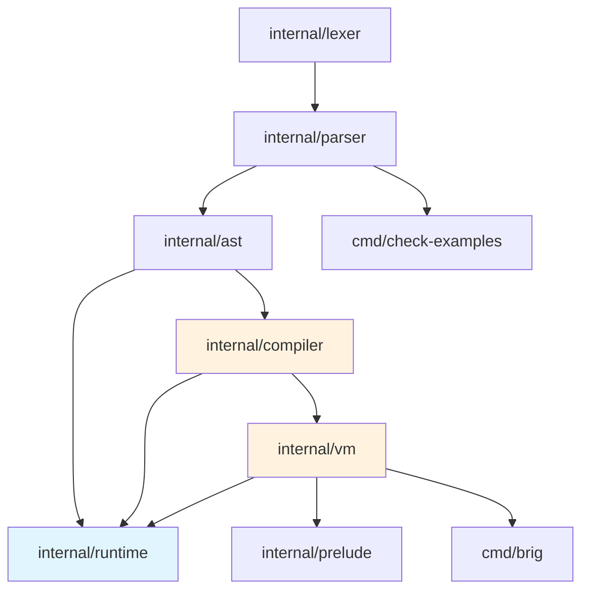

# Архитектура интерпретатора Brig

Референсная реализация — **на Go** (решение v0.3.0, §13). Дизайн-инварианты:
иммутабельные значения (#13), безусловный TCO вне активного `ensure` (#11),
регистровая байткод-VM, общий heap, один бинарник.

## Слои

```
.brig source
│
▼
internal/lexer    токены + offside NEWLINE/INDENT/DEDENT (A3, A5)  ✅ этап 1
│
▼
internal/parser   recursive descent по brig.ebnf (A1, §16)         ✅ этап 2
│
▼
internal/ast      узлы, visitor, равенство, pretty (A1)            ✅ этап 3
│
▼
internal/compiler AST → стековый байткод                           ✅ этап 4
│
▼
internal/vm       стековая ВМ, замыкания, локальные fn             ✅ этап 4
│
├── internal/runtime   значения: Vec/Map/Set, term order (§2, §5.3)
├── internal/prelude   встроенные функции (§9.1)
└── (регистровая VM — миграция после акторов, §15.1)
```

> **Осознанное отступление от §15.1:** текущая ВМ стековая, не регистровая.
> Это вертикальный срез для быстрого получения исполняемого пайплайна.
> Миграция на регистровую (с дизассемблером `--dump-bytecode`) — отдельный
> подэтап после стабилизации семантики.

## Поток сборки

| Слой     | Вход                          | Выход                             |
| -------- | ----------------------------- | --------------------------------- |
| lexer    | текст `.brig`                 | `[]Token` (NEWLINE/INDENT/DEDENT) |
| parser   | `[]Token` + режим module/repl | AST (§9: top-level ограничения)   |
| compiler | AST                           | стековый байткод (`vm.Chunk`)     |
| vm       | bytecode                      | значение / raise                  |

## Режимы парсинга (§9)

- **module** (файлы): top-level только `module/import/alias/type/fn`;
  точка входа — `module Main` + `fn main` (§9.1).
- **repl**: top-level `let` и выражения (скилл `brig-cli`, §10.7: каждая
  строка — новая top-level область, замыкания — лексический снимок N12).

## Граница сериализации (§14.8, §13.1)

`runtime.Code` — маркерный интерфейс байткода. Объявлен в `runtime`,
реализуется `*vm.Chunk`. Это даёт типобезопасность `FuncValue.Body`
без циклического импорта `runtime → vm`.

| Значение             | Сериализация | Альтернатива                     |
| -------------------- | ------------ | -------------------------------- |
| `Function`           | ❌           | MFA `{ module, function, args }` |
| `Closure`            | ❌           | MFA `{ module, function, args }` |
| `Pid`, `Ref`         | ❌           | —                                |
| Примитивы, коллекции | ✅           | —                                |

В shared-heap модели (§15.1) функции передаются по ссылке без
сериализации. `Serialize()` вызывается при выходе за пределы общего хипа.

## Зависимость слоёв (снизу вверх)



Пакеты ниже по списку никогда не импортируют вышестоящие (нет циклических
зависимостей; `parser` не видит `vm`, `vm` не видит `cmd/*`,
`runtime` не видит `vm` — связь через `runtime.Code`).

## Тестовая инфраструктура

- `make check-examples` — A2: все ` ```brig `-блоки дизайн-доков парсятся.
- `testdata/{positive,negative,golden}` — позитивные/негативные кейсы и goldens
  (обновление — `make update-golden`, осознанное действие).
- Фаззинг: `FuzzLex`, `FuzzParse`, `FuzzRoundTrip` (вне CI, `make fuzz`).
- Regression-примеры: `examples/closure.brig`, `examples/mutual.brig`
  (замыкания и взаимная рекурсия через `make run-examples`).

## Статус Трека B

- [x] этап 1: лексер (A3 + A5 top-level; A5.4 offside внутри скобок — TODO, issue #2)
- [x] этап 1: check-examples (A2, парсер-заглушка: offside + инварианты)
- [x] этап 2: recursive descent парсер по `brig.ebnf`
- [x] этап 3: AST + round-trip форматтер
- [x] этап 4: компилятор + стековая VM (вертикальный срез: замыкания,
      локальные fn, взаимная рекурсия, лямбды)
- [ ] этап 4: акторы, полная прелюдия, регистровая VM
