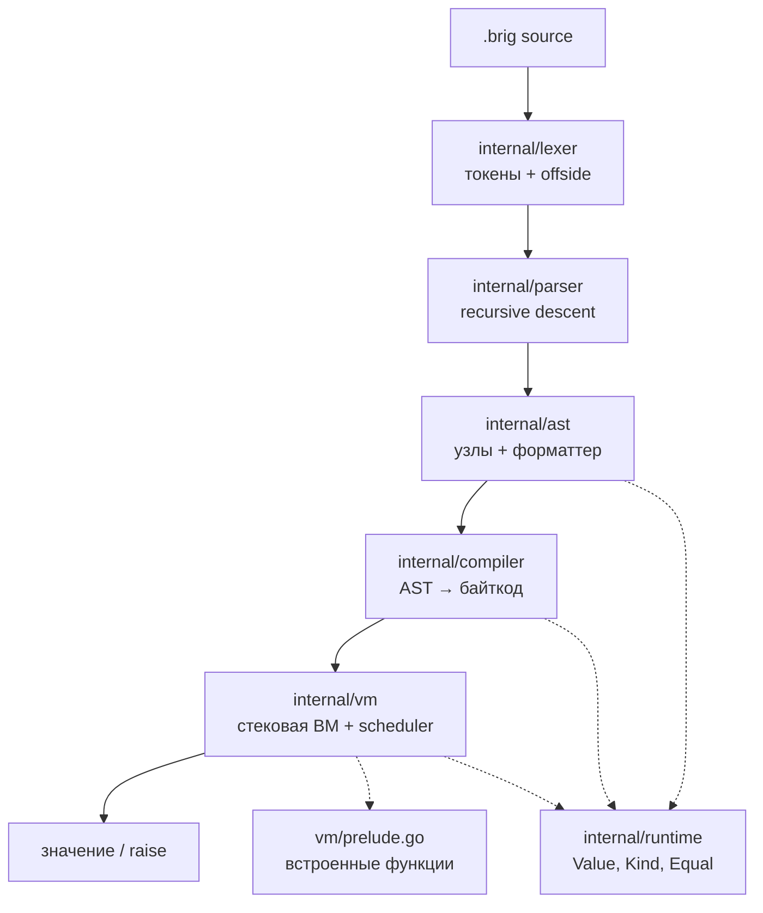
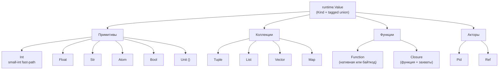
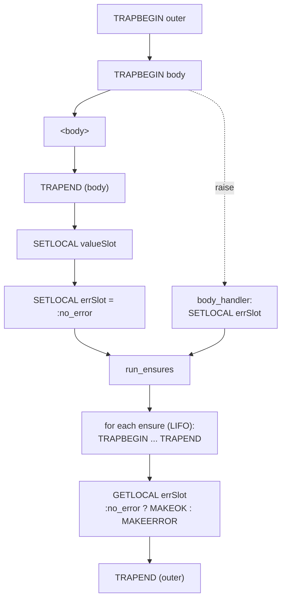
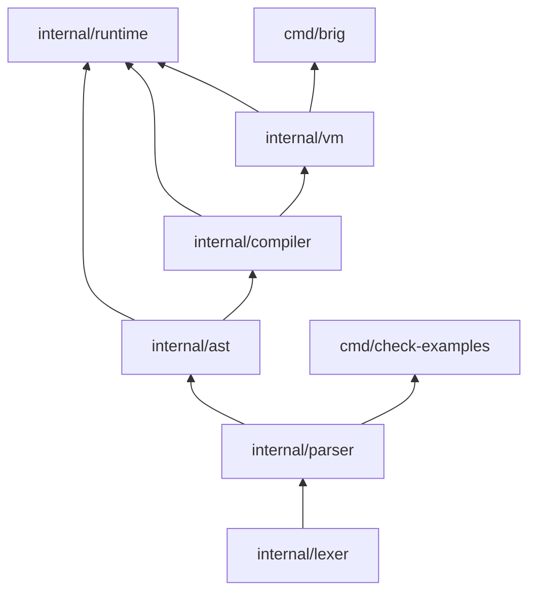

# Архитектура интерпретатора Brig

Референсная реализация — **на Go** (решение v0.3.0, §13). Дизайн-инварианты:
иммутабельные значения (#13), TCO вне активного `ensure` (#11), общий heap,
один бинарник.

> **Осознанное отступление от §15.1.** Спецификация требует регистровую VM
> (BEAM/Lua-style). Текущая реализация — **стековая**: вертикальный срез для
> быстрой стабилизации семантики. Миграция на регистровую с полноценным
> дизассемблером — отдельный спринт, см. `docs/ROADMAP.md`.

---

## Слои



`internal/prelude/doc.go` — зарезервированный пустой пакет. Фактически
прелюдия живёт в `internal/vm/prelude.go`, чтобы не плодить цикл
`vm → prelude → vm`.

---

## Поток сборки

| Слой       | Вход              | Выход                                         |
| ---------- | ----------------- | --------------------------------------------- |
| `lexer`    | текст `.brig`     | `[]Token` (`NEWLINE`/`INDENT`/`DEDENT`/`EOF`) |
| `parser`   | `[]Token` + режим | `*ast.Program`                                |
| `compiler` | AST               | `*ProgramImage` (map функций → `*vm.Chunk`)   |
| `vm`       | `*ProgramImage`   | значение / `*ErrRaise` / `error`              |

---

## Режимы парсинга (§9.3, §11.3)

- **`module`** (файлы): top-level — только `module` / `import` / `alias` /
  `type` / `fn`. Top-level `let` и выражения — ошибка парсинга.
  Точка входа — `fn main()`.
- **`repl`**: top-level `let` и выражения разрешены. Каждая строка — новая
  top-level лексическая область (N12: замыкания захватывают лексический
  снимок своей строки).

Разбор — один и тот же код, флаг `parser.Mode`.

---

## Модель значений (§4.8)



### Small-int fast-path

Поле `Value.intBig *big.Int` — **приватное**. Когда `IsSmall == true`,
`intBig == nil`, а значение лежит в `SmallInt int64`. Инвариант:

```
IsSmall == true   ⇒   intBig == nil
IsSmall == false  ⇒   intBig != nil   (для Kind == KindInt)
```

Единственный способ прочитать целое — `AsBig()`, который соблюдает оба
представления. Прямой доступ к `intBig` извне `runtime` невозможен: поле
не экспортируется. Запрет на `.Int` в остальном коде enforced через
`make check-smallint` (входит в `ci-quick` и `all`).

Причина такого устройства — предыдущий класс nil-deref багов: поле было
публичным, инвариант держался на дисциплине, `b.Int.Sign()` в арифметике
падал на маленьких операндах. Инкапсуляция закрывает класс на уровне
компилятора.

---

## Модель акторов (§12, §15.2)


**Ключевые инварианты:**

- **1 актор = 1 goroutine.** Go-планировщик (с 1.14) делает преемптивную
  остановку; VM дополнительно ведёт счётчик редукций для детерминированных
  yield-точек.
- **`:down` приоритетен.** Доставляется в начало очереди, временно превышая
  HWM. Пользовательские сообщения действуют по HWM: `send` возвращает
  `Error(:busy)`.
- **`recv` на пустом ящике — блокировка.** Актор паркуется, `stepFrame`
  возвращает `stepBlock`, `runSlice` снимает его с ready.
- **TryUnwindRaise.** `raise` всплывает по стеку кадров актора до ближайшего
  `trap` handler. Если handler не найден до дна стека — актор падает,
  наблюдатели через `watch` получают `:down`.

### `link` / `spawn_linked` (MVP)

В текущей реализации `link(pid)` ≡ `watch(pid)` — это **наблюдение**, а не
автоматическая смерть. `spawn_linked` = `spawn` + `watch` со стороны
родителя. Автоматической эскалации ошибок через границы акторов нет —
только `:down` от наблюдателя.

---

## TCO и `ensure` (§15.3)

Хвостовой вызов распознаётся эвристикой `isTailCall`: `CALL ; RETURN` или
`CALL ; JMP target ; ... ; target: RETURN`. Совпадает с layout'ом
`compileIf` и `compileRecv`, где все ветки сходятся к общему `RETURN`.

**TCO отключается внутри активного trap handler.** Причина: замена кадра
in place выбросила бы handler, и `ensure` после возврата не выполнился бы.
Проверка: `len(f.handlers) == 0 && isTailCall(...)`.

---

## trap / ensure — схема байткода



`ensure` в LIFO-порядке, каждый в собственном мини-trap. Если один ensure
падает, остальные всё равно выполняются; побеждает последняя ошибка
(§10.3).

---

## Граница сериализации (§14.8, §13.1)

`runtime.Code` — маркерный интерфейс байткода. Объявлен в `runtime`,
реализуется `*vm.Chunk`. Это даёт типобезопасность `FuncValue.Body`
без циклического импорта `runtime → vm`.

| Значение             | Сериализация | Альтернатива                     |
| -------------------- | ------------ | -------------------------------- |
| `Function`           | ❌           | MFA `{ module, function, args }` |
| `Closure`            | ❌           | MFA `{ module, function, args }` |
| `Pid`, `Ref`         | ❌           | —                                |
| Примитивы, коллекции | ✅           | —                                |

В shared-heap модели (§15.1) функции передаются по ссылке без сериализации.
`Serialize()` вызывается при выходе за пределы общего хипа.

---

## Зависимость слоёв



Направление стрелок — «импортируется из». Пакеты ниже по графу **никогда**
не импортируют вышестоящие: нет циклов, `parser` не видит `vm`, `vm` не
видит `cmd/*`, `runtime` не видит `vm` — связь через `runtime.Code`.

---

## Тестовая инфраструктура

| Цель                  | Что проверяет                                                           |
| --------------------- | ----------------------------------------------------------------------- |
| `make test`           | `go test ./...`                                                         |
| `make test-race`      | то же с race-detector (важно: акторы + замыкания)                       |
| `make check-smallint` | нет прямого `.Int` в `internal/` вне тестов                             |
| `make check-examples` | все ` ```brig `-блоки дизайн-дока парсятся (65/65)                      |
| `make fuzz`           | `FuzzLex`, `FuzzParse`, `FuzzRoundTrip` — 3×60s                         |
| `make update-golden`  | пересборка `testdata/golden/*.{ast,round.brig}`                         |
| `make ci-quick`       | `check-smallint` + `fmt-check` + `vet` + focused tests + `run-examples` |
| `make all`            | `check-smallint` + `fmt` + `vet` + `test` + `lint` + `build`            |

Fuzz-сиды живут в `internal/*/testdata/fuzz/*/` и играют роль постоянных
регрессионных кейсов. Например, `internal/ast/testdata/fuzz/FuzzRoundTrip/`
содержит `0 .A`, из которого вырос фикс форматтера.

---

## Статус реализации

См. `docs/ROADMAP.md` — там актуальный чеклист спринтов. Здесь — только
крупные вехи.

- [x] **Этап 1:** лексер (A3 + A5), fuzz, негативные тесты
- [x] **Этап 2:** recursive descent парсер, golden, негативные
- [x] **Этап 3:** AST, visitor, `Equal`, round-trip форматтер
- [x] **Этап 4 (часть):** стековая VM, замыкания, локальные fn, взаимная
      рекурсия, лямбды, TCO, `trap`/`ensure`
- [x] **Этап 4.8:** акторы — spawn/send/recv/watch/unwatch/self/make_ref/
      mailbox_size, scheduler loop, HWM, `:down` с приоритетом
- [ ] **Этап 4 (остаток):** `Range`, `Set`, `Vec`/`Map` как модули,
      `Bytes`/`Regex`/`Decimal` (см. ROADMAP Sprint 5)
- [ ] **Контекстный анализ (§F.3):** запрет `trap` в аргументах,
      pipe-запрет акторных примитивов, info-диагностика shadowing
- [ ] **REPL:** persistent VM, лексический снимок замыканий (N12)
- [ ] **Регистровая VM:** миграция с полным дизассемблером (§15.1 Must)

---

_Обновляется при значимых архитектурных изменениях. Для чеклиста задач
использовать `STATUS.md`._
