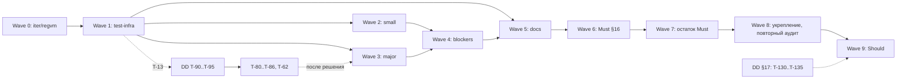

# tasks/ — карта плана

Карта плана работ: волны, зависимости, ссылки на issues. Статусы — только на [доске](https://github.com/users/it1ro/projects/5) «Brig — разработка» (GitHub Projects v2, проект 5). Конвенции — `CONTRIBUTING.md`, команды для доски — `MAINTAINING.md`.

**Где DoD.** Для задач, у которых есть issue, источник DoD, файлов, тест-якоря и «НЕ делать» — тело issue; в файле волны остаётся строка таблицы. Для задач, у которых issue ещё нет, хранится полный блок, из которого создаётся issue. Блоки следующей волны лежат в [backlog.md](backlog.md) в порядке выполнения, блоки более поздних волн (8, 9, DD по §17) — в файле своей волны. Когда волна становится следующей, её блоки переезжают в `backlog.md`; заведённая задача удаляется из `backlog.md`, а её строка в файле волны получает ссылку на issue.

**Label источника.** `audit` — finding `AUDIT_REPORT.md` (ветка `iter/regvm` @ `8ab58cf`) или новая находка; `spec-gap` — пробел относительно спеки §16.

**Нумерация.** Каждая волна начинается с нового десятка: Wave 7 — T-100…T-109, Wave 8 — T-110…T-119, Wave 9 — T-120…T-129, DD по §17 — T-130…T-139. `depends_on` ссылается на меньший номер, так что граф ацикличен. Исключение, оставшееся в истории: T-80…T-86 и T-62 ждали DD T-90…T-93. Следующий свободный номер в волне — первый, которого нет ни в `tasks/`, ни в `PROMPT_SETUP_KANBAN.log.md`.

## Волны

| Волна | Файл | Тема | Эпик | Состояние |
|---|---|---|---|---|
| 0 | [wave-0.md](wave-0.md) | fail-fast на `iter/regvm`, merge | — | закрыта |
| 1 | [wave-1.md](wave-1.md) | test-infra и разблокировка | — | закрыта |
| 2 | [wave-2.md](wave-2.md) | small fixes слоя 1 | — | закрыта |
| 3 | [wave-3.md](wave-3.md) | major fixes | — | закрыта |
| 4 | [wave-4.md](wave-4.md) | blockers full-fix | — | закрыта |
| 5 | [wave-5.md](wave-5.md) | docs cleanup | [#49](https://github.com/it1ro/brig-lang/issues/49) | закрыта, кроме T-65 |
| 6 | [wave-6.md](wave-6.md) | Must-пробелы §16 | [#124](https://github.com/it1ro/brig-lang/issues/124) | закрыта |
| 7 | [wave-7.md](wave-7.md), блоки — [backlog.md](backlog.md) | остаток Must §16 и нормативного синтаксиса | — | следующая, issues не заведены |
| 8 | [wave-8.md](wave-8.md) | укрепление, повторный аудит | — | план, issues не заведены |
| 9 | [wave-9.md](wave-9.md) | Should §16 | — | план, issues не заведены |
| — | [decisions.md](decisions.md) | design decisions: T-90…T-95 (решены), §17 (T-130…) | — | T-130… не заведены |

«Состояние» — снимок на 2026-09-26 для ориентира; правду о статусе знает только доска.

## Verification needed

Findings с тегом `[inferred]` из первого аудита. Все три проверены в Wave 1 (T-13…T-15). Таблица оставлена как образец для повторного аудита (T-110). `I-F4`, `I-F6`, `I-F11` тоже `[inferred]`, но аудит сам пометил их `ok` / «не дыра».

| Finding | Что проверить | Команда/тест | Если подтвердится | Если нет |
|---|---|---|---|---|
| A-F1 (T-13) | Все акторы исполняются в одной goroutine кооперативным run-loop (`internal/vm/scheduler.go:313-428`) | `rg -n 'go func\|go s\.' internal/vm`; тест `TestVerifyAF1SingleGoroutineScheduler`: spawn 100 акторов, `runtime.NumGoroutine()` растёт меньше чем на 100 | T-90 решён: C (#40); T-80 — правка доков | A-F1 → `false-positive`, T-90 закрывается как неактуальный, T-80 не создаётся |
| A-F7 (T-14) | (1) «срез: не реализовано» → exit 3 вместо 1; (2) `internal: upvalue out of range` → exit 2 вместо 3; (3) `runModule` (`internal/compiler/compiler_test.go:13-33`) не прогоняет sema | (1)(2) `go run ./cmd/brig run <probe>.brig; echo $?` по `cmd/brig/main.go:162-166, 208-211`; (3) тест `TestVerifyAF7RunModuleSkipsSema`: `print(trap(1+1))` компилируется через `runModule`, а `brig check` отвергает | Подтвердилось: T-45, T-46 | Неподтверждённый пункт → `false-positive` |
| I-F14 (T-15) | (1) Большой `ms` в `RECVTIMER` молча усекается или переполняется (`scheduler.go:888-894`); (2) `wakeExpired` (`scheduler.go:366`) даёт недетерминированный порядок в `ready` | (1) тест `TestVerifyIF14HugeTimerMs`: `after 9223372036854775807`; (2) программа из N акторов с одинаковым таймаутом: `for i in $(seq 20); do go run ./cmd/brig run p.brig; done \| sort \| uniq -c` — больше одной строки значит недетерминизм | Подтвердилось: T-47, T-48 | `false-positive` |

## Design decisions

Код по вопросу, ждущему решения, не пишется, пока автор языка не решит. DD-задачи имеют label `design-decision` и модель `human`. Задачи, ждущие DD, стоят на доске в Blocked, а после решения переходят в Todo или закрываются как won't-fix, если так сказано в их DoD. Решённые DD и открытые вопросы §17 — в [decisions.md](decisions.md); DD, которые блокируют конкретную волну, числятся в файле этой волны (T-100, T-102, T-107, T-109 — Wave 7, блоки в [backlog.md](backlog.md); T-121, T-122 — Wave 9).
