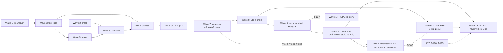

# tasks/ — карта плана

Карта плана работ: волны, зависимости, ссылки на issues. Статусы — только на [доске](https://github.com/users/it1ro/projects/5) «Brig — разработка» (GitHub Projects v2, проект 5). Конвенции — `CONTRIBUTING.md`, команды для доски — `MAINTAINING.md`.

Волны 7–13 спланированы по второму аудиту: [AUDIT_REPORT-2.md](../AUDIT_REPORT-2.md), промпт — [AUDIT_PROMPT-2.md](../AUDIT_PROMPT-2.md).

## Правила

**Один файл — одна волна.** В файле волны лежат:
- вход и выход;
- таблица порядка и параллельности;
- все задачи волны.

У задачи с issue в файле остаётся строка таблицы со ссылкой: источник DoD, файлов, тест-якоря и «НЕ делать» — тело issue. У задачи без issue — полный блок (meta, «Файлы», «Тест-якорь», «DoD», «НЕ делать»), из которого issue и заводится. Блок без заголовка `###` — это body issue; к нему добавляются строки `Blocked by #M` для задач из `depends_on`, у которых уже есть issue. После заведения блок в файле волны заменяется строкой таблицы со ссылкой.

**Label источника.**
- `audit` — finding первого (`AUDIT_REPORT.md`) или второго (`AUDIT_REPORT-2.md`) аудита.
- `spec-gap` — пробел реализации относительно спеки §16.
- `edit-spec` — перенос утверждённого решения research в спеку (research, D4).

**Нумерация.**
- Каждая волна начинается с нового десятка: Wave 7 — T-110…, Wave 8 — T-120…, …, Wave 13 — T-170…; открытые вопросы §17 — T-190….
- `depends_on` ссылается только на меньший номер, граф ацикличен.
- Исключения, оставшиеся в истории: T-80…T-86 и T-62 ждали DD T-90…T-93. T-100…T-104 (#169–#173) заведены до перепланирования и живут в волнах 8 и 11.
- Следующий свободный номер — максимальный номер десятка в titles issues и в `tasks/` плюс один. Проверка — `make plan-check ONLINE=1` (T-111); до неё — `gh issue list --repo it1ro/brig-lang --state all --limit 300 --json title --jq '.[].title'`.

**Effort** — шкала доски: low / medium / large. Старые блоки волн 0–6 и
PR #167 писали S / M / L — это то же самое.

**Имя каталога.** В Brig-проекте `tasks/` — задачи `brig task` (research
16). Этот репозиторий — не Brig-проект, здесь `tasks/` — карта плана.
Если `brig task` начнёт сканировать корень репозитория, каталог
переименовывается.

## Волны

| Волна | Файл | Тема | Эпик | Состояние |
|---|---|---|---|---|
| 0 | [wave-0.md](wave-0.md) | fail-fast на `iter/regvm`, merge | — | закрыта |
| 1 | [wave-1.md](wave-1.md) | test-infra и разблокировка | — | закрыта |
| 2 | [wave-2.md](wave-2.md) | small fixes слоя 1 | — | закрыта |
| 3 | [wave-3.md](wave-3.md) | major fixes | — | закрыта |
| 4 | [wave-4.md](wave-4.md) | blockers full-fix | — | закрыта |
| 5 | [wave-5.md](wave-5.md) | docs cleanup | [#49](https://github.com/it1ro/brig-lang/issues/49) | закрыта, кроме T-65 |
| 6 | [wave-6.md](wave-6.md) | Must-пробелы §16 | [#124](https://github.com/it1ro/brig-lang/issues/124) | закрыта |
| 7 | [wave-7.md](wave-7.md) | контуры обратной связи и согласование | — | следующая; T-113, T-115…T-117 заведены (pre-alpha) |
| 8 | [wave-8.md](wave-8.md) | решения: DD и спека | — | DD T-120…T-125 решены; T-126…T-128 заведены; T-100 — [#169](https://github.com/it1ro/brig-lang/issues/169) |
| 9 | [wave-9.md](wave-9.md) | язык: остаток Must и модули | — | все задачи заведены (pre-alpha) |
| 10 | [wave-10.md](wave-10.md) | язык для библиотек и stdlib на Brig | — | T-147, T-149 заведены (pre-alpha) |
| 11 | [wave-11.md](wave-11.md) | укрепление и производительность | — | T-102…T-104 — [#171](https://github.com/it1ro/brig-lang/issues/171)–[#173](https://github.com/it1ro/brig-lang/issues/173) |
| 12 | [wave-12.md](wave-12.md) | рантайм-механизмы | — | план |
| 13 | [wave-13.md](wave-13.md) | Should §16 и политика на Brig | — | план |
| 14 | [wave-14.md](wave-14.md) | REPL как рабочая консоль | — | план; issues заведены |
| — | [decisions.md](decisions.md) | решённые DD, открытые вопросы §17 (T-190…) | — | T-190… не заведены |

«Состояние» — снимок на 2026-09-27; правду о статусе знает только доска.

Пунктир — ранний старт части задач. DD Wave 8 (T-120…T-125) — работа
человека, их можно решать параллельно Wave 7.

## Pre-alpha

**Критерий:** всё, что §16 называет Must, работает; спека не противоречит
ни себе, ни реализации; CI это проверяет. Стабильность и web-функции не
требуются — это alpha.

Задачи — milestone [pre-alpha](https://github.com/it1ro/brig-lang/milestone/1), 25 issues (#175–#199):
- Wave 7: T-113, T-115, T-116, T-117;
- Wave 8: T-120…T-125 (DD, решены), T-126, T-127, T-128;
- Wave 9: T-130…T-139;
- Wave 10: T-147, T-149.

Критический путь:
- T-113 → T-116 → T-126 → T-128 → T-135 → T-137 → T-139;
- T-126 → T-127 → T-138;
- T-120 → T-130.

Остальные задачи волн 7–13 — alpha и дальше.

## Перед Wave 7 — действия мейнтейнера

Это работа на доске и в PR. Агенту она не отдаётся.

1. Смержить этот план. Он содержит коммиты T-65 (PR #167, перенесены на
   свежий `main`), поэтому #167 закрывается вместе с ним, а #166 (T-65) и
   эпик #49 — после merge.
2. Закрыть эпик #124: все задачи Wave 6 закрыты.
3. Labels: #169 — `wave-8`; #171, #172, #173 — `wave-11` (вместо `wave-7`,
   P-2).
4. PR #174 (T-101): сменить base на `main` — ветка `docs/web-mvp-research`
   уже вмержена. После merge стенд `bench-heap` доступен T-153.
5. PR #165: решить судьбу (открыт с 2026-09-26).
6. Добавить в поле доски **Wave** значения 7–13 (веб-интерфейс: через
   API замена списка значений сбрасывает Wave у существующих карточек) и
   проставить их карточкам pre-alpha.
7. Завести оставшиеся задачи Wave 7 (T-110, T-111, T-112, T-114, T-118,
   T-119) из блоков `wave-7.md`.

## Метрика прогресса для библиотек

После T-115 у каждого файла корпуса (`corpus/`) есть ожидаемый уровень
(`parse` / `check` / `run`) и список `needs`. Выход волн 9–13
сформулирован через корпус. Сводка `make corpus` (топ задач по числу
заблокированных файлов) — вход для приоритизации: при прочих равных
раньше берётся задача, которая разблокирует больше библиотечного кода.

## Горизонт после Wave 13

Research (`web-mvp-research/08-roadmap.md`, фазы 2–5) утвердил ещё
многое. Здесь — без блоков задач: они заводятся, когда предыдущие волны
закрыты, и после третьего аудита (T-154).

- **Скриптинг:** режим `script` (Q-script), `Env`, `Sys.exit`, порты
  `File`, `Proc`, `Stdin`, `Cli.parse`, пул Go-воркеров для тяжёлых
  нативов (R15).
- **Язык для фреймворков:**
  - модули и типы как значения, `Type.fields` (L5, L11);
  - «модуль типа» (Q-poly);
  - контракты: §14.4, `CHECK_KIND`/`CHECK_TAG`, `Json.decode_as` (09);
  - `quote` — RFC-0001 и процесс `rfcs/` (21, Q-rfc).
- **Сеть:** `Tcp`, `Tls`, HTTP на Go `net/http` за портами (B2), `Conn` и
  плаги в `Http`, ACME (B1), фейковые часы и in-memory транспорт (R9),
  `Test.isolated` на экземплярах рантайма (16).
- **Stdlib:** `Log`, `Config`, `Crypto`, `Cache`, `Term` (CBOR), `Telemetry`,
  `Time`-типы (`Instant`, `Date`, `Duration`), `Sql` и встроенный SQLite,
  `PubSub`, `Registry`.
- **Тулчейн:** `brig new`, `fmt`, `build` (один файл), `fix`, `task`,
  `observe`, пакетный менеджер (10), `brig doc`, tree-sitter, LSP.
- **Фреймворки:** Whelk (12), Calmar (06, 14–18) — отдельными пакетами.
- **Производительность:** макро-бенчмарки и дашборд (19), решение по
  модели heap до 1.0 (11), N:M (R10), WASM (B6).

## Verification needed

Findings с тегом `[inferred]` из первого аудита. Все три проверены в
Wave 1 (T-13…T-15). Таблица — образец для следующих аудитов: второй аудит
пометил свои `[inferred]` findings прямо в отчёте. `I-F4`, `I-F6`, `I-F11`
тоже `[inferred]`, но аудит сам пометил их `ok` / «не дыра».

| Finding | Что проверить | Команда/тест | Если подтвердится | Если нет |
|---|---|---|---|---|
| A-F1 (T-13) | Все акторы исполняются в одной goroutine кооперативным run-loop (`internal/vm/scheduler.go:313-428`) | `rg -n 'go func\|go s\.' internal/vm`; тест `TestVerifyAF1SingleGoroutineScheduler`: spawn 100 акторов, `runtime.NumGoroutine()` растёт меньше чем на 100 | T-90 решён: C (#40); T-80 — правка доков | A-F1 → `false-positive`, T-90 закрывается как неактуальный, T-80 не создаётся |
| A-F7 (T-14) | (1) «срез: не реализовано» → exit 3 вместо 1; (2) `internal: upvalue out of range` → exit 2 вместо 3; (3) `runModule` (`internal/compiler/compiler_test.go:13-33`) не прогоняет sema | (1)(2) `go run ./cmd/brig run <probe>.brig; echo $?` по `cmd/brig/main.go:162-166, 208-211`; (3) тест `TestVerifyAF7RunModuleSkipsSema`: `print(trap(1+1))` компилируется через `runModule`, а `brig check` отвергает | Подтвердилось: T-45, T-46 | Неподтверждённый пункт → `false-positive` |
| I-F14 (T-15) | (1) Большой `ms` в `RECVTIMER` молча усекается или переполняется (`scheduler.go:888-894`); (2) `wakeExpired` (`scheduler.go:366`) даёт недетерминированный порядок в `ready` | (1) тест `TestVerifyIF14HugeTimerMs`: `after 9223372036854775807`; (2) программа из N акторов с одинаковым таймаутом: `for i in $(seq 20); do go run ./cmd/brig run p.brig; done \| sort \| uniq -c` — больше одной строки значит недетерминизм | Подтвердилось: T-47, T-48 | `false-positive` |

## Design decisions

Код по вопросу, ждущему решения, не пишется, пока автор языка не решит. DD-задачи имеют label `design-decision` и модель `human`. Задачи, ждущие DD, стоят на доске в Blocked, а после решения переходят в Todo или закрываются как won't-fix, если так сказано в их DoD. У каждого нового DD есть рекомендация аудита или research: DD её утверждает или отвергает.

- DD, которые блокируют волну, лежат в файле волны: T-120…T-125 — [wave-8.md](wave-8.md), T-104 — [wave-11.md](wave-11.md), T-174 — [wave-13.md](wave-13.md).
- Решённые DD и открытые вопросы §17 (T-190…) — в [decisions.md](decisions.md).
